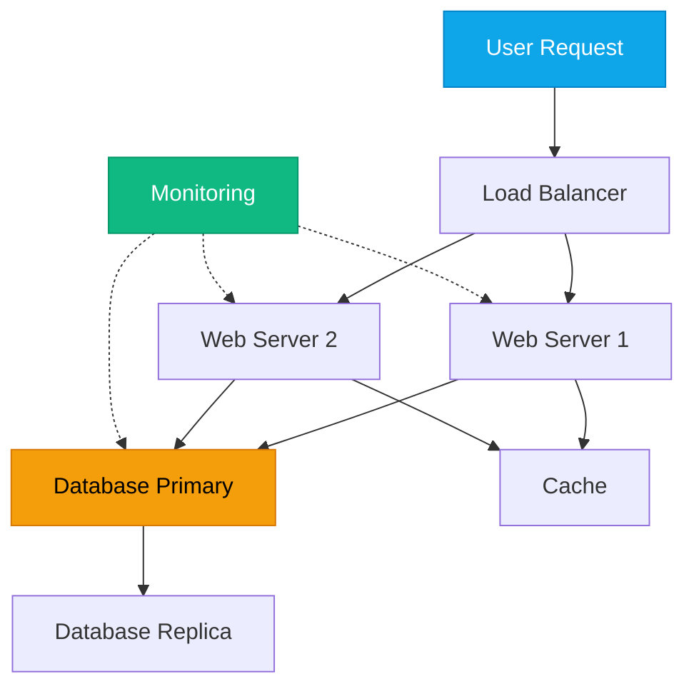

# The Engineering Mindset

:::level simple

Imagine you're building a house. You could learn to use a hammer, a saw, and a drill — that's knowing the tools. But being a builder means understanding how the foundation supports the walls, how the roof keeps out rain, and why you can't put the bathroom above the living room without plumbing.

**Cloud engineering is the same.** You can learn Terraform, Kubernetes, and Azure CLI. But the real skill is understanding how they all fit together, what breaks when one piece changes, and how to design systems that survive failure.

:::

:::level core

## What Is the Engineering Mindset?

The engineering mindset is a way of thinking, not a set of tools. It's the difference between:

| Tool Operator | Engineer |
|---|---|
| Knows `kubectl apply` | Understands the reconciliation loop |
| Can follow a Terraform tutorial | Can design a multi-environment IaC strategy |
| Fixes what's broken | Prevents things from breaking |
| Copies solutions from Stack Overflow | Reasons from first principles |
| Panics during incidents | Follows a systematic debugging process |

Tools change. Clouds evolve. Kubernetes will be replaced someday. **The engineering mindset is permanent.**

:::

---

## Learning Objectives

After completing this lesson, you will be able to:
- Define systems thinking and explain why it matters more than knowing any specific tool
- Apply first-principles reasoning to decompose a complex technical problem
- Identify the difference between knowing tools and thinking like an engineer

---

## Core Content

### Systems Thinking: Seeing the Whole

A systems thinker sees this diagram and immediately asks:

- "What happens if the database primary fails?"
- "Does the load balancer have health checks?"
- "Is the cache cleared when the database updates?"
- "What alerts fire when latency exceeds 200ms?"

A tool operator just sees "we need a load balancer and some servers."

<Definition term="Systems Thinking">
The ability to understand a system as an interconnected whole — seeing how components interact, what dependencies exist, and how changes in one component cascade through the entire system.
</Definition>

### First-Principles Reasoning

First-principles reasoning means breaking a problem down to its most fundamental truths and building up from there — rather than reasoning by analogy.

**Example: "We need Kubernetes"**

| Reasoning by Analogy | First-Principles Reasoning |
|---|---|
| "Everyone uses K8s, so should we." | "We need to run 50 containerized services with auto-scaling, self-healing, and declarative configs." |
| Result: Adopt K8s because it's popular | Result: Evaluate K8s vs Nomad vs AWS ECS based on actual requirements |

<Example title="First-Principles in Practice">

**Problem:** Our application is slow under load.

**Analogy approach:** "We should add more servers — that's what the last project did."

**First-principles approach:**
1. What does "slow" mean? (P95 latency > 500ms)
2. Where is the bottleneck? (Database queries taking 200ms each)
3. Why are queries slow? (Missing index on the `user_id` column)
4. Fix: Add the index — zero new servers needed.

</Example>

### The CloudNova Mindset

At CloudNova Technologies, every engineer — from junior to principal — is expected to think in systems, not just operate tools. When you join the infrastructure team, your manager Marcus Williams won't ask "Do you know Terraform?" He'll ask "How would you design a deployment pipeline that can't take down production?"

This entire academy is built around that question.

---

<BestPractice title="The Engineer's Mental Checklist">

Before touching any system, ask:
1. **What depends on this?** (Upstream and downstream)
2. **What happens if I'm wrong?** (Blast radius)
3. **How do I verify it worked?** (Observability)
4. **How do I undo it?** (Reversibility)
5. **Who needs to know?** (Communication)

</BestPractice>

---

## Common Mistakes

<CommonMistake
  mistake="Learning tools without understanding why they exist"
  correction="Every tool solves a specific problem. Before learning a tool, understand: What problem does it solve? What did people do before it existed? When should you NOT use it?"
/>

<CommonMistake
  mistake="Jumping to solutions before defining the problem"
  correction="Spend 50% of your time understanding the problem. The right solution becomes obvious when the problem is clearly defined."
/>

---

## Debugging Practice

<Debugging
  scenario="A developer at CloudNova reports: 'The API is down!'"
  symptoms={["503 errors from the API gateway", "Database connection pool at 100%", "New microservice deployed 10 minutes ago"]}
  diagnosis="1. Check the timeline — what changed? New service deployed. 2. Check the new service's database connection settings — it's not using connection pooling. 3. It's opening 50 connections per instance and never closing them."
  solution="Fix the new service to use connection pooling. Set max connections to 10 per instance. Add connection timeout of 30 seconds. The fix takes 5 minutes; the diagnosis is the skill."
/>

---

## Key Takeaways

- **The engineering mindset is permanent.** Tools change; systems thinking doesn't.
- **Systems thinking** means seeing the whole: components, dependencies, failure modes.
- **First-principles reasoning** beats reasoning by analogy — every time.
- Before touching any system, ask: what depends on this? what if I'm wrong? how do I verify? how do I undo?
- At CloudNova, you're hired for your thinking, not your tool knowledge.

---

## Check Your Understanding

1. **What is the difference between a tool operator and an engineer?**
   - A) Engineers get paid more
   - B) Engineers understand why tools work, not just how to use them
   - C) Engineers write more code
   - D) Engineers don't use GUIs

   

Answer
**B.** Engineers understand the principles behind the tools — why a load balancer exists, not just which button creates one.

2. **You're debugging a slow application. Which is the first-principles approach?**
   - A) Add more CPU and memory
   - B) Measure where the time is spent, identify the bottleneck, fix the root cause
   - C) Google "application slow fix"
   - D) Reboot the server

   

Answer
**B.** First-principles debugging: measure first, identify the bottleneck, fix the root cause. Everything else is guessing.

3. **A new team member says "We should use Kubernetes because Google uses it." What's the problem?**
   - A) Google doesn't use Kubernetes
   - B) This is reasoning by analogy, not first principles
   - C) Kubernetes is too expensive
   - D) The team member is wrong

   

Answer
**B.** "X uses Y, so should we" is reasoning by analogy. The right question is: "What problem are we solving, and is Kubernetes the best solution for that problem?"

---

## Active Recall

- **Q:** What is systems thinking, and why does it matter more than knowing any specific cloud tool?
- **Q:** Explain the difference between first-principles reasoning and reasoning by analogy.
- **Q:** What are the 5 questions every engineer should ask before touching a production system?

---

## Feynman Check

> Can you explain systems thinking to someone who has never used a computer?

Try this: "Imagine a city. The power grid, water system, roads, and traffic lights all depend on each other. If the power fails, traffic lights go dark, and water pumps stop. A city planner thinks about all these connections — not just one road or one building. That's systems thinking."

---

## Next Steps

- **Next Lesson:** [Problem Decomposition](/cloud-engineering/01-foundations/problem-decomposition)
- **Practice:** Look at any website you use. Draw a diagram of what systems must be involved (load balancer, web server, database, cache, DNS). What breaks if one component fails?
- **Career at CloudNova:** This mindset is the foundation of everything you'll do at CloudNova. Your first project (Linux server provisioning) will test your systems thinking from day one.

---

## Spaced Repetition

This topic will appear in your review on: **Day 1, Day 3, Day 7, Day 14, Day 30, Day 90**
