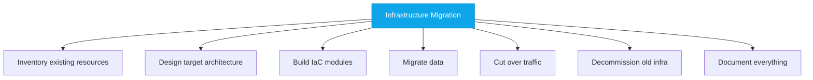
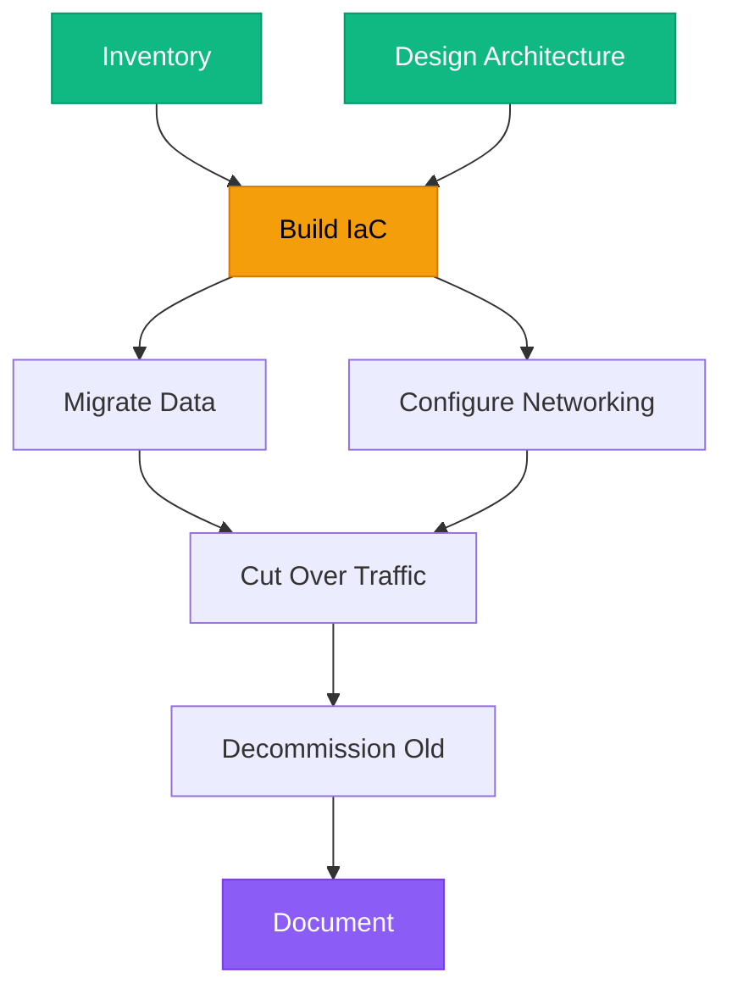

# Problem Decomposition

:::level simple

**Big problems are just lots of small problems stacked together.** If you try to solve them all at once, you'll get overwhelmed. If you break them apart and solve one at a time, almost anything becomes manageable.

Think about cleaning a messy house. "Clean the house" is overwhelming. "Clean the kitchen counters" is doable. Then "clean the kitchen floor." Then "clean the bathroom." One small problem at a time, and suddenly the house is clean.

Cloud engineering works exactly the same way.

:::

:::level core

## Why Problem Decomposition Is Your Superpower

Every cloud engineering challenge is decomposable:

- "Migrate to Kubernetes" → 15 smaller problems
- "Improve application performance" → Identify the bottleneck → Fix the bottleneck → Verify
- "Make our infrastructure secure" → Network security → IAM → Encryption → Monitoring → Compliance

The engineer who can decompose problems well never panics. They see the path through.

:::

---

## Learning Objectives

- Break down a complex cloud migration into manageable sub-problems
- Use the "5 Whys" technique to find root causes
- Create a dependency graph for a multi-step technical project

---

## Core Content

### The Decomposition Framework

Every problem can be decomposed using this 4-step framework:

#### Step 1: Define the Problem Clearly

A well-defined problem is half-solved. Write it down in one sentence:

- ❌ "Our infrastructure is a mess."
- ✅ "We have 47 EC2 instances across 3 AWS accounts with no tagging, no IaC, and no monitoring."

#### Step 2: Break Into Sub-Problems

#### Step 3: Map Dependencies

Not all sub-problems can be solved in parallel:

<BestPractice title="Dependency Mapping Rule">
  Green nodes = can be done in parallel. Yellow = depends on green. Purple = depends on everything
  before it. This is your execution order.
</BestPractice>

### The 5 Whys Technique

When something breaks, don't fix the symptom — find the root cause:

**Scenario: Production is down.**

1. **Why?** — The web servers returned 503 errors.
2. **Why?** — The database connection pool was exhausted.
3. **Why?** — A new microservice opened 500 connections without pooling.
4. **Why?** — The developer didn't know about connection pooling best practices.
5. **Why?** — There's no code review checklist for database connections.

**Root cause:** Missing code review checklist. **Fix:** Add connection pooling to the review checklist. Document it. Share it. The problem won't recur.

<Example title="CloudNova Ticket: Slow Login Page">

**Ticket:** "Login page takes 15 seconds to load."

**5 Whys analysis:**

1. Why? → Login API call takes 15 seconds.
2. Why? → It queries the user database with `SELECT * FROM users`.
3. Why? → No index on the `email` column used in WHERE clause.
4. Why? → The table was created by a migration that didn't include indexes.
5. Why? → Migration review process doesn't require index validation.

**Fix:** Add the index (5 min). Update the migration review checklist (permanent).

</Example>

---

## Debugging Practice

<Debugging
  scenario="CloudNova's deployment pipeline fails with 'Permission denied' when Terraform tries to create resources."
  symptoms={["Error: AuthorizationFailed", "Service principal exists", "Pipeline worked yesterday"]}
  diagnosis="1. What changed? Check git log — someone updated the Terraform provider version. 2. The new provider requires a different permission scope. 3. The service principal doesn't have the new permission."
  solution="Add the required permission to the service principal's role assignment. Update the documentation to note the permission requirement for the new provider version."
/>

---

## Key Takeaways

- **Decompose before you execute.** Never tackle a big problem head-on.
- **4-step framework:** Define → Decompose → Map Dependencies → Solve Sequentially.
- **5 Whys finds root causes,** not symptoms. Keep asking "why?" until you reach a process or knowledge gap.
- **Dependency graphs show you what can be parallelized** and what must be sequential.

---

## Check Your Understanding

1. **What is the correct order for problem decomposition?**
   - A) Solve → Define → Decompose
   - B) Define → Decompose → Map Dependencies → Solve
   - C) Decompose → Define → Solve
   - D) Map Dependencies → Define → Solve

   

     
Answer
**B.** Always define the problem first, then break it down, map what
     depends on what, then solve.
   

2. **A deployment fails. The 5 Whys lead you to "no code review checklist." What's the real fix?**
   - A) Blame the developer
   - B) Fix the deployment and move on
   - C) Add to the code review checklist so this entire class of bugs is prevented
   - D) Write a postmortem

   

     
Answer
**C.** The 5 Whys leads to process fixes, not blame. Adding to the
     checklist prevents this class of bug forever.
   

---

## Next Steps

- **Next Lesson:** [Technical Writing for Engineers](/cloud-engineering/01-foundations/technical-writing)
- **Practice:** Take any technical problem you've encountered and apply the 5 Whys.
- **Career:** At CloudNova, your first incident response will use exactly this framework.

---

## Spaced Repetition

Review: Day 1, Day 3, Day 7, Day 14, Day 30, Day 90
