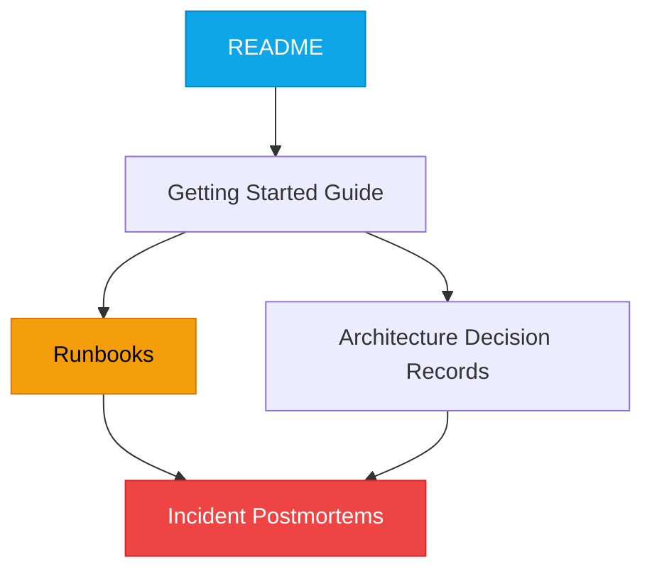

# Technical Writing for Engineers

:::level simple

**Good documentation saves lives.** (Well, saves weekends and 3 AM panic.)

Imagine you're a chef. You don't write down your recipes. One day you're sick, and nobody else can make your signature dish. The restaurant loses money. Your team is stressed.

Now imagine you're a cloud engineer. The production database crashes at 3 AM. The person who knows how to fix it is on vacation. There's no runbook. You're the chef with no recipe.

**Write it down. Your team will thank you at 3 AM.**

:::

:::level core

## Why Engineers Avoid Writing (And Why They're Wrong)

| Excuse | Reality |
|---|---|
| "The code is self-documenting" | The code tells you *what*. It doesn't tell you *why*. |
| "I'll document it later" | You won't. And next week you won't remember the context. |
| "Nobody reads documentation" | Nobody reads bad documentation. They absolutely read good documentation during incidents. |
| "It takes too long" | A 15-minute runbook saves hours of incident response. Forever. |

<BestPractice title="The Rule of Documentation">
If you got hit by a bus tomorrow, could someone else understand, operate, and troubleshoot your system? If the answer is no, you haven't documented enough.
</BestPractice>

:::

---

## Core Content

### The Documentation Stack



### Runbook: The 3 AM Document

A runbook is a step-by-step guide for handling a specific operational scenario. It must be:

1. **Actionable** — commands, not paragraphs
2. **Current** — tested within the last month
3. **Safe** — includes verification steps after each action
4. **Accessible** — found in under 30 seconds during an incident

**Template:**

```markdown
# Runbook: [Scenario Name]

## Symptoms
- Alert: [Alert name]
- User impact: [What users see]
- Dashboard: [Link to relevant dashboard]

## Before You Start
- Required permissions: [Role/permission set]
- Blast radius: [What could go wrong]
- Expected duration: [Time estimate]

## Steps
### Step 1: Verify the Problem
`command to verify`
**Expected output:** [What you should see]

### Step 2: Mitigate (Stop the Bleeding)
`command to mitigate`
**Verification:** `command to verify fix`

### Step 3: Root Cause (After Incident)
- Check logs: [Log query]
- Check recent changes: [Deployment history link]

## Rollback
`command to undo`

## Escalation
If steps don't work, escalate to: [Team/PagerDuty schedule]
```

### Architecture Decision Record (ADR)

An ADR documents *why* you made a technical decision. Not what you did — why you did it.

<Example title="ADR: Use PostgreSQL instead of MongoDB for User Data">

```markdown
# ADR-004: Database Choice for User Service

## Status
Accepted (2026-03-15)

## Context
The user service needs to store structured user profiles with
relationships (users → organizations → teams). Data integrity is
critical. We evaluated PostgreSQL and MongoDB.

## Decision
Use PostgreSQL with the `users` schema in the `platform` database.

## Alternatives Considered
- **MongoDB**: Better for unstructured data, but user profiles are
  highly structured. No ACID guarantees across collections.
- **DynamoDB**: Excellent scalability, but complex query patterns
  would require multiple tables and application-level joins.

## Consequences
- Positive: ACID guarantees, strong schema enforcement, team
  already knows PostgreSQL.
- Negative: Horizontal scaling requires more effort than MongoDB.
- Mitigation: Implement read replicas before hitting scaling limits.
```

</Example>

---

## Key Takeaways

- **Documentation is an engineering discipline**, not an afterthought.
- **Runbooks save lives.** Write them before the incident, not during.
- **ADRs explain why.** Code shows what; ADRs show why.
- **If you got hit by a bus tomorrow**, could your team operate your system?

---

## Next Steps

- **Practice:** Write a runbook for restarting a service you use. Include verification steps.
- **Next Lesson:** [Learning How to Learn](/cloud-engineering/01-foundations/learning-how-to-learn)

---

## Spaced Repetition

Review: Day 1, Day 3, Day 7, Day 14, Day 30, Day 90
