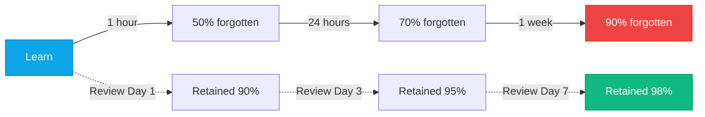
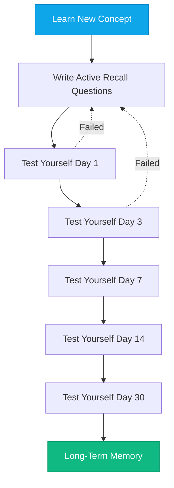

# Learning How to Learn

:::level simple

**Learning is a skill, not a talent.** And like any skill, it can be practiced and improved.

Think about how most people "study": they re-read notes, highlight textbooks, and watch video after video. Then they wonder why they can't remember anything during the exam.

The problem isn't intelligence. It's method. Re-reading feels productive but is one of the least effective ways to learn. What actually works is **testing yourself before you feel ready** and **spacing your practice over time**.

The best cloud engineers aren't the smartest. They're the ones who built the best learning systems.

:::

:::level core

## Why Traditional Study Methods Fail

| Method                       | Feels Effective? | Actually Effective?             |
| ---------------------------- | ---------------- | ------------------------------- |
| Re-reading notes             | ✅ Yes           | ❌ No — recognition, not recall |
| Highlighting                 | ✅ Yes           | ❌ No — passive activity        |
| Watching videos back-to-back | ✅ Yes           | ❌ No — no retrieval practice   |
| Testing yourself             | ❌ Hard          | ✅ Yes — active recall          |
| Spacing practice over time   | ❌ Feels slow    | ✅ Yes — spaced repetition      |

The methods that feel hardest are the most effective. The methods that feel easiest are the least effective.

:::

---

## Core Content

### The Forgetting Curve

**Without review:** You forget 90% within a week.
**With spaced repetition:** You retain 98% indefinitely.

### The Feynman Technique

1. **Pick a concept** you want to understand (e.g., "DNS").
2. **Explain it** as if teaching a 10-year-old. Use simple words.
3. **Identify gaps** — where did you stumble? Where did you use jargon to hide confusion?
4. **Go back and learn** those gaps. Then try explaining again.
5. **Simplify** until the explanation is crystal clear.

<Example title="Feynman Technique: DNS">

**Jargon version:** "DNS is a distributed hierarchical naming system that resolves fully qualified domain names to IP addresses via recursive and iterative queries across authoritative and caching nameservers."

**Feynman version:** "DNS is the phonebook of the internet. When you type 'google.com', your computer asks the DNS phonebook 'What's the phone number for Google?' DNS replies '142.250.80.46'. Your computer then calls that number."

If you can't explain it simply, you don't understand it well enough.

</Example>

### Building Your Learning System

Every lesson in this academy includes Active Recall questions and review schedules. Use them.

---

## Key Takeaways

- **Re-reading is not learning.** Active recall and spaced repetition are.
- **The Feynman technique** reveals exactly what you don't understand.
- **Review at intervals** — 1, 3, 7, 14, 30, 90 days — to defeat the forgetting curve.
- **Build your system once.** It serves you for your entire career.

---

## Check Your Understanding

1. **Why is re-reading less effective than testing yourself?**
   - A) Re-reading takes longer
   - B) Re-reading builds recognition, not recall; tests force retrieval
   - C) Re-reading is more boring
   - D) Re-reading doesn't work for technical content

   

     
Answer
**B.** Recognition ("I've seen this before") is not recall ("I can
     explain this from memory"). Tests force retrieval, which strengthens memory.
   

2. **What's the optimal review schedule for long-term retention?**
   - A) Review every day
   - B) Review once before the exam
   - C) Review at expanding intervals: 1, 3, 7, 14, 30, 90 days
   - D) Review whenever you feel like it

   

     
Answer
**C.** Expanding intervals are optimal — you review just before you'd
     forget, strengthening the memory efficiently.
   

---

## Next Steps

- **Practice:** Pick a concept from the last 24 hours. Explain it using the Feynman technique. Find the gaps.
- **Next Lesson:** [Documentation Culture](/cloud-engineering/01-foundations/documentation-culture)

---

## Spaced Repetition

Review: Day 1, Day 3, Day 7, Day 14, Day 30, Day 90
