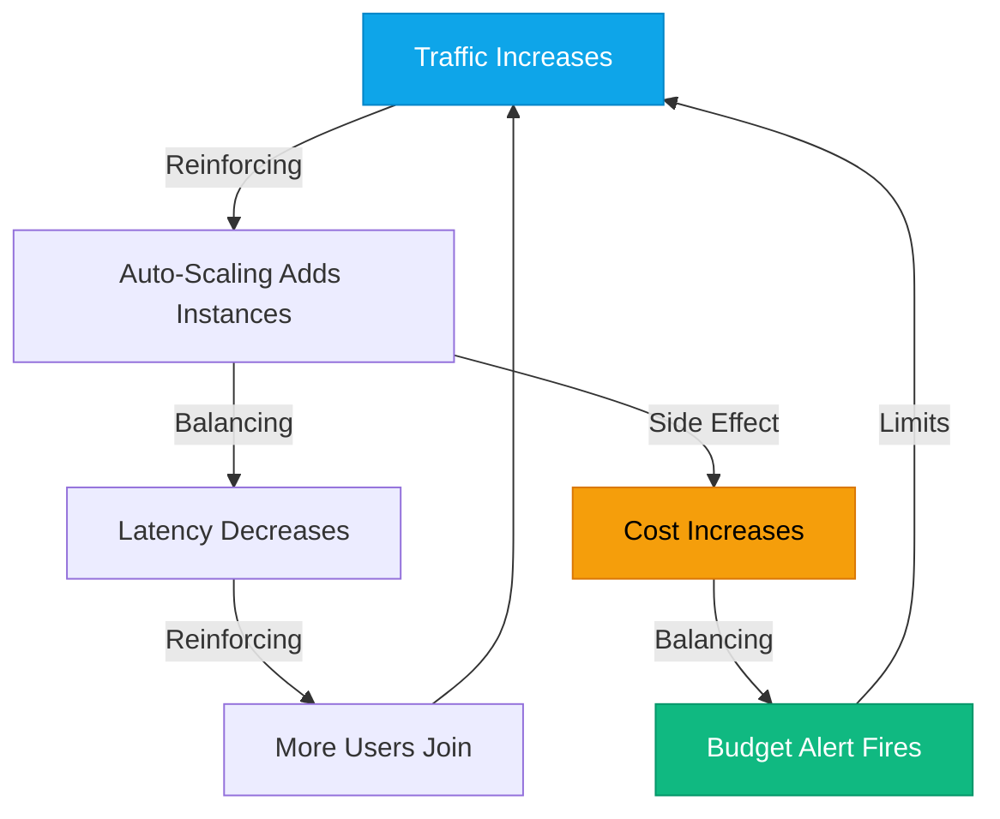
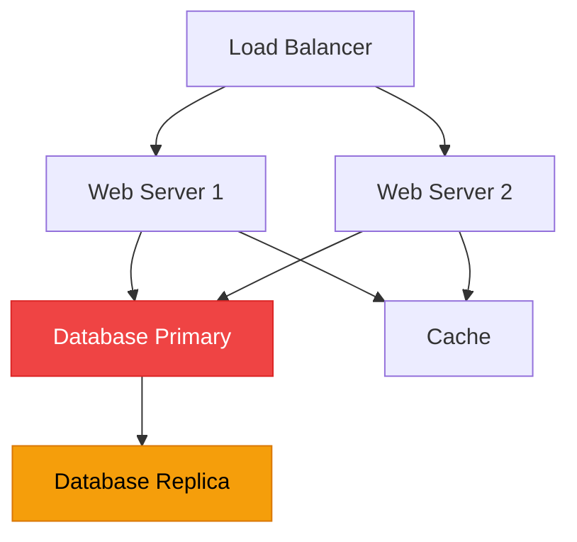

# Systems Thinking Deep Dive

:::level simple

**Systems thinking is seeing the invisible connections.** Every cloud service you deploy is connected to dozens of others. When one fails, the effects ripple outward like waves in a pond. Systems thinking helps you see those ripples before they happen.

A simple example: You increase the memory on your web servers. Great, more performance! But now your database gets more queries because the web servers can handle more traffic. The database becomes the bottleneck. You fixed one thing and broke another — because you didn't see the connection.

:::

:::level core

## Feedback Loops

Cloud architectures are full of feedback loops. Understanding them prevents cascading failures.

**Reinforcing loops** amplify change (more users → more instances → more capacity → more users).
**Balancing loops** stabilize the system (more cost → budget alert → limits growth).

:::

---

## Failure Mode Analysis

If the Database Primary (red) fails:

- Web servers can't write data → read-only mode
- Cache still serves stale data → users see old information
- Replica can be promoted → but takes 2 minutes
- **Blast radius:** All write operations across all services

Systems thinkers map this **before** the failure happens.

---

<BestPractice title="Failure Mode Questions">
  For every component, ask: "If this fails, what breaks? How do we detect it? How do we recover? How
  long does recovery take?"
</BestPractice>

---

## Key Takeaways

- **Reinforcing loops amplify change; balancing loops stabilize.**
- **Map failure modes before failures happen.**
- **Every component has a blast radius.** Know yours.
- **Emergent behavior** (system-level effects not obvious from individual components) is what makes distributed systems hard.

---

## Next Steps

- **Module Complete!** → [Module 02: Linux Mastery](/cloud-engineering/02-linux/)
- **Practice:** Draw the dependency graph for any system you use. Identify single points of failure.

---

## Spaced Repetition

Review: Day 1, Day 3, Day 7, Day 14, Day 30, Day 90
