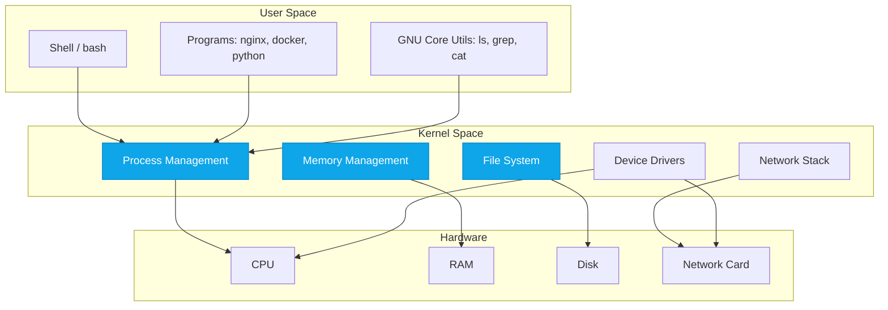

# Linux Architecture & Philosophy

:::level simple

**Linux is the invisible engine that runs the cloud.** Every time you open a website, check your email, or stream a video, Linux servers are doing the work behind the scenes.

Think of Linux like a car:

- **The Kernel** is the engine — it makes everything go.
- **The Shell** is the steering wheel and pedals — how you control it.
- **Programs** (nginx, docker, python) are the seats, radio, and GPS — what makes the car useful.

You don't need to know how to build an engine to drive a car. But cloud engineers need to know how their engine works.

:::

:::level core

## The Three Layers of Linux



The **kernel** is the only part of the OS that talks directly to hardware. Every program — including the shell — must ask the kernel to do anything with hardware. This separation is the foundation of Linux security and stability.

:::

:::level professional

### The Linux Kernel in Detail

```bash
# See your kernel version
uname -r
# Output: 6.5.0-1023-azure

# See kernel modules loaded
lsmod | head -5

# See kernel messages (hardware detection, driver loading)
dmesg | tail -20

# Check kernel parameters
sysctl -a | grep net.ipv4
```

The kernel handles:

- **Process scheduling** — which program runs on which CPU core, and for how long
- **Memory management** — virtual memory, page tables, swap
- **File system abstraction** — VFS layer makes ext4, xfs, and nfs look the same to programs
- **Network stack** — TCP/IP implementation, socket API
- **Device drivers** — translating hardware-specific protocols to standard interfaces

:::

### The Unix Philosophy

> "Do one thing and do it well. Write programs that work together. Write programs to handle text streams, because that is a universal interface." — Doug McIlroy, Bell Labs

```mermaid
graph LR
    A[cat access.log] -->|stdout| B[grep ERROR]
    B -->|stdout| C[awk '{print $1}']
    C -->|stdout| D[sort]
    D -->|stdout| E[uniq -c]
    E -->|stdout| F[sort -rn]

    style A fill:#0ea5e9,stroke:#0284c7,color:#fff
    style F fill:#10b981,stroke:#059669,color:#fff
```

**Real example:** Find the top 10 IPs making ERROR requests:

```bash
cat /var/log/nginx/access.log \
  | grep '" 5[0-9][0-9] ' \
  | awk '{print $1}' \
  | sort \
  | uniq -c \
  | sort -rn \
  | head -10
```

Each command does exactly one thing. Pipes connect them. This is the Unix philosophy in action — and it's still how modern cloud debugging works.

---

<Example title="CloudNova Production Debugging">

**Scenario:** The API is returning 500 errors. You SSH into the server:

```bash
# Find what's happening now
tail -f /var/log/api/error.log | grep "2026-07-15"

# Count errors by type in the last hour
grep "2026-07-15T1[4-5]" /var/log/api/error.log \
  | awk -F'ERROR' '{print $2}' \
  | awk '{print $1}' \
  | sort | uniq -c | sort -rn

# Output:
#   234 ConnectionTimeout
#   156 DatabasePoolExhausted
#    45 PermissionDenied
```

The Unix philosophy makes this possible. Every command is a building block that composes with others.

</Example>

---

## Common Mistakes

<CommonMistake
  mistake="Thinking the shell IS the operating system"
  correction="The shell (bash/zsh) is just a program running in user space. The kernel is the OS. You can have Linux without a shell — it's called a 'headless server' and it's what most cloud VMs are."
/>

<CommonMistake
  mistake="Running everything as root"
  correction="Root has unlimited power. A typo as root can destroy the system. Create a regular user, use sudo only when needed, and follow the principle of least privilege — even on your own servers."
/>

---

<BestPractice title="The Filesystem Hierarchy Standard (FHS) Quick Reference">

| Directory   | Purpose                             | Cloud Relevance                                 |
| ----------- | ----------------------------------- | ----------------------------------------------- |
| `/etc/`     | Configuration files                 | nginx.conf, ssh/sshd_config, systemd units      |
| `/var/log/` | Log files                           | Application logs, system logs, audit logs       |
| `/opt/`     | Optional/third-party software       | Custom monitoring agents, vendor tools          |
| `/tmp/`     | Temporary files (cleared on reboot) | Build artifacts, session data                   |
| `/home/`    | User home directories               | SSH keys in ~/.ssh/, personal scripts           |
| `/usr/bin/` | User binaries                       | Most commands you type (nginx, python3, docker) |
| `/usr/lib/` | Libraries                           | Shared libraries (.so files) programs depend on |

</BestPractice>

---

:::level production

### Production Linux at CloudNova

At CloudNova, every production server follows these standards:

1. **Minimal install** — no GUI, no unnecessary packages. Smaller attack surface.
2. **Immutable infrastructure** — servers are replaced, not patched. Terraform destroys and recreates.
3. **Cattle, not pets** — servers have names like `web-prod-uswest2-04`, not `thor` or `odin`.
4. **Everything logs to stdout/stderr** — systemd-journald captures it all. No custom log rotation scripts.
5. **SSH via bastion only** — no direct SSH to production. All access goes through a jump host with audit logging.

```bash
# Production readiness check script
#!/bin/bash
echo "=== Production Readiness Check ==="

# Check if running as root (bad in production)
if [ "$EUID" -eq 0 ]; then
  echo "❌ Running as root"
else
  echo "✅ Running as non-root user"
fi

# Check automatic security updates
if systemctl is-active unattended-upgrades > /dev/null 2>&1; then
  echo "✅ Auto security updates enabled"
else
  echo "❌ Auto security updates disabled"
fi

# Check firewall
if ufw status | grep -q "Status: active"; then
  echo "✅ Firewall active"
else
  echo "❌ Firewall inactive"
fi
```

:::

---

## Key Takeaways

- The **kernel** talks to hardware. Everything else runs in **user space**.
- The **Unix philosophy** — do one thing well, compose with pipes — is how cloud debugging works.
- **FHS** tells you where everything lives. Memorize `/etc/`, `/var/log/`, `/opt/`.
- In production: minimal installs, immutable infrastructure, cattle-not-pets.

---

## Check Your Understanding

1. **Which of these components runs in kernel space?**
   - A) nginx web server
   - B) bash shell
   - C) Process scheduler
   - D) grep command

   <details>
     <summary>Answer</summary>**C.** The process scheduler is part of the kernel. Everything else
     runs in user space.
   </details>

2. **Why should you never run production services as root?**
   - A) It's slower
   - B) A bug or typo can destroy the entire system
   - C) Root can't access the network
   - D) It's too complicated

   <details>
     <summary>Answer</summary>**B.** Root has unlimited power. A compromised or buggy process
     running as root can delete everything, modify any file, or install malware. Always use the
     least-privileged user possible.
   </details>

---

## Hands-On

<Exercise
  title="Explore Your Linux System"
  instructions="1. Run `uname -a` — what kernel version are you on?&#10;2. Run `ls /etc/` — how many config files do you see?&#10;3. Run `df -h` — what filesystems are mounted?&#10;4. Run `ps aux | wc -l` — how many processes are running?&#10;5. Run `dmesg | tail -20` — any interesting kernel messages?"
/>

## Career at CloudNova

Your first task as a Junior Cloud Engineer is **Project 001 — CloudNova Linux Server**. You'll provision, secure, and document a production Linux server. Everything in this lesson applies directly.

---

## Next Steps

- **Next Lesson:** [Shell & Command Line Mastery](/cloud-engineering/02-linux/shell-mastery)
- **Lab:** [Your First Linux Server](/labs/lab-linux-01)
- **Project:** [CloudNova Linux Server](/projects/proj-001)

---

## Spaced Repetition

Review: Day 1, Day 3, Day 7, Day 14, Day 30, Day 90
