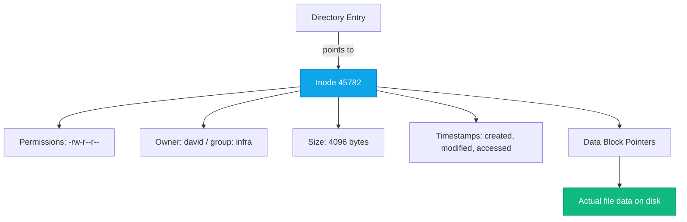

# File System Deep Dive

:::level simple

Everything in Linux is a file. Your hard drive? A file (`/dev/sda`). Your terminal? A file (`/dev/tty`). Running programs? Files in `/proc/`. Even network connections are files.

This "everything is a file" philosophy means you can use the same tools (`cat`, `ls`, `grep`) to inspect almost anything. It's one of Linux's most powerful design decisions.

:::

:::level core

## Inodes: The "Behind the Scenes" of Every File



The **inode** stores everything about the file except its name and its data. The name lives in the directory. The data lives in disk blocks the inode points to.

```bash
# See inode numbers
ls -i
# Output:
# 45782 nginx.conf
# 89123 access.log

# Check inode usage (running out of inodes = can't create files even with free space!)
df -i
```

:::

## Permissions Deep Dive

```bash
# -rwxr-xr--  1 david infra  4096 Jul 15 14:30 script.sh
#  └─┬─┘└─┬─┘└─┬─┘
#    │    │    └── Others: read only
#    │    └─────── Group: read, execute
#    └──────────── Owner: read, write, execute
#                File type: - (regular file)
```

| Octal | Symbolic | Permission |
|---|---|---|
| 7 | rwx | Read, write, execute |
| 6 | rw- | Read, write |
| 5 | r-x | Read, execute |
| 4 | r-- | Read only |
| 0 | --- | No permission |

```bash
chmod 755 script.sh   # rwxr-xr-x (owner: all, others: read+execute)
chmod 600 secret.key  # rw------- (owner only: read+write)
chmod +x script.sh    # Add execute for everyone
```

### Symlinks vs Hard Links

| Feature | Symlink (`ln -s`) | Hard Link (`ln`) |
|---|---|---|
| Points to | File path (name) | Inode (the file itself) |
| Works across filesystems? | Yes | No |
| Survives original deletion? | ❌ Broken link | ✅ Data persists |
| Shows as different file? | Yes (starts with `l`) | No (shares inode) |

---

<Example title="CloudNova: Debugging Disk Full">

```bash
# Disk is "full" but df shows space available — the inode trap!
df -h /dev/sda1   # 60% used — plenty of space
df -i /dev/sda1   # 100% inodes used!

# A misbehaving process created millions of tiny temp files
find /tmp -type f -name "session_*" | wc -l
# Output: 3,847,291 files

# Fix: delete them
find /tmp -type f -name "session_*" -delete
```

</Example>

---

## Key Takeaways

- **Everything is a file** — disks, processes, network connections.
- **Inodes** store metadata and data pointers. Running out of inodes = can't create files even with free space.
- **Permissions** use octal (755) or symbolic (rwxr-xr-x) notation.
- **Symlinks** point to paths; **hard links** point to inodes.

---

## Check Your Understanding

1. **What happens when you delete a file that still has a hard link?**
   - A) The data is deleted immediately
   - B) The data remains until all hard links are deleted
   - C) The hard link becomes a symlink
   - D) Nothing — you can't delete a file with hard links

   <details><summary>Answer</summary>**B.** The data persists until the inode's link count reaches 0.</details>

---

## Spaced Repetition

Review: Day 1, Day 3, Day 7, Day 14, Day 30, Day 90
