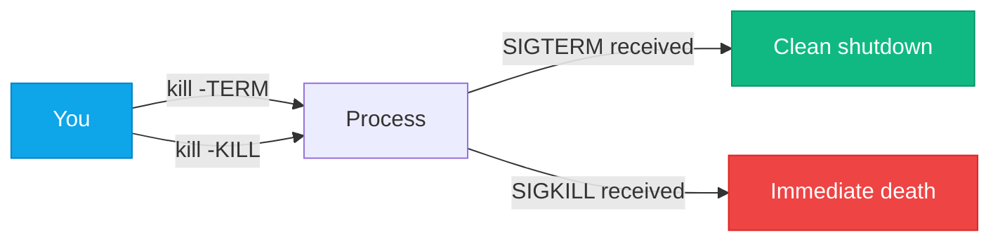

# Process & Service Management

:::level simple

Every program running on your Linux server is a **process**. The web server (nginx), the database (postgres), your SSH session — each is a process with its own ID, memory, and state.

When you manage cloud servers, you're really managing processes. Is nginx running? How much memory is it using? Did it crash? How do we restart it? These are process management questions.

:::

:::level core

## Process Inspection

```bash
# See all processes
ps aux

# See process tree (parent-child relationships)
ps auxf

# Real-time process monitor
top
# Press: 1 (per-CPU), M (sort by memory), P (sort by CPU), k (kill)

# Find a specific process
pgrep nginx        # Returns PID
ps aux | grep nginx
```

## Signals: How You Talk to Processes



| Signal | Number | Effect |
|---|---|---|
| SIGTERM | 15 | Polite shutdown request |
| SIGKILL | 9 | Force kill (no cleanup) |
| SIGHUP | 1 | Reload configuration |
| SIGSTOP | 19 | Pause process |

**Golden rule:** Always `kill -TERM` first. Only use `kill -KILL` if the process ignores SIGTERM.

## systemd: The Service Manager

Every modern Linux uses systemd to start, stop, and monitor services.

```ini
# /etc/systemd/system/cloudnova-api.service
[Unit]
Description=CloudNova API Service
After=network.target postgresql.service

[Service]
Type=simple
User=cloudnova
WorkingDirectory=/opt/cloudnova/api
ExecStart=/usr/bin/python3 -m uvicorn main:app --host 0.0.0.0 --port 8080
Restart=on-failure
RestartSec=5s

[Install]
WantedBy=multi-user.target
```

```bash
systemctl daemon-reload    # Reload unit files
systemctl start cloudnova-api
systemctl enable cloudnova-api  # Start on boot
systemctl status cloudnova-api  # Check status + recent logs
journalctl -u cloudnova-api -f  # Follow logs
```

:::

---

<ProductionNote>

At CloudNova, every service runs under systemd with `Restart=on-failure` and a `RestartSec` of at least 5 seconds (to avoid restart storms). Critical services have `Restart=always`. Logs go to journald, which ships them to our observability stack.

</ProductionNote>

---

## Debugging Practice

<Debugging
  scenario="nginx service won't start after config change."
  symptoms={["systemctl start nginx fails silently", "systemctl status nginx shows 'failed'"]}
  diagnosis="1. `journalctl -u nginx --since '5 min ago'` — shows 'unknown directive' error. 2. `nginx -t` — config test reveals syntax error on line 42. 3. The last person edited nginx.conf and missed a semicolon."
  solution="Fix the syntax error on line 42 of nginx.conf. Run `nginx -t` to verify. Run `systemctl restart nginx`."
/>

---

## Key Takeaways

- **Every running program is a process** with a PID, state, and resource usage.
- **SIGTERM first, SIGKILL last.** Let processes clean up.
- **systemd** manages services: start, stop, restart, enable-on-boot, log capture.
- **journalctl** is your log viewer for systemd-managed services.

---

## Check Your Understanding

1. **You `kill -9` a database process. What happens?**
   - A) Database saves pending writes and shuts down
   - B) Database terminates immediately — possible data corruption
   - C) Nothing — kill -9 is just a request
   - D) Database restarts automatically

   <details><summary>Answer</summary>**B.** SIGKILL terminates immediately with no cleanup. The database cannot flush buffers, close connections, or release locks. Always try SIGTERM first.</details>

---

## Next Steps

- **Next Lesson:** [Bash Scripting for Automation](/cloud-engineering/02-linux/bash-scripting)

---

## Spaced Repetition

Review: Day 1, Day 3, Day 7, Day 14, Day 30, Day 90
