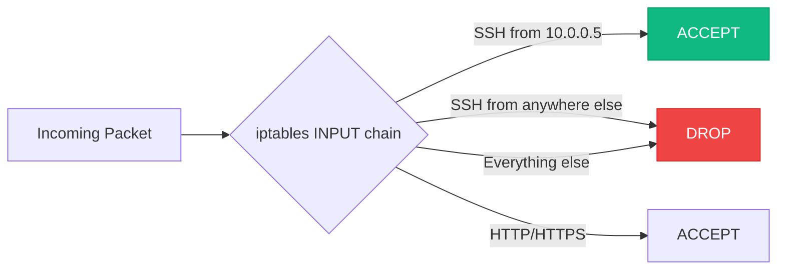

# Linux Networking Stack

:::level simple

Every server has a network card. Linux gives you complete control over it — what IP it has, which routes it uses, what traffic it allows or blocks. This is the networking stack.

Cloud engineers spend a lot of time debugging: "Why can't server A talk to server B?" Understanding the Linux network stack makes you the person who can answer that question.

:::

:::level core

### Essential Network Commands

```bash
# Show interfaces and IPs
ip addr show
ip -br addr   # Brief version

# Show routing table
ip route show

# Show listening ports
ss -tlnp   # TCP listening
ss -ulnp   # UDP listening

# Capture packets
tcpdump -i eth0 port 443
tcpdump -i any host 10.0.1.5 and port 80 -w capture.pcap

# Test connectivity
ping -c 3 8.8.8.8
curl -v https://api.cloudnova.io/health
```

### iptables: The Linux Firewall

```bash
# List current rules
iptables -L -n -v

# Allow SSH from specific IP
iptables -A INPUT -p tcp -s 10.0.0.5 --dport 22 -j ACCEPT

# Block all other SSH
iptables -A INPUT -p tcp --dport 22 -j DROP

# Save rules
iptables-save > /etc/iptables/rules.v4
```



---

<Example title="CloudNova Debugging: Connection Refused">

```bash
# Developer says: "Can't connect to API on port 8080"

# Step 1: Is the service listening?
ss -tlnp | grep 8080
# Output: (nothing) — service not listening!

# Step 2: Is the service running?
systemctl status cloudnova-api
# Output: active (running) — but on port 8000, not 8080

# Step 3: Check config
grep "port" /opt/cloudnova/api/config.yaml
# Output: port: 8000 — there's the problem

# Fix: Either change the config or use the correct port
```

</Example>

---

## Key Takeaways

- `ip addr`, `ip route`, `ss` — the modern networking toolkit.
- `tcpdump` captures packets for deep debugging.
- `iptables` is the Linux firewall — understand the chains (INPUT, OUTPUT, FORWARD).
- Always verify the service is **listening on the expected port** before debugging the network.

---

## Spaced Repetition

Review: Day 1, Day 3, Day 7, Day 14, Day 30, Day 90
