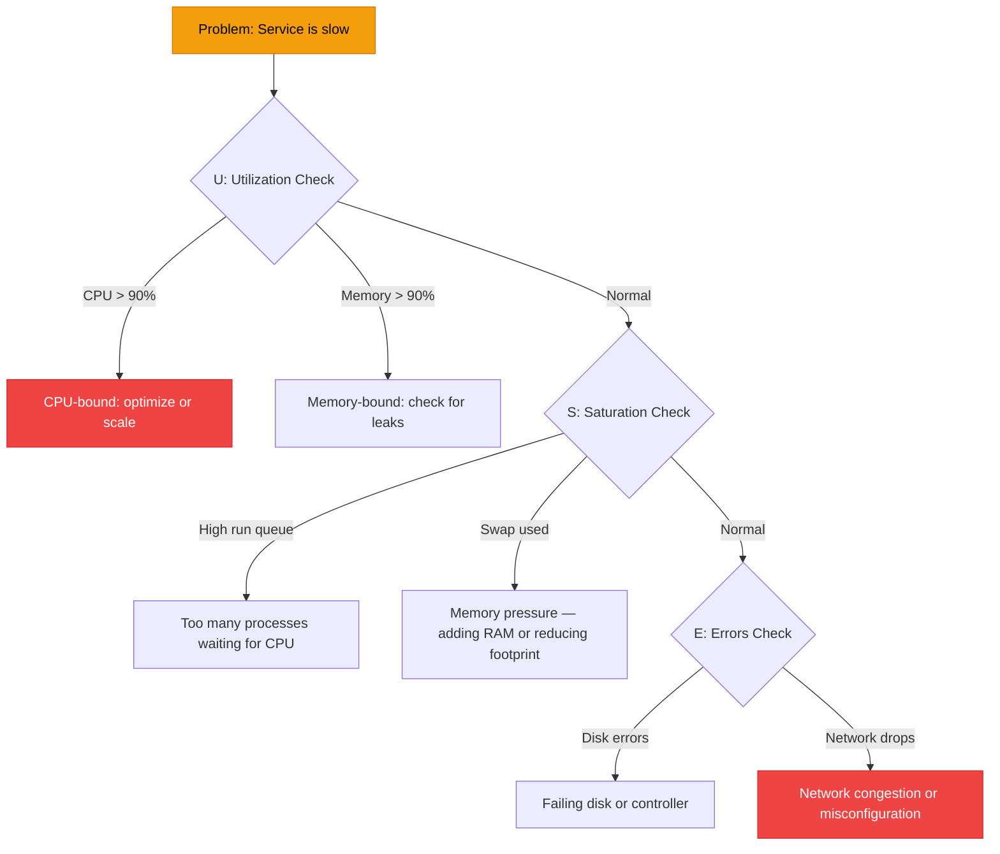

# Linux Troubleshooting Methodology

:::level simple

**Don't guess. Measure.** The difference between a junior engineer who panics and a senior engineer who calmly resolves an incident is methodology. Systematic troubleshooting beats intuition every time.

When something is slow or broken, don't start changing random settings. Follow a method: check utilization, check saturation, check errors. Then dig deeper with the right tools.

:::

:::level core

## The USE Method



### Quick Diagnostics Commands

```bash
# CPU
top -bn1 | head -5           # CPU utilization
uptime                        # Load average (1, 5, 15 min)

# Memory
free -h                       # Memory overview
vmstat 1 5                    # Virtual memory stats

# Disk
df -h                         # Disk space
iostat -x 1                   # Disk I/O stats

# Network
ss -s                         # Socket summary
netstat -i                    # Interface errors/drops

# System
dmesg | tail -30              # Kernel messages (hardware errors!)
journalctl -xe                # Recent system logs
```

## Deep-Dive Tools

```bash
# What files is this process using?
lsof -p $(pgrep nginx)

# Trace system calls (see exactly what a process is doing)
strace -p $(pgrep nginx) -f -e trace=network

# What's consuming disk I/O?
iotop -o
```

:::

---

<Example title="CloudNova Incident: High Load Average">

**Alert:** Load average on web-04 jumped to 25 (normally 2).

```bash
# USE Method:
# U: CPU at 95% — something's burning CPU
top -bn1
# PID 28941 'ffmpeg' using 400% CPU (4 cores)

# What is that process?
ps aux | grep 28941
# It's a transcoding job that shouldn't be on this server

# Who started it?
systemctl status transcoder
# A developer manually ran it for testing and forgot

# Fix: kill the process, send email to developer
kill 28941
```

</Example>

---

## Key Takeaways

- **USE Method:** Check Utilization → Saturation → Errors — in that order.
- **`dmesg`** reveals hardware and kernel-level issues invisible to `top`.
- **`strace`** shows exactly what a process is doing — invaluable for "it hangs" bugs.
- **Don't guess, measure.** Half of troubleshooting is asking the right questions.

---

## Spaced Repetition

Review: Day 1, Day 3, Day 7, Day 14, Day 30, Day 90
