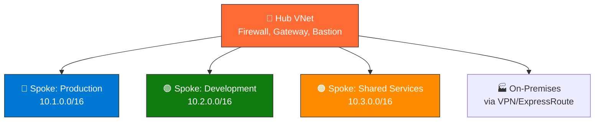
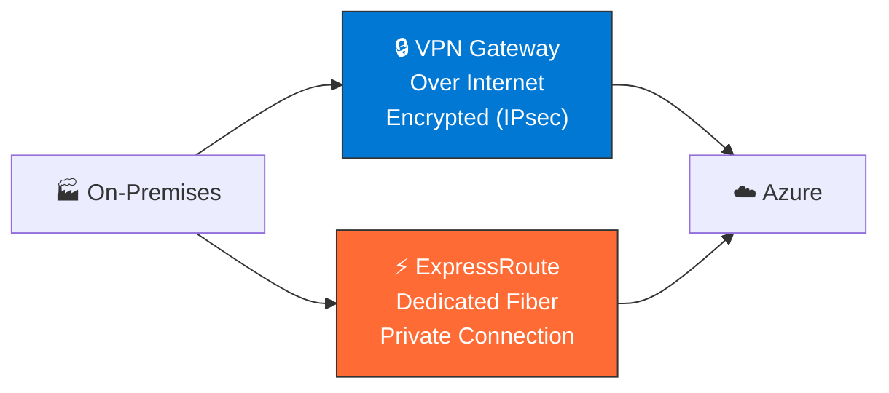
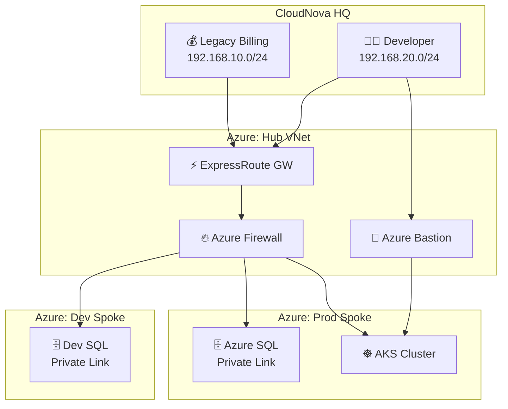
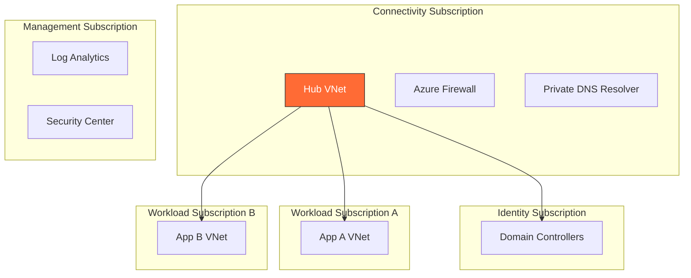

import { Info, Warning, Tip, BestPractice, Example, Exercise, Quiz, CodeBlock, TerminalBlock, Flashcard, ProductionNote, ArchitectureNote, InterviewQuestion } from '@site/src/components/shared/InteractiveBlocks';

## Learning Objectives

By the end of this lesson, you will:
- Design hub-spoke network architectures in Azure
- Configure VNet peering and understand transit routing
- Differentiate VPN Gateway from ExpressRoute
- Secure hybrid connectivity with Private Link and Azure Bastion
- Map hybrid networking to AZ-104 exam objectives

---

## Simple Explanation

**Think of hybrid networking like a company with multiple office buildings.**

Your on-premises data center is the **headquarters**. Azure is a **new branch office**. You need:
1. **Private roads** between buildings (VNet Peering)
2. **Secure tunnels** under public streets (VPN Gateway)
3. **Dedicated fiber lines** for critical traffic (ExpressRoute)
4. **Security checkpoints** at every entrance (NSGs, Azure Firewall)

That's hybrid networking — connecting your existing world to the cloud, securely and reliably.

---

## Core Explanation

### The Hub-Spoke Model

The hub VNet hosts **shared services**: Azure Firewall, VPN Gateway, Azure Bastion. Spoke VNets contain your workloads. All traffic flows through the hub.

### VNet Peering

| Feature | Description |
|---------|-------------|
| **Regional Peering** | VNets in the same Azure region |
| **Global Peering** | VNets in different regions |
| **Gateway Transit** | Spoke uses hub's VPN Gateway |
| **Service Chaining** | Route traffic through an NVA |
| **Cost** | Ingress + egress data transfer |

<CodeBlock language="bash">
{`# Create VNet peering with Azure CLI
az network vnet peering create \\
  --name hub-to-spoke-prod \\
  --resource-group cloudnova-networking \\
  --vnet-name hub-vnet \\
  --remote-vnet spoke-prod-vnet \\
  --allow-gateway-transit \\
  --allow-forwarded-traffic`}
</CodeBlock>

---

## Professional Explanation

### VPN Gateway vs ExpressRoute

| Aspect | VPN Gateway | ExpressRoute |
|--------|------------|--------------|
| **Path** | Public internet | Private fiber |
| **Bandwidth** | Up to 10 Gbps | Up to 100 Gbps |
| **Latency** | Variable | Consistent, low |
| **SLA** | 99.9% | 99.95% |
| **Setup time** | Minutes | Weeks (carrier) |
| **Cost** | Pay-as-you-go | Monthly commitment |
| **Use case** | Dev/test, backup | Production, mission-critical |

### Private Link vs Service Endpoints

<ProductionNote>
**Real-world distinction:** Service Endpoints extend your VNet to Azure services over the Azure backbone (still a public endpoint). Private Link brings the service **into** your VNet with a private IP. Private Link is the gold standard for security-sensitive workloads.
</ProductionNote>

| Feature | Service Endpoint | Private Link |
|---------|-----------------|--------------|
| **Connectivity** | Azure backbone | Private IP in VNet |
| **Access from on-prem?** | Only via forced tunneling | Yes, natively |
| **Data exfiltration risk** | Possible | Eliminated |
| **Cost** | Free | Per endpoint + data |

---

## Production Explanation

### CloudNova: Connecting HQ to Azure

<ArchitectureNote title="CloudNova Hybrid Architecture">
**Scenario:** CloudNova needs to migrate their customer-facing applications to Azure while keeping their legacy billing system on-premises.

**Requirements:**
- Billing system (on-prem) must communicate with Azure databases securely
- Developers need secure access to VMs without public IPs
- Production and development environments must be isolated

**Solution:** Hub-spoke with ExpressRoute + Azure Bastion + Private Link
</ArchitectureNote>

### Configuring ExpressRoute (Conceptual)

<TerminalBlock>
{`# 1. Create ExpressRoute circuit (contact your carrier)
az network express-route create \\
  --name CloudNova-ER \\
  --resource-group cloudnova-networking \\
  --bandwidth 1Gbps \\
  --provider "Equinix" \\
  --location "East US"

# 2. Create ExpressRoute Gateway in the hub VNet
az network vnet-gateway create \\
  --name hub-er-gateway \\
  --resource-group cloudnova-networking \\
  --vnet hub-vnet \\
  --gateway-type ExpressRoute \\
  --sku ErGw1AZ

# 3. Link circuit to gateway
az network express-route gateway-connection create \\
  --name CloudNova-to-Azure \\
  --resource-group cloudnova-networking \\
  --gateway-name hub-er-gateway \\
  --express-route-circuit-name CloudNova-ER`}
</TerminalBlock>

---

## Architect Explanation

### Designing for Scale: Enterprise Landing Zones

**Key principles:**
1. **Subscription segmentation** — connectivity, identity, management, workloads
2. **Hub-spoke across subscriptions** — hub in connectivity sub, spokes in workload subs
3. **Route tables enforce** — all traffic through Azure Firewall
4. **Private DNS zones** — linked to hub for centralized name resolution

<BestPractice>
**Azure Virtual WAN** is the evolution of hub-spoke for large enterprises. It provides any-to-any transitive connectivity, automated spoke configuration, and integrated routing.
</BestPractice>

---

## Hands-On Exercise

<Exercise title="Design a Hybrid Network" time="30 minutes">

Your task at CloudNova: Design the hybrid network for a new microservices application.

**Requirements:**
1. Production AKS cluster in East US, DR in West Europe
2. On-premises CI/CD server must deploy to both
3. PostgreSQL must be accessible only from AKS (not public internet)
4. Developers need SSH access without exposing VMs to internet

**Deliverables:**
1. Architecture diagram (Mermaid or draw.io)
2. List of Azure networking resources needed
3. Estimated monthly networking cost

<Quiz question="Which connectivity option should CloudNova use between their on-prem CI/CD and Azure for production deployments requiring consistent low latency?">
- VPN Gateway (site-to-site)
- *ExpressRoute*
- VNet Peering
- Azure Bastion
</Quiz>

<Quiz question="How should CloudNova secure PostgreSQL access from AKS?">
- Network Security Group rule allowing AKS subnet
- Public endpoint with firewall rules
- *Private Link with private endpoint in AKS subnet*
- Service Endpoint with VNet ACL
</Quiz>

</Exercise>

---

## Interview Preparation

<InterviewQuestion level="senior" company="CloudNova">

**Q: When would you choose ExpressRoute over a site-to-site VPN?**

**Strong answer:**
"I evaluate based on four criteria:

1. **Bandwidth requirements** — VPN maxes at 10 Gbps with active-active; ExpressRoute goes to 100 Gbps
2. **Latency sensitivity** — VPN adds 15-30ms over public internet; ExpressRoute is consistent at 5-10ms
3. **Compliance** — Some regulations require data never traverse public internet (finance, government)
4. **Cost-benefit** — ExpressRoute has 12-36 month commitments; VPN is pay-as-you-go

For a dev/test environment, VPN is fine. For production trading platforms, ExpressRoute is worth every dollar. At CloudNova, I'd use VPN for the office and ExpressRoute for the colocation data center."

</InterviewQuestion>

<InterviewQuestion level="architect">

**Q: Explain how Private Link eliminates data exfiltration risks.**

**Answer:**
"Service Endpoints allow any outbound connection from the VNet to the service's public IP — meaning a compromised VM could exfiltrate data to a different tenant's storage account. Private Link gives the service a private IP in your VNet. There's no route to the service's public endpoint from that subnet. Combined with NSG rules and Azure Policy that denies public endpoints, data cannot leave through that path."

</InterviewQuestion>

---

## Flashcard Review

<Flashcard front="What is VNet peering gateway transit?" back="A hub VNet with a VPN/ExpressRoute gateway can share it with peered spoke VNets, allowing spokes to reach on-premises through the hub's gateway." />

<Flashcard front="ExpressRoute vs VPN: which has better SLA?" back="ExpressRoute: 99.95% (dedicated fiber). VPN Gateway: 99.9% for active-passive, 99.95% for active-active." />

<Flashcard front="What does Azure Private Link eliminate?" back="Data exfiltration risk — the PaaS service gets a private IP in your VNet with no public exposure." />

---

## Active Recall

1. Draw the hub-spoke architecture from memory. Label all shared services.
2. Explain the difference between VNet peering, VPN Gateway, and ExpressRoute to a junior engineer.
3. Write the AZ CLI command to peer two VNets with gateway transit.
4. When would you use Azure Virtual WAN instead of manual hub-spoke?

---

## Feynman Exercise

**Explain "hybrid cloud networking" to a frontend developer who only knows HTTP.**

Write your explanation in 3-4 sentences. Use no networking jargon beyond "IP address" and "encryption."

---

## Related Content

| Resource | Link |
|----------|------|
| Previous lesson: Network Security | [Lesson 6](06-network-security) |
| Next lesson: Troubleshooting Lab | [Lesson 8](08-troubleshooting-lab) |
| Project: CloudNova Secure Infrastructure | [Project 3](../../projects/03-azure-infrastructure) |
| AZ-104: Implement Virtual Networks | [Exam objective](../../certifications/az-104/vnet) |
