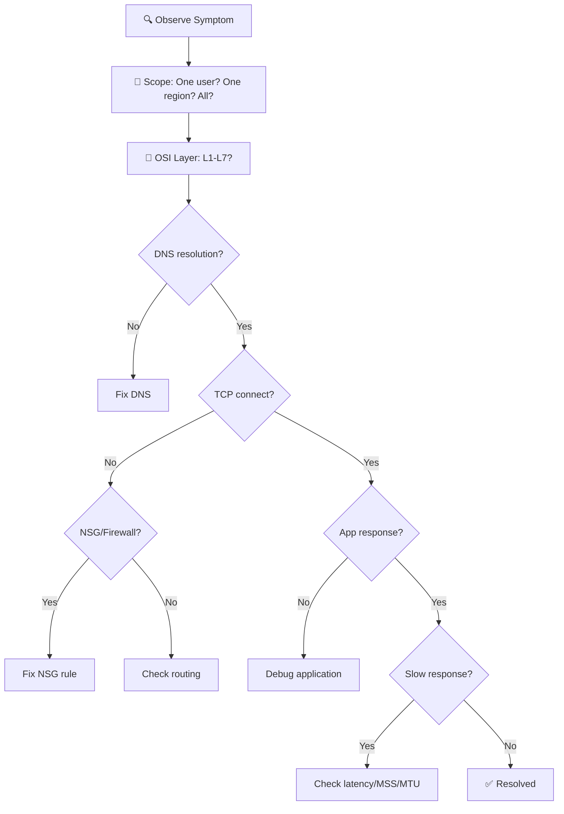

import { Info, Warning, Tip, BestPractice, Example, Exercise, Quiz, CodeBlock, TerminalBlock, Flashcard, ProductionNote, ArchitectureNote, InterviewQuestion } from '@site/src/components/shared/InteractiveBlocks';

## Learning Objectives

By the end of this lab, you will:
- Diagnose connectivity issues using a systematic methodology
- Use Network Watcher tools: Connection Troubleshoot, NSG Diagnostics, Packet Capture
- Troubleshoot DNS resolution problems with `nslookup` and `dig`
- Analyze TCP handshake issues with `tcpdump` and Wireshark
- Resolve real-world networking incidents at CloudNova

---

## The Troubleshooting Methodology

<BestPractice>
**Always start at the lowest layer and work up.** If DNS is broken, TCP handshake analysis is a waste of time. Eliminate layers systematically.
</BestPractice>

---

## Lab Scenario 1: The Mysterious Timeout

<TerminalBlock>
{`# CloudNova Incident #CN-2024-0317
# The production web app cannot reach the PostgreSQL database.
# DevOps escalated to you. Let's troubleshoot.

# Step 1: Verify DNS — is postgres.cloudnova.internal resolvable?
nslookup postgres.cloudnova.internal
# Output: Server: 10.0.0.5
#         Address: postgres.cloudnova.internal → 10.1.2.100 ✅ DNS works

# Step 2: Check TCP connectivity to port 5432
nc -zv 10.1.2.100 5432
# Output: nc: connect to 10.1.2.100 port 5432 (tcp) failed: Connection timed out
# ❌ No TCP connection — no RST, no response

# Step 3: Check NSG rules on the database subnet
az network nsg rule list \\
  --resource-group cloudnova-prod \\
  --nsg-name db-subnet-nsg \\
  --query "[?destinationPortRange=='5432']" \\
  --output table

# Output: No rules for port 5432 found! 
# ❌ Someone deleted the NSG rule during a "cleanup" script`}
</TerminalBlock>

### Analysis

| Step | Finding | Conclusion |
|------|---------|------------|
| DNS resolution | ✅ Resolved correctly | DNS is fine |
| TCP connect | ❌ Timed out | Something is dropping packets |
| NSG rules | ❌ Port 5432 rule missing | **Root cause found** |

<Info>
**Why no RST?** An NSG deny rule silently drops packets. The default NSG rule blocks all inbound traffic unless explicitly allowed. No rule for 5432 = silent drop = TCP SYN timeout.
</Info>

### Resolution

<TerminalBlock>
{`# Add the missing NSG rule
az network nsg rule create \\
  --resource-group cloudnova-prod \\
  --nsg-name db-subnet-nsg \\
  --name allow-app-subnet-postgres \\
  --priority 100 \\
  --direction Inbound \\
  --protocol Tcp \\
  --source-address-prefixes 10.0.1.0/24 \\
  --source-port-ranges '*' \\
  --destination-address-prefixes 10.1.2.0/24 \\
  --destination-port-ranges 5432

# Verify connectivity restored
nc -zv 10.1.2.100 5432
# Output: Connection to 10.1.2.100 port 5432 [tcp/postgresql] succeeded! ✅`}
</TerminalBlock>

---

## Lab Scenario 2: The Intermittent DNS

<TerminalBlock>
{`# CloudNova Incident #CN-2024-0328
# The AKS pods randomly can't resolve storage.blob.core.windows.net.
# It works 80% of the time, fails 20%.

# Step 1: Check DNS resolution from a failing pod
kubectl exec -it pod/app-backend-7d8f9 -- nslookup storage.blob.core.windows.net

# Output (successful attempt):
# Server: 10.0.0.10
# Address: storage.blob.core.windows.net → 20.150.38.124

# Output (failing attempt):
# Server: 10.0.0.10
# ** server can't find storage.blob.core.windows.net: SERVFAIL

# Step 2: Check if custom DNS server is dropping queries under load
az network nic show-effective-route-table \\
  --resource-group cloudnova-prod \\
  --name aks-node-0-nic \\
  --output table

# Output shows custom DNS server 10.0.0.10 forwarding to Azure DNS

# Step 3: Check the custom DNS forwarder VM
az monitor metrics list \\
  --resource /subscriptions/.../virtualMachines/dns-forwarder \\
  --metric "Percentage CPU" \\
  --time-grain PT1M \\
  --output table

# Output: CPU averaging 95% during failure windows! 
# ❌ DNS forwarder is overloaded`}
</TerminalBlock>

### Root Cause

The custom DNS forwarder VM (Standard_B1s — 1 vCPU, 1 GB RAM) is undersized for 200+ pods making DNS queries. Under load, it drops queries → intermittent SERVFAIL.

### Resolution

<ProductionNote>
**Fix:** Scale the DNS forwarder to Standard_B2ms (2 vCPU, 8 GB RAM) AND deploy a second instance behind an internal load balancer. Better yet, migrate to Azure DNS Private Resolver — a fully-managed service.
</ProductionNote>

---

## Lab Scenario 3: Packet Capture Deep Dive

<Warning>
Only capture the minimum packets needed. Capturing at the VM level captures all traffic and can impact performance. Filter aggressively.
</Warning>

<TerminalBlock>
{`# Scenario: TLS handshake fails between web app and internal API
# Symptom: "SSL connection error" in app logs
# Let's capture packets to see what's happening

# Option A: Azure Network Watcher Packet Capture (GUI or CLI)
az network watcher packet-capture create \\
  --resource-group cloudnova-prod \\
  --name tls-debug-capture \\
  --vm app-server-01 \\
  --storage-account cloudnovadiag \\
  --filters '[{"protocol":"TCP","remoteIPAddress":"10.1.3.50","remotePort":"443"}]' \\
  --time-limit 120

# Option B: tcpdump on the VM itself
tcpdump -i eth0 -w /tmp/tls-debug.pcap \\
  'host 10.1.3.50 and port 443' &
TCPDUMP_PID=$!

# Trigger the failing request
curl -v https://10.1.3.50/api/health

# Stop capture
kill $TCPDUMP_PID

# Analyze with tcpdump
tcpdump -r /tmp/tls-debug.pcap -A | head -40
# Look at the TLS ClientHello and ServerHello messages`}
</TerminalBlock>

### What to Look For

| Packet | What to Check |
|--------|---------------|
| TCP SYN | Is it reaching the server? |
| TCP SYN-ACK | Is the server responding? |
| TLS ClientHello | Which TLS versions and ciphers? |
| TLS ServerHello | Did server accept the cipher? |
| TCP RST | Abrupt disconnect — why? |
| TLS Alert | Specific error (e.g., `handshake_failure`, `certificate_unknown`) |

<Example title="Real TLS Debugging">
If you see `TLS Alert: handshake_failure`, the client and server cannot agree on a cipher suite. Check:
1. Are both sides using TLS 1.2+?
2. Did the server's certificate expire?
3. Is the client's CA trust store missing the server's CA?
</Example>

---

## Hands-On Challenge

<Exercise title="Incident Response Simulation" time="45 minutes">

You are the on-call Cloud Engineer at CloudNova. Three incidents arrive simultaneously.

### Incident A: "App is slow"
- Production web app response time: 50ms → 3000ms
- Affects all users, all regions
- Deployed a new version 1 hour ago

### Incident B: "Cannot deploy"
- CI/CD pipeline can't SSH into build agents
- Error: `ssh: connect to host 10.0.5.20 port 22: Connection refused`
- Worked yesterday

### Incident C: "DNS broken"
- Some pods resolve `database.internal` but not `cache.internal`
- Kubernetes cluster, Azure CNI networking
- Started after CoreDNS config change

**Your task:** For each incident, write:
1. Your first diagnostic command
2. Your working hypothesis
3. The triage order (which to investigate first?)

<Quiz question="Which incident should you investigate FIRST?">
- Incident A: App is slow (affects all users)
- *Incident A: App is slow (business impact is highest)*
- Incident B: Cannot deploy (developers blocked)
- Incident C: DNS broken (some services affected)
</Quiz>

</Exercise>

---

## Your Troubleshooting Toolkit

| Tool | Purpose | Command |
|------|---------|---------|
| `nslookup`/`dig` | DNS resolution | `nslookup hostname` |
| `ping` | Basic connectivity (ICMP) | `ping -c 4 10.0.0.1` |
| `traceroute`/`tracert` | Path discovery | `traceroute -n 10.0.0.1` |
| `nc` (netcat) | TCP/UDP port testing | `nc -zv host port` |
| `curl -v` | HTTP/TLS debugging | `curl -v https://host` |
| `tcpdump` | Packet capture | `tcpdump -i eth0 -w file.pcap host X` |
| `ss`/`netstat` | Socket state | `ss -tlnp` |
| Network Watcher | Azure diagnostics | `az network watcher ...` |
| NSG Diagnostics | NSG rule evaluation | Portal or `az network watcher ...` |

---

## Active Recall

1. From memory, draw the troubleshooting flowchart. What three questions do you ask first?
2. Explain the difference between "connection timed out" and "connection refused."
3. What command checks if a TCP port is open from the command line?
4. How do you determine if a problem is DNS vs network connectivity?

---

## Feynman Exercise

Explain "how to troubleshoot a network problem" to someone who has never used a terminal. Use no technical jargon.

---

## Flashcard Review

<Flashcard front="Connection timed out vs Connection refused" back="Timed out = no response at all (firewall drop). Refused = destination actively said no (no service listening)." />

<Flashcard front="What does NSG Diagnostics show?" back="Which NSG rule allowed or denied specific traffic flow, useful when debugging connectivity issues." />

<Flashcard front="First 3 things to check in any network incident" back="1) DNS resolution, 2) TCP connectivity (TCP handshake), 3) Application-layer response" />

---

## Related Content

| Resource | Link |
|----------|------|
| Previous lesson: Hybrid Networking | [Lesson 7](07-hybrid-networking) |
| AZ-104: Monitor Networks | [Exam objective](../../certifications/az-104/network-monitoring) |
| Project: CloudNova Monitoring | [Project 8](../../projects/08-monitoring-stack) |
