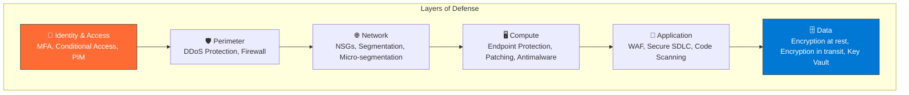
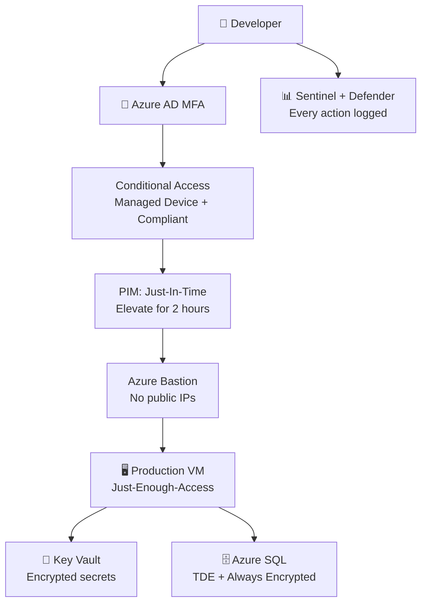

import {
  Info,
  Warning,
  Tip,
  BestPractice,
  Example,
  Exercise,
  Quiz,
  CodeBlock,
  TerminalBlock,
  Flashcard,
  ProductionNote,
  ArchitectureNote,
  InterviewQuestion,
} from "@site/src/components/shared/InteractiveBlocks";

## Learning Objectives

By the end of this lesson, you will:

- Understand the Shared Responsibility Model for IaaS, PaaS, SaaS
- Apply Defense-in-Depth across all layers
- Explain Zero Trust principles
- Identify Azure's core security services
- Map security concepts to AZ-900 and AZ-104 objectives

---

## Simple Explanation

**Security in the cloud is a partnership.**

In a physical data center, you lock doors, install cameras, and guard racks. In the cloud, Microsoft secures the building, the servers, and the hypervisors. **You** secure your data, your identities, and your configurations.

You and Microsoft share responsibility. What you're responsible for depends on what service you're using. More managed services = less you secure. Less managed = more you secure.

---

## Core Explanation

### The Shared Responsibility Model

```mermaid
graph LR
    subgraph "On-Premises"
        O1["Application"]
        O2["Data"]
        O3["Runtime"]
        O4["Middleware"]
        O5["OS"]
        O6["Virtualization"]
        O7["Servers"]
        O8["Storage"]
        O9["Networking"]
    end

    subgraph "IaaS"
        I1["Application"]
        I2["Data"]
        I3["Runtime"]
        I4["Middleware"]
        I5["OS"]
    end

    subgraph "PaaS"
        P1["Application"]
        P2["Data"]
    end

    subgraph "SaaS"
        S1[""]
    end

    style O1 fill:#0078d4,color:#fff
    style O2 fill:#0078d4,color:#fff
    style O3 fill:#0078d4,color:#fff
    style O4 fill:#0078d4,color:#fff
    style O5 fill:#0078d4,color:#fff
    style I1 fill:#0078d4,color:#fff
    style I2 fill:#0078d4,color:#fff
    style I3 fill:#0078d4,color:#fff
    style I4 fill:#0078d4,color:#fff
    style I5 fill:#0078d4,color:#fff
    style P1 fill:#0078d4,color:#fff
    style P2 fill:#0078d4,color:#fff
    style S1 fill:#aaa
```

| Service              | You Handle                                       | Microsoft Handles                         |
| -------------------- | ------------------------------------------------ | ----------------------------------------- |
| **IaaS** (VMs)       | OS, patches, runtime, data, apps, network config | Physical, hypervisor, networking hardware |
| **PaaS** (Azure SQL) | Data, application code, access policies          | OS, patches, runtime, physical            |
| **SaaS** (M365)      | User access, data classification                 | Everything else                           |

---

## Professional Explanation

### Defense-in-Depth



**Principle:** If one layer fails, the next one catches the attacker. Never rely on a single control.

<ProductionNote>
  **Real-world example:** An attacker bypasses your perimeter firewall (Layer 2). Network
  segmentation (Layer 3) limits them to one subnet. Compute controls (Layer 4) block lateral
  movement. Data encryption (Layer 6) makes stolen data useless. Defense-in-depth turns a single
  failure into a contained incident.
</ProductionNote>

### Zero Trust: "Never Trust, Always Verify"

| Traditional Model            | Zero Trust Model                   |
| ---------------------------- | ---------------------------------- |
| Trusted internal network     | No trusted network                 |
| Perimeter firewall is enough | Verify every request               |
| Once inside, full access     | Least privilege per session        |
| VPN = trusted                | Device health + identity + context |

<BestPractice>
  **Three Zero Trust principles:** 1. **Verify explicitly** — authenticate and authorize based on
  all available data (identity, location, device health, service, data classification) 2. **Least
  privilege** — limit access with Just-In-Time (JIT) and Just-Enough-Access (JEA) 3. **Assume
  breach** — segment networks, encrypt data, monitor continuously
</BestPractice>

---

## Production Explanation

### CloudNova Security Architecture

<ArchitectureNote title="CloudNova Security Design">
  **Background:** CloudNova handles customer payment data. They must comply with PCI-DSS. A security
  architect designed the following controls.
</ArchitectureNote>



**Controls in play (each layer):**

1. **Identity:** MFA, Conditional Access (managed device), PIM for time-bound elevation
2. **Perimeter:** Azure DDoS Protection, Azure Front Door with WAF
3. **Network:** NSGs, Private Link for all PaaS, no public endpoints
4. **Compute:** Azure Bastion (no RDP/SSH exposed), Defender for Cloud, automatic patching
5. **Data:** TDE + Always Encrypted, Key Vault with HSM, backup with immutability

---

## Architect Explanation

### Azure Security Services Map

| Service                       | Layer       | Purpose                                 |
| ----------------------------- | ----------- | --------------------------------------- |
| **Azure AD**                  | Identity    | Authentication, Conditional Access, PIM |
| **Defender for Cloud**        | All         | Unified security posture management     |
| **Azure Policy**              | Governance  | Enforce rules, audit compliance         |
| **Azure Firewall**            | Network     | L3-L7 stateful firewall                 |
| **WAF (Application Gateway)** | Application | OWASP Top 10 protection                 |
| **Key Vault**                 | Data        | Secrets, keys, certificates             |
| **Sentinel**                  | All         | SIEM — collect, detect, respond         |
| **DDoS Protection**           | Perimeter   | Volumetric and application-layer DDoS   |

### Security Through Automation

<TerminalBlock>
{`# CloudNova: Enforce security with Azure Policy
# Policy: "Require encryption at rest for all storage accounts"

az policy definition create \\
--name require-storage-encryption \\
--rules '{
"if": {
"field": "type",
"equals": "Microsoft.Storage/storageAccounts"
},
"then": {
"effect": "deny"
}
}' \\
--params '{}'

# Assign to subscription

az policy assignment create \\
--name enforce-storage-encryption \\
--policy require-storage-encryption \\
--scope /subscriptions/cloudnova-prod

# Now any attempt to create a storage account without encryption is DENIED

# Policy is automated, auditable, and enforced at the ARM level`}

</TerminalBlock>

<Info>
  **Azure Policy prevents mistakes before they happen.** It evaluates every ARM request against your
  rules. "Deny" blocks non-compliant resources. "Audit" logs them for review. "DeployIfNotExists"
  auto-fixes them.
</Info>

---

## Hands-On Exercise

<Exercise title="Design Defense-in-Depth" time="20 minutes">

CloudNova's new microservice handles credit card data. Design the security controls.

**Requirements:**

- Developer access must be time-limited
- Database must never be on public internet
- All access must be logged
- Encryption everywhere (transit and rest)
- Must detect suspicious access patterns

**Tasks:**

1. List one Azure service per defense layer
2. Draw the access flow from developer to database
3. Identify which PCI-DSS requirements each control addresses

<Quiz question="Which service provides Just-In-Time VM access?">
  - Azure AD Conditional Access - Azure Bastion - *Microsoft Defender for Cloud (JIT VM Access)* -
  Azure Key Vault
</Quiz>

</Exercise>

---

## Flashcard Review

<Flashcard
  front="What is the Shared Responsibility Model?"
  back="Cloud provider secures the cloud (physical, network, hypervisor). You secure what's IN the cloud (data, identities, apps, OS config). Division depends on IaaS/PaaS/SaaS."
/>

<Flashcard
  front="Name the 7 layers of Defense-in-Depth"
  back="1) Physical, 2) Identity & Access, 3) Perimeter, 4) Network, 5) Compute, 6) Application, 7) Data"
/>

<Flashcard
  front="What are the 3 Zero Trust principles?"
  back="Verify explicitly, Use least privilege, Assume breach"
/>

---

## Interview Preparation

<InterviewQuestion level="senior">

**Q: Walk me through securing a new cloud-native application from scratch.**

**Answer:** "I start with identity — every entity (human, service, device) authenticates via Azure AD with MFA and Conditional Access. Then network — all PaaS services behind Private Link, no public endpoints, NSGs default-deny. Compute — Azure Bastion for admin access, Defender for Cloud for threat detection. Data — encryption at rest via platform-managed keys (or customer-managed for compliance), encryption in transit via TLS 1.2+. Finally governance — Azure Policy to deny non-compliant resources, Sentinel for SIEM, and regular penetration testing."

</InterviewQuestion>

---

## Related Content

| Resource                       | Link                                                   |
| ------------------------------ | ------------------------------------------------------ |
| Next lesson: Identity & Access | [Lesson 2](02-identity-access)                         |
| AZ-900: Security & Compliance  | [Exam objective](../../certifications/az-900/security) |
| SC-900: Security Fundamentals  | [Certification](../../certifications/sc-900)           |
