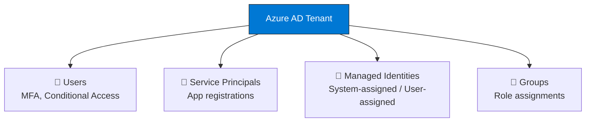
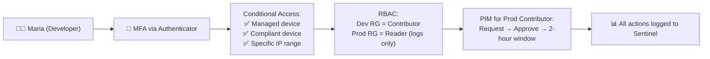

import { Info, Warning, Tip, BestPractice, Example, Exercise, Quiz, CodeBlock, TerminalBlock, Flashcard, ProductionNote, ArchitectureNote, InterviewQuestion } from '@site/src/components/shared/InteractiveBlocks';

## Learning Objectives

By the end of this lesson, you will:
- Understand Azure AD vs on-prem AD
- Apply RBAC at management group, subscription, resource group, and resource scopes
- Use Managed Identities to eliminate service principal secrets
- Configure Conditional Access policies
- Implement Just-In-Time access with PIM

---

## Simple Explanation

**Identity is the new perimeter.**

In the old world, the office network was the perimeter. If you were inside the office, you were trusted. In the cloud, there is no office network. Your identity IS your security boundary.

Every request — from a user, a VM, a container, or a managed service — must prove who it is before getting access to anything.

---

## Core Explanation

### Azure AD: The Identity Backbone

| Concept | What It Is |
|---------|-----------|
| **User** | A human with credentials (password, MFA, FIDO2) |
| **Service Principal** | An identity for an application or automation |
| **Managed Identity** | A service principal that Azure manages for you — **no secrets!** |
| **Group** | Collection of users/service principals |
| **Role** | A set of permissions (e.g., "Reader", "Contributor") |



### RBAC: Who Can Do What

<BestPractice>
**RBAC follows the principle of least privilege.** Assign the minimum role needed, at the narrowest scope possible.
</BestPractice>

| Scope | Example | Use When |
|-------|---------|----------|
| Management Group | All subscriptions under "Production" | Policy for entire org |
| Subscription | "CloudNova Production" | Billing, global settings |
| Resource Group | "webapp-rg" | All resources of one app |
| Resource | One specific VM | Granular access |

<CodeBlock language="bash">
{`# Assign Reader role to a developer at resource group scope
az role assignment create \\
  --assignee maria@cloudnova.com \\
  --role "Reader" \\
  --resource-group webapp-rg

# Maria can see everything in webapp-rg but cannot modify anything
# This is least privilege: she doesn't need write access to read logs`}
</CodeBlock>

---

## Professional Explanation

### Managed Identities: The Secret Killer

<ProductionNote>
**Never store credentials in code or config files.** The #1 cloud security mistake is hardcoded connection strings and API keys. Managed Identities eliminate this problem entirely.
</ProductionNote>

```mermaid
sequenceDiagram
    participant VM as ☁️ VM with Managed Identity
    participant IMDS as Azure Instance Metadata Service<br/>(169.254.169.254)
    participant AAD as Azure AD
    participant KV as Key Vault
    
    VM->>IMDS: "Who am I? Give me a token for Key Vault"
    IMDS->>AAD: Request token for VM's identity
    AAD-->>IMDS: JWT access token
    IMDS-->>VM: Here's your token
    VM->>KV: "GET /secrets/db-password"<br/>Authorization: Bearer &lt;token&gt;
    KV-->>VM: db-password: "xYz..."
    
    Note over VM,KV: No secrets stored anywhere!<br/>Azure handles authentication transparently.
```

| Type | Lifecycle | Use Case |
|------|-----------|----------|
| **System-assigned** | Tied to resource lifecycle | One resource = one identity |
| **User-assigned** | Independent lifecycle | Share identity across resources |

<CodeBlock language="bash">
{`# Enable system-assigned managed identity on a VM
az vm identity assign \\
  --name app-server-01 \\
  --resource-group cloudnova-prod

# Now grant it access to Key Vault
az keyvault set-policy \\
  --name cloudnova-kv \\
  --object-id <vm-principal-id> \\
  --secret-permissions get list

# The VM can now read secrets from Key Vault
# WITHOUT any connection string, password, or certificate in its code!`}
</CodeBlock>

---

## Production Explanation

### CloudNova: Securing Developer Access

<ArchitectureNote title="CloudNova Developer Access Flow">
CloudNova has 50 developers. They need:
- Read access to production logs (but NOT to customer data)
- Write access to development resources
- No standing access to production resources
- All access must be logged for SOC 2 compliance
</ArchitectureNote>



### Conditional Access Policies

| Policy Component | CloudNova Configuration |
|-----------------|----------------------|
| **Assignments** | All developers |
| **Cloud apps** | Azure Management, Azure DevOps |
| **Conditions** | Require managed device, compliant device, trusted IP |
| **Grant** | Require MFA |
| **Session** | Sign-in frequency: every 8 hours |

<TerminalBlock>
{`# CloudNova Incident #CN-2024-0402
# Maria reports: "I can access dev but not prod logs!"
# Troubleshooting RBAC:

# Check Maria's role assignments
az role assignment list \\
  --assignee maria@cloudnova.com \\
  --output table

# Output:
# Scope                          Role
# /subscriptions/.../dev-rg      Contributor      ✅
# /subscriptions/.../prod-rg     Reader           ✅

# Looks correct. Check if the storage account has a deny assignment:
az role assignment list \\
  --scope /subscriptions/.../prod-rg/providers/Microsoft.Storage/storageAccounts/prodlogs \\
  --output table

# No role assignments! The Reader role was assigned at RG level
# but storage account data plane requires explicit data role!
# Fix: Assign "Storage Blob Data Reader" at the storage account scope`}
</TerminalBlock>

<Warning>
**Control plane vs Data plane.** RBAC roles like "Reader" grant access to Azure resource metadata (names, settings, tags). Accessing actual data (blobs, SQL rows, Key Vault secrets) requires **data plane roles** like "Storage Blob Data Reader".
</Warning>

---

## Hands-On Exercise

<Exercise title="Design IAM for CloudNova Microservice" time="25 minutes">

A new microservice at CloudNova needs:
1. Read secrets from Key Vault
2. Write blobs to Storage Account
3. Query an Azure SQL Database

**Tasks:**
1. What type of identity should the microservice use? (System-assigned MI? User-assigned MI? Service Principal with secret?)
2. What RBAC roles does it need at each resource?
3. Write the Azure CLI commands to grant these permissions.

<Quiz question="The best identity type for an AKS pod that needs Key Vault access is:">
- Service Principal with client secret
- *Workload Identity (federated Managed Identity)*
- Storage account key
- Connection string in ConfigMap
</Quiz>

</Exercise>

---

## Flashcard Review

<Flashcard front="Control plane vs Data plane access" back="Control plane (Reader/Contributor) manages Azure resources. Data plane (Storage Blob Data Reader) accesses data stored inside the resource. They are SEPARATE permissions." />

<Flashcard front="Why use Managed Identity instead of a service principal secret?" back="No secret to store, rotate, or leak. Azure handles authentication transparently via the IMDS endpoint." />

<Flashcard front="What is PIM?" back="Privileged Identity Management — time-bound, approval-based elevation to privileged roles. No standing access." />

---

## Interview Preparation

<InterviewQuestion level="professional">

**Q: How do you manage secrets in production?**

**Answer:** "I use Managed Identities wherever possible — AKS Workload Identity for pods, system-assigned MI for VMs and App Services. For secrets that can't use MI (like third-party API keys), I store them in Key Vault with access policies scoped to the MI. Key Vault auto-rotates keys. Nothing is ever in code, config files, or environment variables in plain text."

</InterviewQuestion>

---

## Related Content

| Resource | Link |
|----------|------|
| Previous lesson: Security Fundamentals | [Lesson 1](01-security-fundamentals) |
| Next lesson: Network Security | [Lesson 3](03-network-security) |
| AZ-104: Manage Identities | [Exam objective](../../certifications/az-104/identity) |
