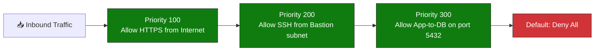
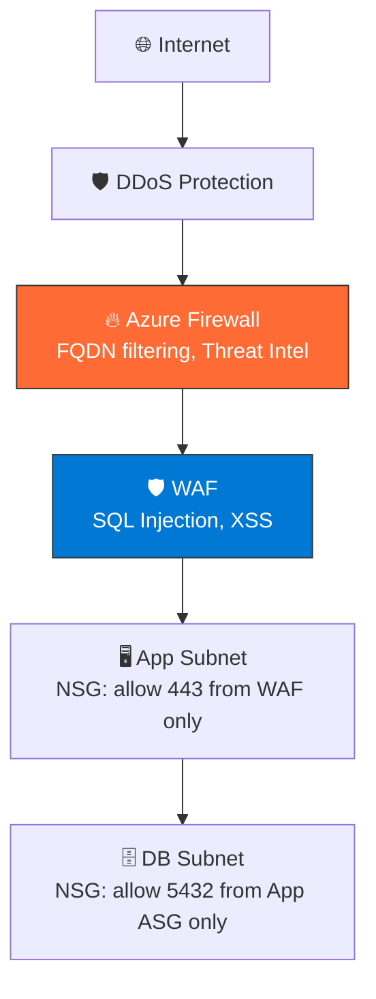

import { Info, Warning, Tip, BestPractice, Example, Exercise, Quiz, CodeBlock, TerminalBlock, Flashcard, ProductionNote, ArchitectureNote, InterviewQuestion } from '@site/src/components/shared/InteractiveBlocks';

## Learning Objectives

By the end of this lesson, you will:
- Design NSG rules with service tags and ASGs
- Configure Azure Firewall for centralized traffic control
- Protect web applications with WAF rules against OWASP Top 10
- Understand DDoS protection tiers
- Implement network micro-segmentation

---

## Simple Explanation

**Network security is like layered castle defense.**

- **NSGs** are the guards at each door — who can enter each room
- **Azure Firewall** is the castle wall and main gate — all traffic must pass through
- **WAF** is the customs officer — inspects what's inside each visitor's bags
- **DDoS Protection** is the moat — absorbs massive crowds before they reach the gate

Each layer catches what the previous one missed.

---

## Core Explanation

### NSGs: Stateful Packet Filtering at the Subnet/NIC Level

**Rules are processed by priority (100 → 65000). The first match wins.** Default rules (65500) deny everything.

### Application Security Groups (ASGs)

<BestPractice>
**Use ASGs instead of IP addresses in NSG rules.** ASGs group VMs by function. When a VM's role changes, update its ASG — not all your NSG rules.
</BestPractice>

<CodeBlock language="bash">
{`# Create ASGs for CloudNova's three-tier app
az network asg create --name web-servers --resource-group cloudnova-prod
az network asg create --name app-servers --resource-group cloudnova-prod
az network asg create --name db-servers --resource-group cloudnova-prod

# Now write ONE NSG rule that allows web→app on port 8080
az network nsg rule create \\
  --nsg-name app-nsg \\
  --name allow-web-to-app \\
  --priority 200 \\
  --source-asgs web-servers \\
  --destination-asgs app-servers \\
  --destination-port-ranges 8080

# If you add a new web server, just add it to the web-servers ASG
# No NSG rule changes needed!`}
</CodeBlock>

---

## Professional Explanation

### Azure Firewall vs NSGs

| Aspect | NSG | Azure Firewall |
|--------|-----|----------------|
| **Scope** | Subnet or NIC | VNet or hub (all spokes) |
| **Layer** | L3-L4 (IP + port) | L3-L7 (full application) |
| **State** | Stateful | Stateful + threat intelligence |
| **Logging** | Flow logs | Full firewall logs |
| **Cost** | Free | ~$900/month + data |
| **Use when** | Simple allow/deny | Centralized control, FQDN filtering, threat intel |

### WAF: Protecting Web Applications

| OWASP Rule | Attack | WAF Protection |
|------------|--------|---------------|
| SQL Injection | `' OR 1=1 --` | Inspects query parameters for SQL patterns |
| XSS | `` | Strips/encodes script tags |
| Path Traversal | `../../etc/passwd` | Blocks directory traversal |
| Command Injection | `; rm -rf /` | Blocks shell metacharacters |

<ProductionNote>
**CloudNova incident:** A pentest found an XSS vulnerability in their customer portal. The WAF blocked it immediately — the vulnerability still existed in code, but the WAF prevention meant zero customer impact while the dev team patched it. WAF bought them time.
</ProductionNote>

---

## Production Explanation  

### CloudNova: DDoS Mitigation

<TerminalBlock>
{`# CloudNova Incident #CN-2024-0415
# 03:47 AM: PagerDuty alert — production API latency spike
# Azure Monitor shows 500x spike in incoming connections

# Step 1: Check DDoS Protection telemetry
az network public-ip show \\
  --name api-gateway-pip \\
  --resource-group cloudnova-prod \\
  --query "ddosSettings"

# Output: "protectionMode": "Enabled" ✅
# DDoS Protection Standard is auto-mitigating

# Step 2: Check mitigation reports
# Portal → DDoS Protection → Mitigation reports
# Shows: 47 Gbps volumetric attack → Scrubbed to 0 Gbps
# SYN flood → Rate-limited by DDoS Protection

# Step 3: Verify app still working
curl -s -o /dev/null -w "%{http_code}" https://api.cloudnova.com/health
# 200 ✅ — DDoS Protection absorbed the attack transparently
# Users noticed nothing`}
</TerminalBlock>

<Info>
**DDoS Protection Standard costs ~$2,944/month and covers 100 public IPs.** It provides always-on monitoring, automatic mitigation, and attack analytics. For a production SaaS, it pays for itself in one prevented outage.
</Info>

---

## Hands-On Exercise

<Exercise title="Secure CloudNova's E-Commerce App" time="30 minutes">

**Scenario:** CloudNova is launching an e-commerce platform. Design the network security.

**Requirements:**
1. Public-facing web frontend (HTTPS only)
2. Internal REST API (no public access)
3. PostgreSQL database (only API can access)
4. Protection against SQL injection, XSS, and DDoS

**Tasks:**
1. Draw the network architecture with all security layers
2. Write pseudocode NSG rules for each subnet
3. Specify WAF rule set and custom rules
4. Estimate monthly security costs

<Quiz question="What's the most cost-effective DDoS protection for a single production API with one public IP?">
- DDoS Protection Standard (covers 100 IPs)
- *WAF with Application Gateway (includes L7 DDoS mitigation)*
- Nothing — Azure's basic DDoS is enough
- Cloudflare Free tier
</Quiz>

</Exercise>

---

## Flashcard Review

<Flashcard front="NSG priority: which number wins?" back="Lower number = higher priority. 100 wins over 200. First match in priority order applies. Default deny-all is priority 65500." />

<Flashcard front="ASG vs IP-based NSG rules" back="ASGs group VMs by function (web, app, db). NSG rules reference ASGs instead of IPs. Add/remove VMs from ASG without touching NSG rules." />

<Flashcard front="Three layers of network protection in Azure" back="1) DDoS Protection (volumetric), 2) NSG/Azure Firewall (packet filtering), 3) WAF (application-layer attacks: SQLi, XSS)" />

---

## Related Content

| Resource | Link |
|----------|------|
| Previous: Identity & Access | [Lesson 2](02-identity-access) |
| Next: Data Protection | [Lesson 4](04-data-protection) |
| AZ-104: Secure Networks | [Exam objective](../../certifications/az-104/network-security) |
