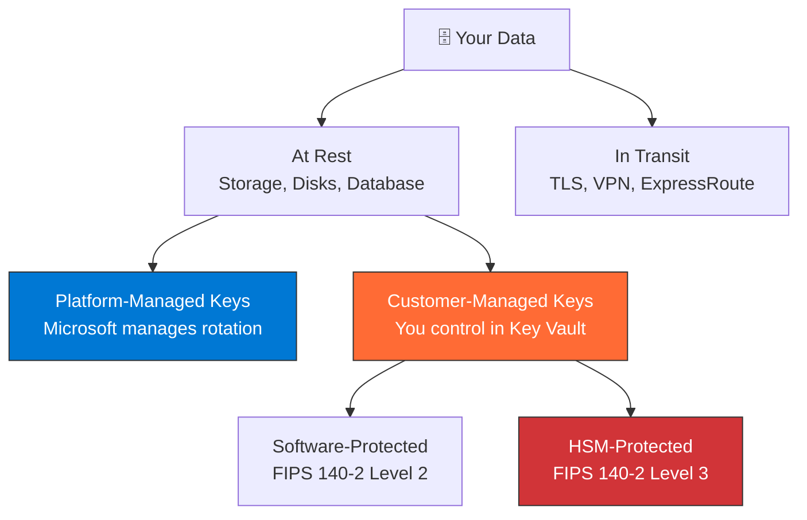
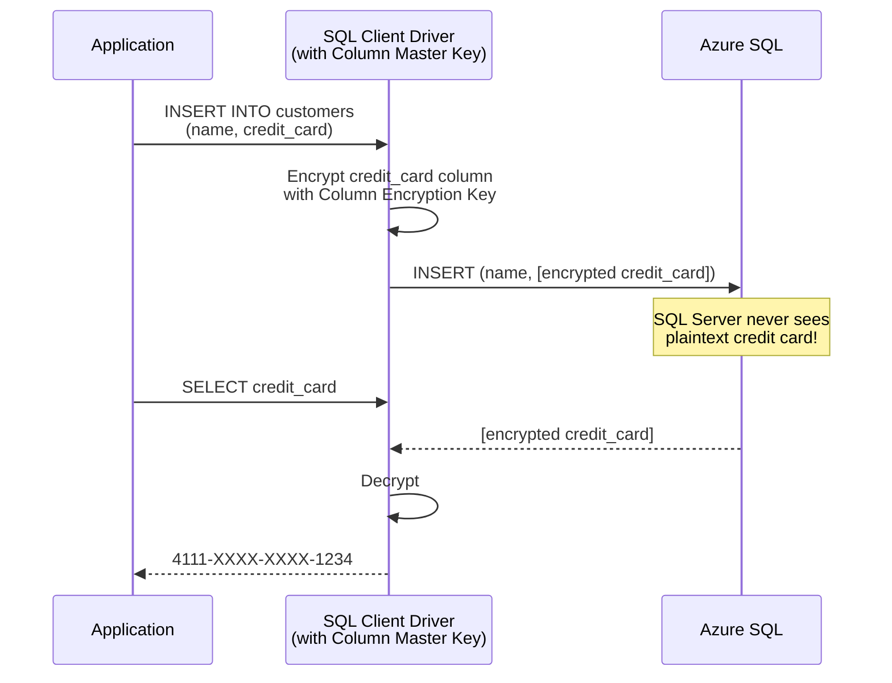

import { Info, Warning, Tip, BestPractice, Example, Exercise, Quiz, CodeBlock, TerminalBlock, Flashcard, ProductionNote, ArchitectureNote, InterviewQuestion } from '@site/src/components/shared/InteractiveBlocks';

## Learning Objectives

By the end of this lesson, you will:
- Differentiate encryption at rest vs encryption in transit
- Manage encryption keys with Key Vault (software-protected, HSM-protected, customer-managed)
- Apply Azure Disk Encryption to VMs
- Configure TDE and Always Encrypted for Azure SQL
- Implement immutable storage for compliance

---

## Simple Explanation

**Encryption is locking your data.**

- **At rest** — data sitting on a disk. If someone steals the disk, they can't read it without the key.
- **In transit** — data moving across the network. If someone intercepts the packets, they're scrambled.
- **Key Vault** — the safe where you keep your keys. Only authorized identities can open it.

Every Azure storage service encrypts data at rest **by default**. Your job is to manage the keys correctly.

---

## Core Explanation

### The Encryption Landscape

| Approach | Who manages keys? | Compliance level | Cost |
|----------|-------------------|-----------------|------|
| **Platform-Managed** | Microsoft auto-rotates | Standard (SOC 2) | Free |
| **Customer-Managed (software)** | You in Key Vault | PCI-DSS, HIPAA | Key Vault $ |
| **Customer-Managed (HSM)** | You in dedicated HSM | FIPS 140-2 Level 3 | Key Vault Premium + HSM $ |

### Encryption in Transit

<BestPractice>
**TLS 1.2 minimum for all connections. TLS 1.0/1.1 are deprecated.** Azure Storage and SQL can enforce minimum TLS version.
</BestPractice>

<CodeBlock language="bash">
{`# Enforce TLS 1.2 on a storage account
az storage account update \\
  --name cloudnovadata \\
  --resource-group cloudnova-prod \\
  --min-tls-version TLS1_2

# Now the storage account rejects TLS 1.0 and 1.1 connections
# Any legacy client using older TLS gets: "The TLS version is not permitted"`}
</CodeBlock>

---

## Professional Explanation

### Azure Disk Encryption (VMs)

<ProductionNote>
Azure Disk Encryption uses BitLocker (Windows) or DM-Crypt (Linux) to encrypt VM OS and data disks. Keys are stored in Key Vault. Even if someone copies the VHD file, they can't mount it without the key.
</ProductionNote>

<TerminalBlock>
{`# Enable Azure Disk Encryption on a Linux VM
# 1. Create Key Vault with encryption support
az keyvault create \\
  --name cloudnova-encryption-kv \\
  --resource-group cloudnova-prod \\
  --enabled-for-disk-encryption true

# 2. Encrypt the VM
az vm encryption enable \\
  --resource-group cloudnova-prod \\
  --name payment-processor-vm \\
  --disk-encryption-keyvault cloudnova-encryption-kv \\
  --volume-type ALL

# 3. Verify encryption status
az vm encryption show \\
  --resource-group cloudnova-prod \\
  --name payment-processor-vm
# Output: "osDisk": "Encrypted", "dataDisk": "Encrypted"`}
</TerminalBlock>

### SQL Database: TDE vs Always Encrypted

| Feature | Transparent Data Encryption (TDE) | Always Encrypted |
|---------|----------------------------------|-----------------|
| **What it protects** | Data at rest (files on disk) | Data in use (columns in memory) |
| **Transparent to app?** | Yes, fully transparent | No — requires client driver |
| **Protects from DBA?** | No (DBA can query) | Yes (DBA sees ciphertext) |
| **Performance impact** | Minimal | Some overhead |
| **Use case** | General encryption | PII, credit cards, healthcare |

---

## Production Explanation

### CloudNova: PCI-DSS Compliance for Payment Data

<ArchitectureNote title="CloudNova Payment Processing Security">
CloudNova handles credit card data and must comply with PCI-DSS.
</ArchitectureNote>

| PCI-DSS Requirement | Azure Implementation |
|--------------------|---------------------|
| 3.4 — Render PAN unreadable | Always Encrypted for credit_card column |
| 3.5 — Protect encryption keys | Key Vault with HSM |
| 4.1 — Encrypt over open networks | TLS 1.2 enforced on all endpoints |
| 8.2 — Unique authentication | Managed Identity for all service-to-service |
| 10.1 — Audit access | Sentinel + Key Vault logging |

### Immutable Storage (WORM)

<Warning>
**Once written, cannot be deleted or modified for the retention period.** Use for legal holds, compliance, and ransomware protection.
</Warning>

<TerminalBlock>
{`# Create immutable storage policy for compliance
az storage account blob-service-properties update \\
  --account-name cloudnovacompliance \\
  --resource-group cloudnova-prod \\
  --enable-versioning true

# Set time-based retention: 7 years
az storage container immutability-policy create \\
  --account-name cloudnovacompliance \\
  --container-name financial-records \\
  --period 2555  # 7 years in days

# Now: no one — not even the subscription owner —
# can delete or modify blobs in this container for 7 years`}
</TerminalBlock>

---

## Hands-On Exercise

<Exercise title="Design Data Protection Strategy" time="25 minutes">

CloudNova stores three types of data. Design the encryption approach for each.

| Data Type | Example | Requirements |
|-----------|---------|--------------|
| Public content | Blog posts, product images | Basic protection |
| Customer PII | Email, address, preferences | GDPR compliance |
| Payment data | Credit cards, bank accounts | PCI-DSS Level 1 |

**Tasks:**
1. Choose encryption approach for each data type (PMK, CMK, HSM)
2. Specify which columns use Always Encrypted
3. Write a Key Vault access policy for the payment processor
4. Estimate monthly Key Vault costs

</Exercise>

---

## Flashcard Review

<Flashcard front="Platform-managed vs Customer-managed keys" back="PMK: Microsoft manages keys, auto-rotates, free. CMK: You control keys in Key Vault, you manage rotation, required for PCI-DSS/HIPAA." />

<Flashcard front="TDE vs Always Encrypted" back="TDE encrypts database files on disk (transparent). Always Encrypted encrypts specific columns in memory (DBA can't see plaintext)." />

<Flashcard front="What is immutable storage (WORM)?" back="Write Once, Read Many. Blobs cannot be deleted or modified for a set retention period. Used for compliance, legal holds, ransomware protection." />

---

## Interview Preparation

<InterviewQuestion level="senior">

**Q: How do you protect sensitive customer data in a SaaS application?**

**Answer:** "Layered approach. At rest — Azure Storage and SQL encrypt by default; I use CMK in Key Vault for compliance flexibility. For payment data, Always Encrypted ensures the database never sees plaintext. In transit — TLS 1.2 enforced everywhere, with Azure Policy blocking older versions. Access — Managed Identities for all services, zero standing access for humans. Finally, immutable backups with soft-delete in Key Vault protect against both attackers and accidents."

</InterviewQuestion>

---

## Related Content

| Resource | Link |
|----------|------|
| Previous: Network Security | [Lesson 3](03-network-security) |
| Next: Security Monitoring | [Lesson 5](05-security-monitoring) |
| AZ-104: Data Protection | [Exam objective](../../certifications/az-104/data-protection) |
