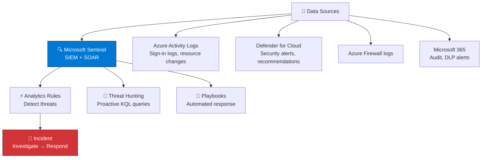
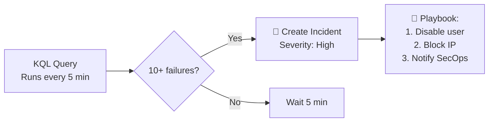
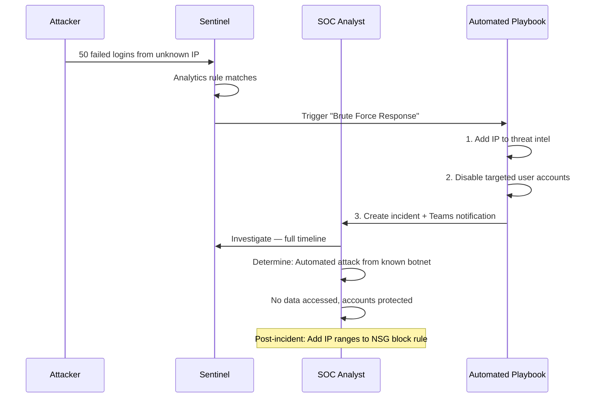

import { Info, Warning, Tip, BestPractice, Example, Exercise, Quiz, CodeBlock, TerminalBlock, Flashcard, ProductionNote, ArchitectureNote, InterviewQuestion } from '@site/src/components/shared/InteractiveBlocks';

## Learning Objectives

By the end of this lesson, you will:
- Configure Microsoft Sentinel as a cloud-native SIEM
- Use Defender for Cloud to assess security posture
- Write KQL queries for threat hunting
- Understand security incident response workflows
- Map to SC-200 certification objectives

---

## Simple Explanation

**Security monitoring is like having security cameras AND guards watching them 24/7.**

- **Defender for Cloud** evaluates your posture — "Is this door locked? Is this window patched?"
- **Sentinel** watches the live feeds — "Someone just tried 100 passwords on this account!"
- **KQL** is how you ask questions — "Show me all failed logins from Russia in the last hour."

Without monitoring, you won't know you're breached until the ransom note appears.

---

## Core Explanation

### The Security Monitoring Stack

### Defender for Cloud: Your Security Score

| Feature | What It Does |
|---------|-------------|
| **Secure Score** | Numeric score (0-100%) measuring compliance with best practices |
| **Recommendations** | "Enable disk encryption," "Apply NSG to subnet," "Enable MFA" |
| **Regulatory Compliance** | Map controls to PCI-DSS, SOC 2, ISO 27001, NIST, CIS |
| **Just-In-Time VM Access** | Time-bound, approval-based RDP/SSH access |
| **Adaptive Application Controls** | Allow-list what apps can run on VMs |

---

## Professional Explanation

### Sentinel Analytics: Detecting Threats

<ProductionNote>
**Sentinel analytics rules query data continuously.** When a rule matches, it creates an incident. You can also create
automated playbooks (Logic Apps) that respond immediately — like disabling a compromised user account or isolating a VM.
</ProductionNote>

<TerminalBlock>
{`// KQL: Detect brute-force attempts — 10+ failed logins in 5 minutes
SigninLogs
| where ResultType == "50057"  // Failed due to wrong password
| where TimeGenerated > ago(1h)
| summarize FailedAttempts = count() 
    by UserPrincipalName, IPAddress, bin(TimeGenerated, 5m)
| where FailedAttempts > 10
| project TimeGenerated, UserPrincipalName, IPAddress, FailedAttempts
| order by FailedAttempts desc`}
</TerminalBlock>

### Proactive Threat Hunting

<CodeBlock language="kql" title="Hunt: Unusual sign-in locations">
{`// Detect impossible travel — user signs in from two distant locations
// within a timeframe that makes physical travel impossible
SigninLogs
| where ResultType == 0  // Successful sign-in
| where TimeGenerated > ago(24h)
| summarize 
    Locations = make_set(Location),
    FirstSeen = min(TimeGenerated),
    LastSeen = max(TimeGenerated)
    by UserPrincipalName
| where array_length(Locations) > 1
| project UserPrincipalName, Locations, 
    TimeBetween = LastSeen - FirstSeen`}
</CodeBlock>

<Example title="Real-World Hunt Result">
An accountant signed in from London at 10:05 AM and from Tokyo at 10:17 AM. Impossible travel (12-hour flight in 12 minutes). Sentinel detected it and created a high-severity incident. Investigation revealed: **credential compromise**. The attacker was using a VPN to appear in Tokyo while the real user was in London.
</Example>

---

## Production Explanation

### CloudNova Incident Response

<ArchitectureNote title="CloudNova SOC Playbook">
CloudNova's Security Operations Center uses Sentinel to detect and respond to threats.
</ArchitectureNote>

<TerminalBlock>
{`# CloudNova: Query all security incidents from last 24 hours
# Run in Log Analytics / Sentinel workspace

SecurityIncident
| where TimeGenerated > ago(24h)
| summarize 
    Total = count(),
    High = countif(Severity == "High"),
    Medium = countif(Severity == "Medium"),
    Low = countif(Severity == "Low")
| project Total, High, Medium, Low

# Output:
# Total: 47, High: 2, Medium: 12, Low: 33
# Two high-severity incidents need immediate attention`}
</TerminalBlock>

---

## Hands-On Exercise

<Exercise title="Threat Hunting at CloudNova" time="30 minutes">

**Scenario:** You're the SOC analyst on call. Three alerts fired:

1. **Alert A:** "Impossible travel detected" — User `sarah@cloudnova.com` signed in from New York and Beijing within 30 minutes
2. **Alert B:** "Suspicious resource creation" — 200 VMs created in Central US at 3 AM
3. **Alert C:** "Data exfiltration detected" — 50 GB outbound from a dev VM to an unknown IP

**Tasks:**
1. Triage: which alert do you investigate first? Why?
2. Write a KQL query to investigate Alert B — find who created the VMs
3. Design the playbook response for Alert C

<Quiz question="Which alert is highest priority?">
- Alert A: Impossible travel (credential compromise)
- *Alert C: Data exfiltration (active data loss)*
- Alert B: Suspicious VM creation (cost risk)
</Quiz>

</Exercise>

---

## Flashcard Review

<Flashcard front="What is Microsoft Sentinel?" back="Cloud-native SIEM + SOAR. Collects security data from all sources, detects threats with analytics rules, and automates response with playbooks." />

<Flashcard front="What does Defender for Cloud's Secure Score measure?" back="How well your Azure resources comply with security best practices. 0-100%. Each recommendation you fix increases the score." />

<Flashcard front="KQL: what does 'ago()' do?" back="Returns a datetime relative to now. ago(1h) = one hour ago. ago(7d) = seven days ago." />

---

## Interview Preparation

<InterviewQuestion level="senior">

**Q: Walk me through building a threat detection pipeline.**

**Answer:** "I connect all data sources to Sentinel — Azure Activity Logs, sign-in logs, firewall logs, and Defender for Cloud alerts. Then I create analytics rules for known attack patterns: brute force (>10 failures in 5 min), impossible travel, privilege escalation, and data exfiltration (>1 GB outbound to unknown IP). Each rule maps to a MITRE ATT&CK technique. Automated playbooks handle low-risk responses (block IP, disable user). High-severity incidents go to the SOC with full timeline and entity mapping. I review and tune rules monthly based on false positive rates."

</InterviewQuestion>

---

## Related Content

| Resource | Link |
|----------|------|
| Previous: Data Protection | [Lesson 4](04-data-protection) |
| Next: Compliance & Governance | [Lesson 6](06-compliance-governance) |
| SC-200: Security Operations | [Certification](../../certifications/sc-200) |
