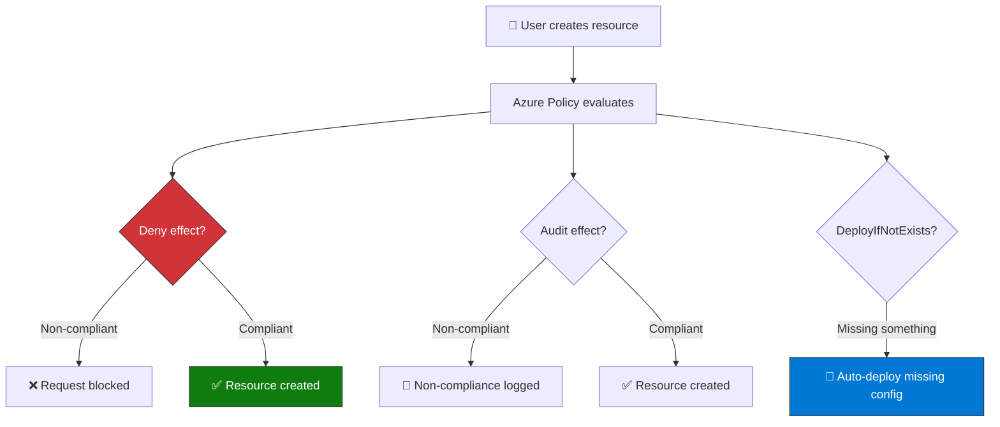
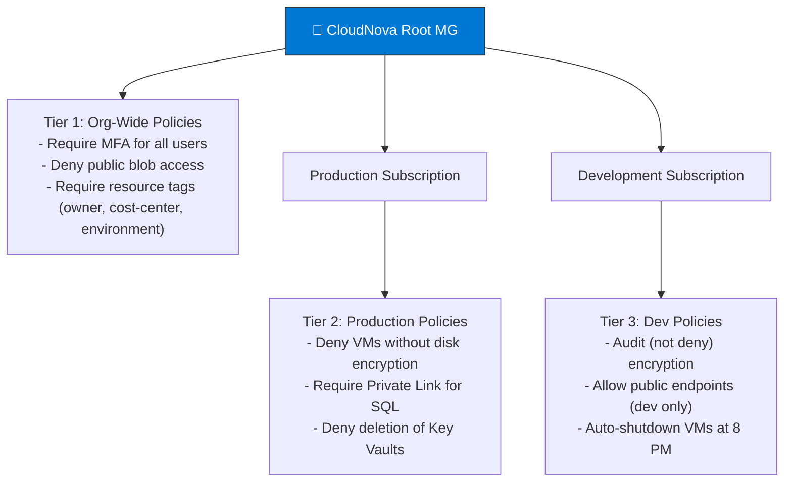

import { Info, Warning, Tip, BestPractice, Example, Exercise, Quiz, CodeBlock, TerminalBlock, Flashcard, ProductionNote, ArchitectureNote, InterviewQuestion } from '@site/src/components/shared/InteractiveBlocks';

## Learning Objectives

By the end of this lesson, you will:
- Write and assign Azure Policies to enforce compliance
- Use Azure Blueprints for standardized deployments
- Understand regulatory compliance frameworks (PCI-DSS, HIPAA, SOC 2, ISO 27001)
- Query resources at scale with Azure Resource Graph
- Implement a governance framework from scratch

---

## Simple Explanation

**Governance is the rulebook for your cloud.**

Just like a city has building codes (policy), approved blueprints (templates), and inspectors (compliance checks), your Azure environment needs rules that prevent mistakes from becoming security incidents.

Without governance, you'll find VMs without encryption, storage accounts open to the internet, and resources with no owner — chaos.

---

## Core Explanation

### Azure Policy: Prevent, Audit, or Auto-Fix

| Effect | What Happens | Use Case |
|--------|-------------|----------|
| **Deny** | Blocks non-compliant request | No storage accounts without encryption |
| **Audit** | Logs non-compliance, allows creation | Track resources missing tags |
| **AuditIfNotExists** | Checks for related resource | Is diagnostic logging enabled? |
| **DeployIfNotExists** | Auto-deploys missing config | Auto-enable Defender on new VMs |
| **Modify** | Changes resource properties | Add tag with creation date |

<CodeBlock language="bash">
{`# Policy: Deny storage accounts that don't enforce HTTPS
az policy definition create \\
  --name deny-non-https-storage \\
  --rules '{
    "if": {
      "allOf": [
        {"field": "type", "equals": "Microsoft.Storage/storageAccounts"},
        {"field": "Microsoft.Storage/storageAccounts/supportsHttpsTrafficOnly", "equals": "false"}
      ]
    },
    "then": {"effect": "deny"}
  }'

az policy assignment create \\
  --name enforce-https-storage \\
  --policy deny-non-https-storage \\
  --scope /subscriptions/cloudnova-prod

# Now: any ARM template or CLI command creating a storage account
# with HTTPS disabled will be REJECTED at the API level`}
</CodeBlock>

---

## Professional Explanation

### Regulatory Compliance Dashboard

<ProductionNote>
**Defender for Cloud's Regulatory Compliance dashboard** maps Azure resources to specific compliance controls. For PCI-DSS, it shows exactly which VMs need encryption, which NSGs need tightening, and which storage accounts need auditing — all mapped to PCI-DSS section numbers.
</ProductionNote>

| Framework | Controls Tracked | Common Findings |
|-----------|-----------------|-----------------|
| **PCI-DSS** | 12 requirements | Storage without encryption, NSGs too permissive |
| **SOC 2** | 5 Trust Service Criteria | Missing MFA, no audit logging, unmanaged identities |
| **HIPAA** | Privacy + Security Rules | PHI in unencrypted storage, excessive access |
| **ISO 27001** | 114 controls in Annex A | Missing asset management, no change control |
| **CIS Benchmark** | 200+ Azure-specific controls | Default settings, excessive permissions |

### Azure Resource Graph: Query Everything

<TerminalBlock>
{`# Find all storage accounts open to public internet
az graph query -q '
Resources
| where type == "microsoft.storage/storageaccounts"
| where properties.networkAcls.defaultAction != "Deny"
| project name, resourceGroup, 
    isPublic = "YES ❌", 
    subscriptionId
' --output table

# Output:
# Name             ResourceGroup       isPublic
# cloudnovadata    prod-rg             YES ❌
# cloudnovabackup  prod-rg             YES ❌
# devlogs          dev-rg              YES ❌

# 3 storage accounts exposed — need immediate remediation!`}
</TerminalBlock>

---

## Production Explanation

### CloudNova Governance Framework

<ArchitectureNote title="CloudNova's Three-Tier Governance">
CloudNova implemented governance at three levels: Management Group (org-wide), Subscription (environment-specific), Resource Group (application-specific).
</ArchitectureNote>

### Tagging Strategy

<BestPractice>
**Mandatory tags for every resource:**
- `owner` — who is responsible (email)
- `cost-center` — finance tracking code
- `environment` — prod / staging / dev / test
- `application` — which app this supports

Enforce with Azure Policy **before** you have 10,000 untagged resources.
</BestPractice>

<TerminalBlock>
{`# Policy: Require specific tags on all resource groups
az policy definition create \\
  --name require-resource-group-tags \\
  --rules '{
    "if": {
      "field": "type",
      "equals": "Microsoft.Resources/resourceGroups"
    },
    "then": {
      "effect": "deny",
      "details": {
        "requiredTags": ["owner", "cost-center", "environment"]
      }
    }
  }'

# Now: creating an RG without these tags → DENIED
# az group create --name test-rg → ❌ "Missing required tag: owner"`}
</TerminalBlock>

---

## Hands-On Exercise

<Exercise title="CloudNova Compliance Audit" time="25 minutes">

**Scenario:** CloudNova is preparing for SOC 2 audit. You must:

1. **Query** all resources missing the `owner` tag
2. **Identify** storage accounts without encryption
3. **Create** a policy that auto-tags new resources with `created-by: <username>`
4. **Map** three PCI-DSS requirements to their Azure Policy implementations

<Quiz question="Which policy effect blocks a non-compliant resource BEFORE it's created?">
- *Deny*
- Audit
- DeployIfNotExists
- Modify
</Quiz>

</Exercise>

---

## Flashcard Review

<Flashcard front="Deny vs Audit policy effects" back="Deny: blocks the request entirely (preventive). Audit: allows creation but logs non-compliance (detective). Use Deny for security, Audit for tracking." />

<Flashcard front="What is Azure Resource Graph?" back="Query engine that searches across ALL subscriptions and resource types in a single KQL query. Much faster than looping through each subscription." />

<Flashcard front="Three tiers of CloudNova's governance framework" back="1) Management Group (org-wide policies), 2) Subscription (environment-specific: prod stricter than dev), 3) Resource Group (app-specific)" />

---

## Related Content

| Resource | Link |
|----------|------|
| Previous: Security Monitoring | [Lesson 5](05-security-monitoring) |
| Next: Security Operations Lab | [Lesson 7](07-security-ops-lab) |
| AZ-104: Governance | [Exam objective](../../certifications/az-104/governance) |
