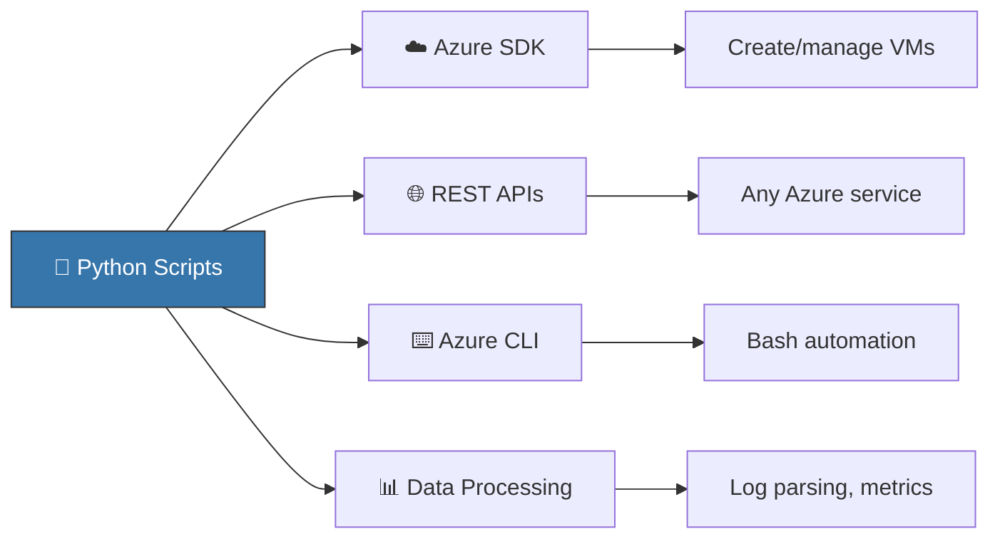

import {
  Info,
  Warning,
  Tip,
  BestPractice,
  Example,
  Exercise,
  Quiz,
  CodeBlock,
  TerminalBlock,
  Flashcard,
  ProductionNote,
  ArchitectureNote,
  InterviewQuestion,
} from "@site/src/components/shared/InteractiveBlocks";

## Learning Objectives

By the end of this lesson, you will:

- Write Python scripts for cloud automation tasks
- Set up isolated virtual environments with `venv`
- Install and manage packages with `pip`
- Understand Python's role in cloud engineering (not software development)
- Build a Python project structure suitable for cloud automation

---

## Simple Explanation

**Python is the cloud engineer's Swiss Army knife.**

You won't build web applications in Python (leave that to developers). You'll use Python for:

- **Automation** — "Delete all orphaned disks across 50 subscriptions"
- **Scripting** — "Parse this 10 GB log file and find the errors"
- **API calls** — "Create 100 VMs from a CSV file using the Azure SDK"
- **Glue code** — "Take output from Terraform, feed it into this monitoring dashboard"

Think of Python as your universal remote control for Azure.

---

## Core Explanation

### Python's Role in Your Cloud Toolkit



### Setting Up Your Python Environment

<BestPractice>
  **Always use virtual environments.** Never install Python packages globally. Each project gets its
  own isolated environment.
</BestPractice>

<TerminalBlock>
{`# Create your cloud-automation project
mkdir cloud-automation && cd cloud-automation

# Create isolated virtual environment

python3 -m venv .venv

# Activate it (Linux/macOS)

source .venv/bin/activate

# (Windows PowerShell)

# .venv\\Scripts\\Activate.ps1

# Now install packages — they only live in this project

pip install azure-identity azure-mgmt-compute azure-mgmt-resource

# Freeze your dependencies for reproducibility

pip freeze > requirements.txt`}

</TerminalBlock>

### Python Quick Refresher

<CodeBlock language="python">
{`# === YOUR CLOUD AUTOMATION TOOLKIT ===

# 1. Working with JSON (every cloud API returns JSON)

import json

config = {
"vm_size": "Standard_D2s_v3",
"regions": ["eastus", "westeurope"],
"tags": {"environment": "prod", "owner": "cloud-team"}
}

# Serialize (send to API)

json_string = json.dumps(config, indent=2)

# Deserialize (API response)

response = '{"status": "Succeeded", "resources": 42}'
data = json.loads(response)
print(data["status"]) # Succeeded

# 2. Working with files (logs, CSVs, templates)

with open("vm_config.json", "r") as f:
template = json.load(f)

# 3. Working with environment variables (secrets!)

import os
subscription_id = os.environ.get("AZURE_SUBSCRIPTION_ID")
# Never hardcode credentials in your script!

# 4. Error handling (cloud APIs fail — handle it)

try:
create_vm(name="web-server-01")
except Exception as e:
print(f"Failed to create VM: {e}")
send_alert(f"VM creation failed: {e}")`}

</CodeBlock>

---

## Professional Explanation

### Cloud Engineer vs Software Engineer: Python Usage

| Aspect             | Software Engineer    | Cloud Engineer                       |
| ------------------ | -------------------- | ------------------------------------ |
| **Goal**           | Build applications   | Automate infrastructure              |
| **Code lifespan**  | Years (maintained)   | Hours to days (run and done)         |
| **Testing**        | Unit tests, CI/CD    | Manual verification often sufficient |
| **Dependencies**   | Minimal (stability)  | Heavy (Azure SDK, `requests`)        |
| **Error handling** | Graceful degradation | Fail fast, alert, let human decide   |
| **Performance**    | Optimize             | Get it done, optimize if needed      |

<ProductionNote>
  **Real CloudNova example:** When CloudNova needed to tag 2,000 resources with cost center IDs, a
  30-line Python script saved 8 hours of manual clicking. The script took 15 minutes to write and 30
  seconds to run. That's the cloud engineering mindset.
</ProductionNote>

### Project Structure

```
cloud-automation/
├── .venv/                  # Virtual environment (never commit)
├── requirements.txt        # Dependencies
├── scripts/
│   ├── tag_resources.py    # One-off automation scripts
│   ├── cleanup_disks.py
│   └── audit_nsg_rules.py
├── modules/                # Reusable helper code
│   ├── azure_auth.py       # Authentication helper
│   └── alerting.py         # Send Teams/Slack alerts
├── data/                   # Input/output CSV/JSON files
│   └── vm_inventory.csv
└── README.md               # What each script does
```

---

## Production Explanation

### CloudNova: Your First Automation

<ArchitectureNote title="Task: Audit all NSG rules across CloudNova's subscriptions">
  The security team needs a weekly report of all NSG rules that allow inbound traffic from the
  internet (0.0.0.0/0).
</ArchitectureNote>

<CodeBlock language="python" title="audit_nsg_rules.py">
{`"""Audit: Find NSG rules allowing inbound traffic from 0.0.0.0/0."""
from azure.identity import DefaultAzureCredential
from azure.mgmt.network import NetworkManagementClient
from azure.mgmt.resource import SubscriptionClient
import csv
from datetime import datetime

# Authenticate (uses your Azure CLI login or Managed Identity)

credential = DefaultAzureCredential()

# Get all subscriptions

sub_client = SubscriptionClient(credential)
dangerous_rules = []

print("🔍 Scanning all subscriptions for open NSG rules...")

for sub in sub_client.subscriptions.list():
network_client = NetworkManagementClient(credential, sub.subscription_id)

    for nsg in network_client.network_security_groups.list_all():
        for rule in nsg.security_rules:
            if (rule.direction == "Inbound"
                and rule.access == "Allow"
                and rule.source_address_prefix == "0.0.0.0/0"
                and rule.destination_port_range in ["22", "3389", "80", "443", "*"]):

                dangerous_rules.append({
                    "subscription": sub.display_name,
                    "nsg_name": nsg.name,
                    "rule_name": rule.name,
                    "port": rule.destination_port_range,
                    "priority": rule.priority
                })

# Write findings to CSV

timestamp = datetime.now().strftime("%Y%m%d*%H%M")
filename = f"data/open_nsg_rules*{timestamp}.csv"
with open(filename, "w", newline="") as f:
writer = csv.DictWriter(f, fieldnames=["subscription", "nsg_name", "rule_name", "port", "priority"])
writer.writeheader()
writer.writerows(dangerous_rules)

print(f"✅ Found {len(dangerous_rules)} dangerous rules → saved to {filename}")
if dangerous_rules:
print("⚠️ Open ports found — review immediately!")`}

</CodeBlock>

---

## Hands-On Exercise

<Exercise title="CloudNova VM Inventory Script" time="20 minutes">

**Task:** Write a Python script that lists all VMs across CloudNova's subscriptions with their size, region, and power state.

**Starter code:**

```python
from azure.identity import DefaultAzureCredential
from azure.mgmt.compute import ComputeManagementClient
from azure.mgmt.resource import SubscriptionClient

# Your code here
```

**Requirements:**

1. Loop through all subscriptions
2. List every VM with: name, resource group, size, region, power state
3. Export to CSV
4. Print summary: "Found 47 VMs, 12 are running, 35 are stopped"

<Quiz question="Which Azure SDK library do you need for VM operations?">
  - azure-mgmt-storage - *azure-mgmt-compute* - azure-mgmt-network - azure-keyvault
</Quiz>

</Exercise>

---

## Flashcard Review

<Flashcard
  front="Why use virtual environments (`venv`)?"
  back="Isolate project dependencies. Avoid conflicts between different projects needing different versions of the same package."
/>

<Flashcard
  front="What does `DefaultAzureCredential()` do?"
  back="Tries multiple authentication methods in order: Managed Identity → Environment variables → Azure CLI login → VS Code login. Write once, works everywhere."
/>

<Flashcard
  front="When should a cloud engineer use Python vs Bash?"
  back="Python: complex logic, API calls, JSON/CSV handling, error handling. Bash: simple CLI commands, file operations, pipeline chains."
/>

---

## Related Content

| Resource                        | Link                                             |
| ------------------------------- | ------------------------------------------------ |
| Next lesson: Azure SDK & APIs   | [Lesson 2](02-azure-sdk-apis)                    |
| Next module: Cloud Fundamentals | [Module 06](../../06-cloud-fundamentals/index)   |
| Project: Python Automation      | [Project 3](../../projects/03-python-automation) |
