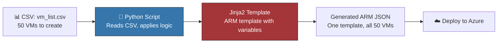

import { Info, Warning, Tip, BestPractice, Example, Exercise, Quiz, CodeBlock, TerminalBlock, Flashcard, ProductionNote, ArchitectureNote, InterviewQuestion } from '@site/src/components/shared/InteractiveBlocks';

## Learning Objectives

By the end of this lesson, you will:
- Use Python + Jinja2 for dynamic ARM template generation
- Understand when Python IaC complements Terraform/Bicep
- Build a bulk provisioning engine from CSV/JSON input
- Compare Python IaC approaches with Bicep and Terraform

---

## Simple Explanation

**Sometimes you need to create things that don't fit a static template.**

Terraform and Bicep are great when you know exactly what you're building. But what if you need to:
- Create 50 resource groups from a spreadsheet?
- Generate NSG rules from a security scan output?
- Provision resources differently based on what already exists?

That's where Python shines — it can **decide** what to create based on logic, not just describe it.

---

## Core Explanation

### Python + Jinja2: Dynamic Templates



<CodeBlock language="python" title="generate_nsg_rules.py">
{'''Generate NSG rules from a CSV security policy."""
import csv
from jinja2 import Template

# Read policy from CSV
with open("data/security_policy.csv") as f:
    rules = list(csv.DictReader(f))

# Jinja2 ARM template
arm_template = Template('''
{
  "$schema": "https://schema.management.azure.com/...",
  "contentVersion": "1.0.0.0",
  "resources": [
    {
      "type": "Microsoft.Network/networkSecurityGroups",
      "apiVersion": "2023-04-01",
      "name": "{{ nsg_name }}",
      "location": "{{ location }}",
      "properties": {
        "securityRules": [
          
          {
            "name": "{{ rule.name }}",
            "properties": {
              "priority": {{ rule.priority }},
              "direction": "{{ rule.direction }}",
              "access": "Allow",
              "protocol": "{{ rule.protocol }}",
              "sourceAddressPrefix": "{{ rule.source }}",
              "destinationPortRange": "{{ rule.port }}"
            }
          },
          
        ]
      }
    }
  ]
}
''')

# Render: fill in template with values
rendered = arm_template.render(
    nsg_name="cloudnova-prod-nsg",
    location="eastus",
    rules=rules
)

# Save to file for deployment
with open("deploy/nsg-template.json", "w") as f:
    f.write(rendered)

print(f"✅ Generated NSG with {len(rules)} rules")'''}
</CodeBlock>

---

## Professional Explanation

### When to Use Python IaC vs Bicep/Terraform

| Scenario | Best Tool | Why |
|----------|-----------|-----|
| Standard deployment of known infrastructure | Bicep/Terraform | Declarative, state-aware |
| Bulk creation from external data source | Python + SDK | Reads CSV/API, applies logic per resource |
| Dynamic naming or tagging based on conditions | Python + SDK | Complex logic easier in Python |
| One-time migration or cleanup | Python + SDK | Script runs once, doesn't need state |
| Environment-specific variations (dev vs prod) | Bicep/Terraform | Native parameterization |
| Generating from existing resources (audit → template) | Python + SDK | Can query Azure, then template |

<BestPractice>
**Don't choose one — use both.** Terraform for core infrastructure that doesn't change. Python scripts for operational tasks, migrations, and dynamic provisioning. They complement each other.
</BestPractice>

---

## Production Explanation

### CloudNova: Multi-Region Deployment Engine

<ArchitectureNote title="Scenario: Deploy Standard Environment to 6 Regions">
CloudNova needs to deploy a standard set of resources (VNet, NSG, AKS cluster) to 6 Azure regions. Each region needs slight variations: naming prefix, address space, VM SKU (some regions don't have certain sizes).
</ArchitectureNote>

<CodeBlock language="python" title="multi_region_deploy.py">
{"""Deploy standardized infrastructure to multiple regions."""
from azure.identity import DefaultAzureCredential
from azure.mgmt.resource import ResourceManagementClient
from jinja2 import Template

credential = DefaultAzureCredential()

# Configuration: what changes per region
regions = [
    {"name": "eastus",      "prefix": "use",  "vnet_cidr": "10.0.0.0/16"},
    {"name": "westeurope",  "prefix": "weu",  "vnet_cidr": "10.1.0.0/16"},
    {"name": "southeastasia","prefix": "sea",  "vnet_cidr": "10.2.0.0/16"},
    {"name": "australiaeast","prefix": "aue",  "vnet_cidr": "10.3.0.0/16"},
    {"name": "japaneast",   "prefix": "jpe",  "vnet_cidr": "10.4.0.0/16"},
    {"name": "brazilsouth",  "prefix": "brs",  "vnet_cidr": "10.5.0.0/16"},
]

# ARM template with Jinja2
bicep_template = open("templates/regional-infra.bicep.j2").read()
template = Template(bicep_template)

for region in regions:
    print(f"🌍 Deploying {region['name']}...")
    
    # 1. Create resource group
    resource_client = ResourceManagementClient(credential, subscription_id)
    resource_client.resource_groups.create_or_update(
        f"cloudnova-{region['prefix']}-rg",
        {"location": region["name"]}
    )
    
    # 2. Render template with region-specific values
    rendered = template.render(**region)
    
    # 3. Deploy (or use Bicep CLI with subprocess)
    # In production, you'd call `az deployment group create` or use SDK deployment APIs
    
    print(f"  ✅ {region['prefix']} infrastructure deployed")

print("\\n🎉 All 6 regions deployed!")`}
</CodeBlock>

---

## Hands-On Exercise

<Exercise title="Build a Bulk Provisioning Script" time="30 minutes">

**Scenario:** CloudNova's dev team needs 15 identical dev environments, each with a unique name from a CSV file.

**CSV input:** `dev_environments.csv`
```csv
name,owner,ttl_days
dev-login,alice,30
dev-payment,bob,14
dev-search,charlie,30
...
```

**Tasks:**
1. Read the CSV file
2. Create resource groups named `dev-{name}-rg`
3. Tag each RG with `owner` and `ttl_days`
4. Log all created RGs to `output/deployment_log.json`

<Quiz question="Which is better for this task: Python SDK or Terraform?">
- Terraform with `for_each`
- *Python SDK — reads CSV, applies logic, logs to JSON*
- Azure CLI in bash
- ARM template with copy loops
</Quiz>

</Exercise>

---

## Flashcard Review

<Flashcard front="What is Jinja2 used for in IaC?" back="Template engine that generates ARM templates, Bicep files, or any config from dynamic data. Fill in variables from CSV/API/database before deployment." />

<Flashcard front="Python IaC vs Bicep: when to use Python?" back="When you need logic (conditions, loops over external data, API calls to other systems) that's hard or impossible in declarative IaC languages." />

---

## Related Content

| Resource | Link |
|----------|------|
| Previous: Azure SDK & APIs | [Lesson 2](02-azure-sdk-apis) |
| Next: Data Processing | [Lesson 4](04-data-processing) |
| Module: Terraform | [Module 12](../../12-terraform/index) |
