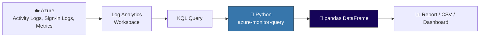

import { Info, Warning, Tip, BestPractice, Example, Exercise, Quiz, CodeBlock, TerminalBlock, Flashcard, ProductionNote, ArchitectureNote, InterviewQuestion } from '@site/src/components/shared/InteractiveBlocks';

## Learning Objectives

By the end of this lesson, you will:
- Parse and analyze Azure activity logs programmatically
- Execute KQL queries from Python and process results
- Use pandas for infrastructure inventory and cost analysis
- Generate automated reports from raw cloud data

---

## Simple Explanation

**The cloud generates petabytes of logs. Python makes sense of them.**

Every VM start, every NSG rule change, every failed login — it's all logged. But raw logs are useless unless you can extract patterns. Python + pandas turns noise into insights:
- "Which VMs have been running 24/7 for the last month?"
- "Who created that rogue resource at 3 AM?"
- "Where are we spending the most money?"

---

## Core Explanation

### Python + KQL: Query Azure Logs

<CodeBlock language="python" title="query_activity_logs.py">
{"""Query Azure Activity Logs from Python."""
from azure.identity import DefaultAzureCredential
from azure.monitor.query import LogsQueryClient
from datetime import datetime, timedelta
import pandas as pd

credential = DefaultAzureCredential()
logs_client = LogsQueryClient(credential)

# KQL: Find all resource deletions in the last 7 days
query = """
AzureActivity
| where TimeGenerated > ago(7d)
| where OperationNameValue contains "DELETE"
| project TimeGenerated, 
          Caller = Caller, 
          Resource = Resource, 
          ResourceGroup, 
          Operation = OperationNameValue
| order by TimeGenerated desc
"""

workspace_id = "/subscriptions/.../resourceGroups/.../providers/Microsoft.OperationalInsights/workspaces/cloudnova-logs"

response = logs_client.query_workspace(
    workspace_id=workspace_id,
    query=query,
    timespan=timedelta(days=7)
)

# Convert to pandas DataFrame for analysis
df = pd.DataFrame(response.tables[0].rows, columns=[col.name for col in response.tables[0].columns])
print(f"Found {len(df)} deletions in the last 7 days")
print(df.head())
`}
</CodeBlock>

---

## Professional Explanation

### Building a Cost Analysis Report

<ProductionNote>
**CloudNova's monthly cost review:** The finance team wants a report showing which VMs are underutilized (CPU < 10% for 7 days) and can be downsized or deallocated. Manual checking takes hours. Python does it in 30 seconds.
</ProductionNote>

<CodeBlock language="python" title="vm_rightsizing.py">
{"""Identify underutilized VMs for cost optimization."""
from azure.identity import DefaultAzureCredential
from azure.monitor.query import MetricsQueryClient
from azure.mgmt.compute import ComputeManagementClient
from datetime import timedelta
import pandas as pd

credential = DefaultAzureCredential()
compute = ComputeManagementClient(credential, subscription_id)
metrics = MetricsQueryClient(credential)

UNDERUTILIZED_THRESHOLD = 10.0  # CPU percentage below this = underutilized

results = []
for vm in compute.virtual_machines.list_all():
    # Get CPU metrics for the last 7 days
    response = metrics.query_resource(
        resource_uri=vm.id,
        metric_names=["Percentage CPU"],
        timespan=timedelta(days=7),
        interval=timedelta(hours=1)
    )
    
    cpu_values = [point.average for metric in response.metrics 
                  for ts in metric.timeseries 
                  for point in ts.data 
                  if point.average is not None]
    
    if cpu_values:
        avg_cpu = sum(cpu_values) / len(cpu_values)
        max_cpu = max(cpu_values)
        
        if avg_cpu < UNDERUTILIZED_THRESHOLD:
            current_sku = vm.hardware_profile.vm_size
            if "Standard_D" in current_sku and "v3" in current_sku:
                recommendation = current_sku.replace("D4s", "D2s").replace("D8s", "D4s")
            else:
                recommendation = "Consider deallocation"
            
            results.append({
                "vm_name": vm.name,
                "resource_group": vm.resource_group,
                "current_sku": current_sku,
                "avg_cpu_7d": round(avg_cpu, 1),
                "max_cpu_7d": round(max_cpu, 1),
                "recommendation": recommendation,
                "estimated_monthly_savings": "~$150-300"
            })

# Report
df = pd.DataFrame(results)
df.to_csv("reports/underutilized_vms.csv", index=False)
print(f"Found {len(df)} underutilized VMs")
print(f"Estimated total monthly savings: ${len(df) * 200}")
print(df.to_string())
`}
</CodeBlock>

### Parsing Cloud-Init and Deployment Logs

<TerminalBlock>
{`# Not all logs live in Azure. Sometimes you have raw text logs.
# Python excels at parsing unstructured data.

# Example: Parse cloud-init output for errors
import re

with open("cloud-init-output.log") as f:
    log_content = f.read()

# Find all errors
errors = re.findall(r'(ERROR|FAIL|Exception): (.+)', log_content)
for level, message in errors:
    print(f"❌ [{level}] {message}")

# Find which packages were installed
installed = re.findall(r'Setting up (.+?) \(', log_content)
print(f"\\n📦 Installed {len(installed)} packages")

# Find how long cloud-init took
timing = re.findall(r'cloud-init.*finished at (.+?) after (.+?)\\n', log_content)
if timing:
    print(f"⏱️  Cloud-init completed at {timing[0][0]} (took {timing[0][1]})")
`}
</TerminalBlock>

---

## Hands-On Exercise

<Exercise title="Build a Weekly Security Summary" time="25 minutes">

**Scenario:** CloudNova's CISO wants a weekly email with:
1. Number of failed sign-ins by country
2. Newly created service principals (potential backdoors)
3. Resources without mandatory tags

**Task:** Write a Python script that queries Log Analytics for items 1 and 2, then exports to a formatted markdown email body.

<Quiz question="Which Python library converts KQL results to a table for analysis?">
- requests
- json
- *pandas (from rows and columns)*
- matplotlib
</Quiz>

</Exercise>

---

## Flashcard Review

<Flashcard front="How do you run a KQL query from Python?" back="Use `azure-monitor-query` library: `LogsQueryClient` + `query_workspace()` with workspace ID, KQL string, and timespan." />

<Flashcard front="Why use pandas for cloud data?" back="Pandas DataFrames make it easy to filter, sort, aggregate, and export cloud data. Think of it as Excel for Python — but for millions of rows." />

---

## Related Content

| Resource | Link |
|----------|------|
| Previous: IaC with Python | [Lesson 3](03-infrastructure-as-code) |
| Next: Testing & Debugging | [Lesson 5](05-testing-debugging) |
| Module: Observability | [Module 21](../../21-observability/index) |
