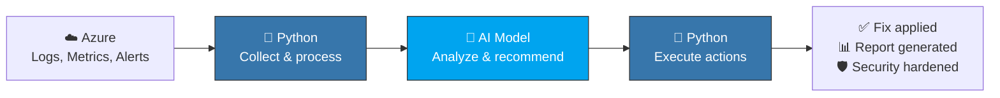

import { Info, Warning, Tip, BestPractice, Example, Exercise, Quiz, CodeBlock, TerminalBlock, Flashcard, ProductionNote, ArchitectureNote, InterviewQuestion } from '@site/src/components/shared/InteractiveBlocks';

## Learning Objectives

By the end of this lesson, you will:
- Understand Python's role in AI-powered cloud automation
- Use the Azure OpenAI SDK for infrastructure analysis
- Build an AI-assisted troubleshooting pipeline
- Create prompt templates for cloud engineering tasks

---

## Simple Explanation

**Python is the bridge between cloud infrastructure and AI.**

AI models can analyze logs, suggest fixes, and even generate infrastructure code. But AI can't connect to Azure on its own. Python is the glue:
1. Your Python script queries Azure logs
2. Sends the data to an AI model with a prompt
3. The AI analyzes it and returns insights
4. Your script takes action based on those insights

The AI does the thinking. Python does the doing.

---

## Core Explanation

### The AI-Augmented Cloud Engineer



### Provider-Agnostic AI Interface

<BestPractice>
This platform uses **provider-agnostic interfaces**. The examples show patterns you can use with any LLM (Azure OpenAI, Ollama, local models). Swap the `call_ai()` function for your provider — the architecture stays the same.
</BestPractice>

<CodeBlock language="python" title="ai_analyzer.py">
{"""Provider-agnostic AI analysis for cloud operations."""
import json
from typing import Optional

# This would be your AI provider's client
# from openai import AzureOpenAI  # Azure
# from ollama import chat         # Local
# import requests                  # Any REST API

def analyze_security_incident(incident_logs: dict) -> dict:
    """Analyze security incident data and recommend actions."""
    
    # Build the prompt from structured data
    prompt = f"""
You are a senior security engineer. Analyze this Azure security incident:

ALERT: {incident_logs.get('alert_type')}
USER: {incident_logs.get('user')}
TIME: {incident_logs.get('timestamp')}
LOCATIONS: {incident_logs.get('locations')}
ACTIONS TAKEN: {incident_logs.get('actions')}

Respond in JSON format:
{{
    "severity": "critical|high|medium|low",
    "likely_attack_vector": "explanation",
    "immediate_actions": ["action1", "action2"],
    "prevention_recommendations": ["rec1", "rec2"],
    "should_escalate": true|false
}}
"""
    
    # This is where you'd call your AI provider:
    # response = ai_client.chat.completions.create(
    #     model="gpt-4",
    #     messages=[{"role": "user", "content": prompt}],
    #     response_format={"type": "json_object"}
    # )
    # return json.loads(response.choices[0].message.content)
    
    # For now: return structured analysis
    return {
        "severity": "high",
        "likely_attack_vector": "credential theft via MFA fatigue",
        "immediate_actions": [
            "Revoke all sessions for the user",
            "Remove from privileged roles",
            "Block source IP at NSG"
        ],
        "prevention_recommendations": [
            "Deploy phishing-resistant MFA (FIDO2)",
            "Implement PIM for all admin roles",
            "Enable impossible travel alerting"
        ],
        "should_escalate": True
    }
`}
</CodeBlock>

---

## Professional Explanation

### AI-Assisted Troubleshooting Pipeline

<ProductionNote>
**CloudNova AI Pipeline:** When an alert fires in Sentinel, a Logic App triggers this Python function. It gathers context (logs, metrics, recent changes), asks the AI for analysis, and presents a triage summary to the on-call engineer.
</ProductionNote>

<CodeBlock language="python" title="ai_troubleshooter.py">
{"""AI-assisted cloud incident triage."""
from datetime import datetime, timedelta

def triage_incident(incident_id: str, affected_resource: str) -> dict:
    """Gather context and get AI analysis for an incident."""
    
    # 1. Gather context from multiple sources
    context = {
        "incident_id": incident_id,
        "resource": affected_resource,
        "time": datetime.utcnow().isoformat(),
        "recent_changes": get_recent_azure_activity(affected_resource, hours=4),
        "metrics": get_resource_metrics(affected_resource, hours=24),
        "related_alerts": get_related_sentinel_alerts(affected_resource),
        "nsg_rules": get_current_nsg_rules(affected_resource),
        "deployment_history": get_recent_deployments(hours=24)
    }
    
    # 2. Build analysis prompt
    prompt = f"""
Context for incident {incident_id}:

Resource: {affected_resource}
Time: {context['time']}

Recent changes (last 24h):
{json.dumps(context['recent_changes'], indent=2)}

Resource metrics (last 24h):
{json.dumps(context['metrics'], indent=2)}

Related alerts:
{json.dumps(context['related_alerts'], indent=2)}

Current NSG rules:
{json.dumps(context['nsg_rules'], indent=2)}

Recent deployments:
{json.dumps(context['deployment_history'], indent=2)}

Based on this context:
1. What is the most likely root cause?
2. Which of the recent changes is suspicious?
3. What 3 diagnostic commands should the on-call engineer run?
4. What is the recommended fix?
"""
    
    # 3. Get AI analysis (provider-agnostic)
    # analysis = call_ai(prompt)
    
    return {
        "triage_summary": "Likely NSG rule change at 03:15 blocking port 443",
        "suspicious_change": "NSG rule 'allow-https' deleted by service principal 'devops-sp'",
        "diagnostic_commands": [
            "az network nsg rule list --nsg-name prod-nsg --output table",
            "curl -v https://{affected_resource}.cloudnova.com",
            "az monitor activity-log list --resource-group prod-rg --start-time 2024-01-15T03:00:00Z"
        ]
    }
`}
</CodeBlock>

---

## Production Explanation

### Prompt Templates for Cloud Engineering

Here are battle-tested prompt templates. Use them with any AI provider.

| Template | Use When |
|----------|----------|
| **Incident Triage** | Alert fires, need quick analysis |
| **Security Review** | New deployment, check for vulnerabilities |
| **Cost Optimization** | Monthly review, find savings |
| **Architecture Review** | Design review, get feedback on diagram |
| **Interview Prep** | Generate questions from job description |

<CodeBlock language="python" title="prompt_templates.py">
{"""Reusable prompt templates for cloud engineering tasks."""

SECURITY_REVIEW_PROMPT = """
Review this Azure architecture for security issues:
{architecture_description}

Consider:
1. Network security (NSGs, firewalls, segmentation)
2. Identity (IAM, MFA, PIM, Managed Identities)
3. Data protection (encryption at rest/transit, Key Vault)
4. Monitoring (logging, alerting, Sentinel)
5. Compliance (PCI-DSS, SOC 2 considerations)

Return findings ordered by severity (Critical → Low).
"""

COST_OPTIMIZATION_PROMPT = """
Analyze these Azure resources for cost optimization:
{resource_list}

For each resource, suggest:
1. Can it be downsized? (Right-size SKU)
2. Can it be reserved? (1-year or 3-year RI)
3. Can it be deallocated off-hours? (Dev/Test workloads)
4. Is there a cheaper alternative? (Cool tier, spot VMs)

Estimate monthly savings potential.
"""

ARCHITECTURE_REVIEW_PROMPT = """
Review this cloud architecture design:
{architecture_mermaid}

Evaluate:
1. High availability — single points of failure?
2. Scalability — can it handle 10x traffic?
3. Security — defense-in-depth?
4. Cost — most expensive components?
5. Operations — monitoring, backup, DR?

Score each category 1-10 and explain.
"""
`}
</CodeBlock>

---

## Hands-On Exercise

<Exercise title="Build an AI Triage Assistant" time="25 minutes">

**Scenario:** At CloudNova, incidents often flood the on-call engineer with raw data. Build a Python function that takes an incident payload and returns a structured triage summary.

**Input:**
```python
incident = {
    "alert": "High CPU on web-server-01",
    "time": "2024-01-15 03:47:00",
    "resource": "vm-web-server-01",
    "recent_changes": ["Deployed v2.3.1 at 03:30"],
    "metrics": {"cpu": "94%", "memory": "72%", "disk_io": "12 MB/s"}
}
```

**Tasks:**
1. Write the context-gathering function (mock the Azure calls)
2. Build the prompt template
3. Return the structured triage summary

</Exercise>

---

## Flashcard Review

<Flashcard front="What is Python's role in AI cloud automation?" back="Python is the glue — it gathers data from Azure, sends it to AI for analysis, and executes the recommended actions. AI thinks, Python acts." />

<Flashcard front="Why use prompt templates?" back="Consistent, reusable, and testable prompts. Change the template once, not every script. Templates can be version-controlled." />

<Flashcard front="Provider-agnostic means..." back="The architecture doesn't depend on any specific AI provider. Swap the `call_ai()` function to use Azure OpenAI, Ollama, or local models without changing the rest of the code." />

---

## Related Content

| Resource | Link |
|----------|------|
| Previous: Testing & Debugging | [Lesson 5](05-testing-debugging) |
| Next module: Cloud Fundamentals (AZ-900) | [Module 06](../../06-cloud-fundamentals/index) |
| AI Integration Guide | [Guides](../../../docs/guides/ai-integration) |
| Module: AI Agents | [Module 27](../../27-ai-agents/index) |
