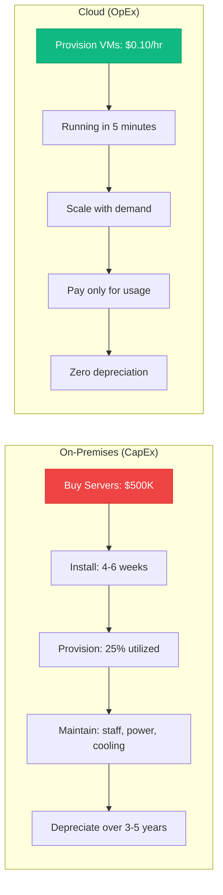
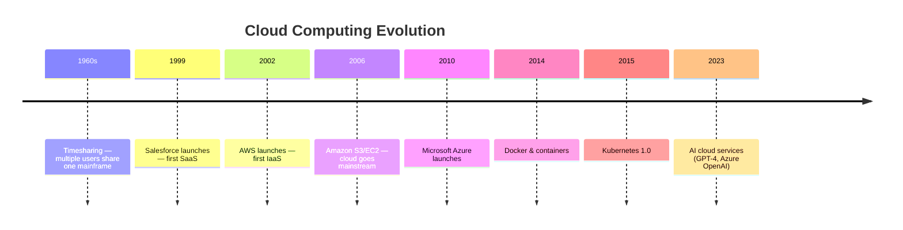
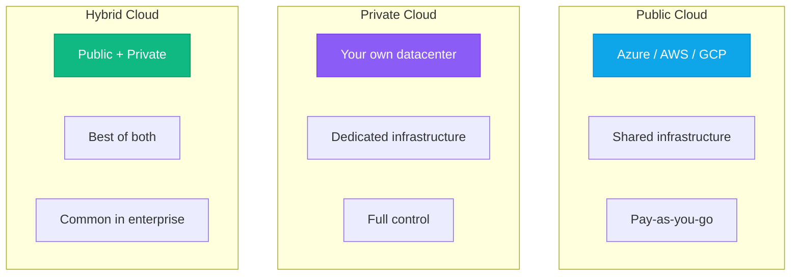

import Definition from "@site/src/components/Definition";

# What Is Cloud Computing?

:::level simple

**Cloud computing is renting someone else's computers over the internet.**

Think about electricity. You don't own a power plant. You plug into the grid and pay for what you use. Cloud computing works the same way: instead of buying servers, installing them in a data center, and managing everything yourself, you rent compute power, storage, and services from companies like Microsoft, Amazon, or Google. You pay only for what you use.

Before cloud, every company had to buy their own servers. Need more capacity? Buy more servers (takes weeks). Traffic drops? Those servers sit idle, but you still paid for them. Cloud fixes both problems: scale up in minutes, scale down when you don't need it, and only pay for what you use.

:::

:::level core

## The NIST Definition of Cloud Computing

The National Institute of Standards and Technology (NIST) defines cloud computing with 5 essential characteristics:

| Characteristic | What It Means |
|---|---|
| **On-demand self-service** | Provision resources without human interaction with the provider |
| **Broad network access** | Accessible over the internet from any device (laptop, phone, tablet) |
| **Resource pooling** | Provider's resources are pooled to serve multiple customers (multi-tenant) |
| **Rapid elasticity** | Scale up and down quickly — appear to have unlimited resources |
| **Measured service** | Pay only for what you use; usage is metered, monitored, and reported |

<Definition term="Cloud Computing">
A model for enabling ubiquitous, convenient, on-demand network access to a shared pool of configurable computing resources (networks, servers, storage, applications, and services) that can be rapidly provisioned and released with minimal management effort or service provider interaction. — NIST SP 800-145
</Definition>

:::

:::level professional

## Cloud vs On-Premises: The Economic Shift

**CapEx (Capital Expenditure):** Upfront investment in physical infrastructure. You own it, you depreciate it, you maintain it.

**OpEx (Operational Expenditure):** Ongoing operational cost. Pay as you go. No upfront investment. No long-term commitment.

Cloud shifts IT spending from CapEx to OpEx — this is the fundamental economic transformation.

### Real Numbers: CloudNova's Migration

| | On-Premises (Before) | Cloud (After) |
|---|---|---|
| Upfront cost | $850,000 | $0 |
| Monthly cost | $12,000 (power, staffing, colo) | $8,400 (compute + storage + networking) |
| Provisioning time | 4-8 weeks | 5 minutes |
| Utilization | 22% | 65% (with auto-scaling) |
| Disaster recovery | Manual, 48-hour RTO | Automated, 4-hour RTO |

:::

---

## Learning Objectives

- Define cloud computing and list its 5 essential characteristics
- Explain the difference between cloud and traditional on-premises infrastructure
- Identify CapEx vs OpEx and explain the economic shift

---

## Core Content

### The Cloud Computing Timeline

The cloud didn't appear overnight. It evolved from timesharing in the 1960s through the dot-com era's data centers to today's hyperscale cloud platforms. Understanding this evolution helps you see where the industry is heading next.

### Public, Private, and Hybrid Cloud

| Model | Who Uses It | Typical Use Case |
|---|---|---|
| **Public Cloud** | Startups, scale-ups, most companies | Web apps, SaaS platforms, data analytics |
| **Private Cloud** | Regulated industries, government | Financial services, healthcare data |
| **Hybrid Cloud** | Large enterprises | Keep sensitive data on-prem, burst to cloud for scale |

CloudNova uses **public cloud** (Azure) — the right choice for a fast-growing SaaS company that needs to scale quickly without managing hardware.

---

<BestPractice title="The Cloud Decision Framework">

Ask yourself these 5 questions before any cloud decision:

1. **Scale:** Does our demand fluctuate? (Cloud = yes)
2. **Speed:** Do we need to move faster than hardware procurement allows? (Cloud = yes)
3. **Cost:** Is our utilization low? (Cloud = probably cheaper)
4. **Compliance:** Do regulations require physical control? (On-prem = maybe)
5. **Skills:** Does our team know cloud operations? (If not, invest in this academy 😉)

</BestPractice>

---

## Common Mistakes

<CommonMistake
  mistake="Thinking 'cloud is just someone else's computer'"
  correction="That's like saying 'a car is just a horse with wheels.' Cloud isn't just remote servers — it's the entire ecosystem of managed services (databases, AI, CDN, serverless) that would take years to build yourself. The value is in the services, not just the compute."
/>

<CommonMistake
  mistake="Assuming cloud is always cheaper"
  correction="Cloud CAN be cheaper — if you use it correctly. Lift-and-shift migrations without optimization often cost more. Cloud requires different operational practices: right-sizing, auto-scaling, reserved instances, and FinOps discipline."
/>

---

## Check Your Understanding

1. **Which is NOT one of the 5 essential characteristics of cloud computing?**
   - A) On-demand self-service
   - B) Rapid elasticity
   - C) Physical hardware ownership
   - D) Measured service

   

Answer
**C.** Cloud computing means you DON'T own the physical hardware — that's the point. The provider owns and manages it.

2. **A company buys servers for $200,000. Is this CapEx or OpEx?**
   - A) CapEx
   - B) OpEx
   - C) Neither
   - D) Both

   

Answer
**A.** CapEx — capital expenditure. Upfront investment in physical assets. Cloud shifts this to OpEx — paying monthly for what you use.

3. **CloudNova handles GDPR data. Should they use public or private cloud?**
   - A) Only private cloud — GDPR requires it
   - B) Public cloud is fine — all major clouds are GDPR compliant with proper configuration
   - C) Hybrid is always the answer
   - D) GDPR doesn't apply to cloud

   

Answer
**B.** All major cloud providers are GDPR compliant. You still need to configure services correctly (encryption, data residency, access controls), but public cloud is absolutely viable for regulated workloads.

---

## Key Takeaways

- **Cloud = on-demand, pay-per-use, over the internet, elastic.**
- **5 NIST characteristics:** Self-service, broad access, resource pooling, elasticity, measured service.
- **CapEx → OpEx:** The fundamental economic shift that makes cloud powerful.
- **Public, private, hybrid** — choose based on scale, speed, cost, compliance, and skills.

---

## Career at CloudNova

At CloudNova, every engineer understands WHY we're on Azure — not just that we use it. When you provision your first VM in Module 07, you'll understand the economic and architectural reasoning behind that decision.

---

## Next Steps

- **Next Lesson:** [IaaS, PaaS, SaaS, FaaS Explained](/cloud-engineering/06-cloud-fundamentals/service-models)
- **AZ-900 Alignment:** This lesson covers objective `az900-1.1: Describe cloud computing`

---

## Spaced Repetition

Review: Day 1, Day 3, Day 7, Day 14, Day 30, Day 90
