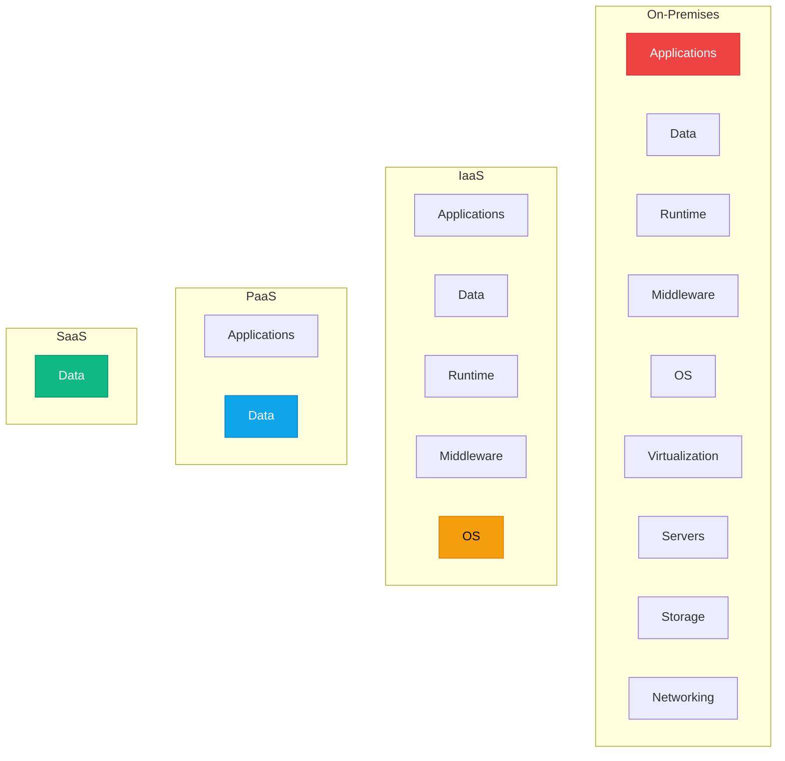
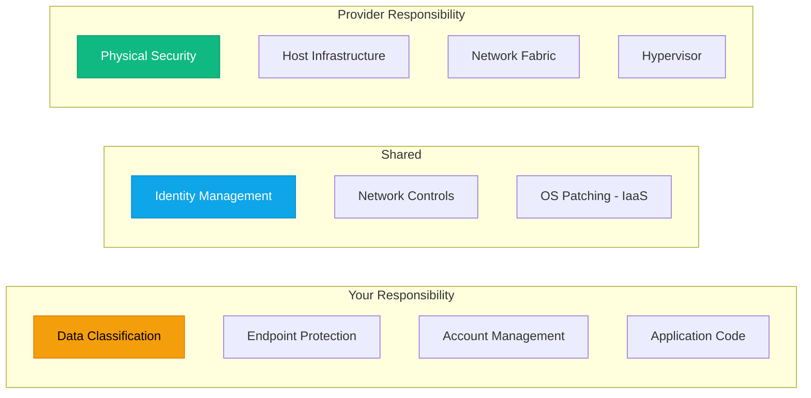

# IaaS, PaaS, SaaS, FaaS Explained

:::level simple

**The cloud gives you different levels of control — like different ways to get pizza.**

- **IaaS (Infrastructure):** You get the kitchen. You cook. You clean. Complete control, more work.
- **PaaS (Platform):** You get a pre-heated oven and ingredients. You assemble and bake. Less work, less control.
- **SaaS (Software):** You order delivery. Eat and enjoy. No cooking, no cleanup, but you can't change the recipe.
- **FaaS (Functions):** You bring one ingredient. The kitchen does everything else for exactly 30 seconds. Pay only for those 30 seconds.

Each model solves a different problem. The art of cloud engineering is knowing which model to use when.

:::

:::level core

## The Four Service Models

| Model | You Manage | Provider Manages | Azure Example |
|---|---|---|---|
| **IaaS** | OS, middleware, apps, data | Hardware, network, hypervisor | Azure VM |
| **PaaS** | Apps, data | OS, runtime, middleware, hardware | Azure App Service |
| **SaaS** | Data, users | Everything else | Microsoft 365 |
| **FaaS** | Code only | Entire runtime, scales to zero | Azure Functions |

:::

## Azure Examples

| Model | Azure Service | When to Use |
|---|---|---|
| **IaaS** | Virtual Machines, AKS node pools | Full OS control, legacy apps, custom networking |
| **PaaS** | App Service, SQL Database, AKS control plane | Focus on code, not infrastructure |
| **SaaS** | Microsoft 365, Dynamics 365 | Ready-to-use business applications |
| **FaaS** | Azure Functions, Logic Apps | Event-driven, bursty workloads |

## The Shared Responsibility Model

**The golden rule:** The provider secures the cloud. You secure what's IN the cloud.

---

## Check Your Understanding

1. **You need to run a legacy .NET Framework app that requires specific IIS configuration. Which model?**
   - A) SaaS — just use SharePoint
   - B) FaaS — rewrite as Azure Functions
   - C) IaaS — run on an Azure VM with full OS/IIS control
   - D) PaaS — deploy to App Service

   

Answer
**C.** Legacy apps with specific OS/IIS requirements often need IaaS. App Service (PaaS) is great for modern .NET but may not support legacy configurations.

2. **Who is responsible for patching the OS on an Azure SQL Database?**
   - A) You — it's your data
   - B) Microsoft — it's a PaaS service
   - C) Shared — you do security patches, Microsoft does feature updates
   - D) Nobody — PaaS doesn't need patches

   

Answer
**B.** Azure SQL Database is PaaS. Microsoft patches the OS, the SQL engine, and the infrastructure. You manage your data and access.

3. **You want the cheapest option for a workload that runs once a day for 30 seconds. Which model?**
   - A) IaaS VM running 24/7
   - B) PaaS App Service with always-on
   - C) FaaS — Azure Functions consumption plan
   - D) SaaS — it's always the cheapest

   

Answer
**C.** FaaS (Functions) scales to zero and charges only for execution time. A 30-second daily job costs pennies. A 24/7 VM would cost ~$30+/month for the same workload.

---

## Key Takeaways

- **IaaS = most control, most work.** Use for legacy or specialized workloads.
- **PaaS = sweet spot.** Use for most new applications. Let the provider manage the platform.
- **SaaS = ready to use.** For business apps you consume, not build.
- **FaaS = pay per execution.** For event-driven, bursty, or infrequent workloads.
- **Shared responsibility:** Provider secures the cloud, you secure what's in it.

---

## Next Steps

- **Next Lesson:** [Cloud Economics & Business Case](/cloud-engineering/06-cloud-fundamentals/cloud-economics)
- **AZ-900 Alignment:** Objectives `az900-1.2` and `az900-1.3`

---

## Spaced Repetition

Review: Day 1, Day 3, Day 7, Day 14, Day 30, Day 90
