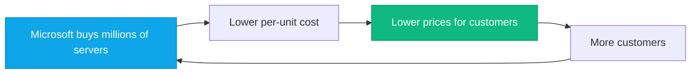

# Cloud Economics & Business Case

:::level simple

**Buying servers is like buying a car.** You pay $30,000 upfront, then pay for gas, insurance, and maintenance every month. The car loses value over time. If you drive less, you still pay the same.

**Cloud is like using Uber.** You pay per ride. No upfront cost. No maintenance. No insurance. If you don't go anywhere, you pay nothing. If you need a bigger car, you order an SUV.

That's CapEx (buying the car) vs OpEx (paying per ride). Cloud shifts IT spending from buying to renting — and that changes everything about how companies budget and operate.

:::

:::level core

## CapEx vs OpEx

| | CapEx (Capital Expenditure) | OpEx (Operational Expenditure) |
|---|---|---|
| **What** | Upfront investment in assets | Ongoing operational costs |
| **Example** | Buy servers for $500K | Pay Azure $8K/month |
| **Accounting** | Depreciated over 3-5 years | Deducted in current year |
| **Cash Flow** | Large upfront hit | Predictable monthly cost |
| **Flexibility** | Locked into capacity | Scale up/down instantly |

## Economies of Scale

Cloud providers achieve economies of scale impossible for individual companies. Microsoft operates 200+ datacenters worldwide. Their per-server costs (power, cooling, networking, security, staffing) are a fraction of what any single company can achieve. Those savings flow to customers.

:::

## CloudNova: The Migration Business Case

When CloudNova evaluated moving from on-premises to Azure:

| Factor | On-Premises | Azure |
|---|---|---|
| Upfront cost | $850,000 | $0 |
| Monthly cost | $12,000 | $8,400 |
| Provisioning time | 4-8 weeks | 5 minutes |
| Utilization rate | 22% | 65% |
| DR capability | Manual, 48h RTO | Automated, 4h RTO |

**Annual savings:** $43,200 in operational costs + elimination of $170K/year in depreciation = **$213K/year savings.**

---

## Key Takeaways

- **CapEx = buy assets (servers). OpEx = pay for usage (cloud).**
- **Cloud OpEx is flexible, predictable, and tax-efficient.**
- **Economies of scale mean cloud providers can always offer better per-unit costs.**
- **TCO must include hardware, power, cooling, staffing, and opportunity cost — not just server prices.**

## Spaced Repetition

Review: Day 1, Day 3, Day 7, Day 14, Day 30, Day 90
