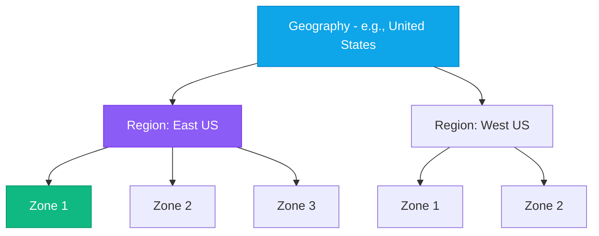

# Regions, Zones & Global Infrastructure

:::level simple

**Think of regions as cities, availability zones as buildings in the same city.**

A **region** is a geographical area with multiple datacenters. East US, West Europe, Southeast Asia — each is a region.

Inside each region, **availability zones** are physically separate datacenters — different buildings, different power grids, different cooling systems. If one building loses power, the others keep running.

**Region pairs** are two regions at least 300 miles apart. If an earthquake takes out an entire region, you fail over to its pair.

:::

:::level core

## The Hierarchy

| Layer           | What It Is                                      | Failure Protection              |
| --------------- | ----------------------------------------------- | ------------------------------- |
| **Zone**        | Physically separate datacenter in a region      | Datacenter-level failures       |
| **Region**      | Multiple zones, <2ms latency between zones      | Zone-level failures             |
| **Region Pair** | Two regions 300+ miles apart                    | Regional disasters              |
| **Geography**   | Data residency boundary (e.g., "United States") | Compliance and data sovereignty |

## CloudNova Design Decision

CloudNova operates in **East US** (primary) with **West US** (DR). Each region has services deployed across 2 availability zones. This means:

- Zone failure → other zone handles traffic
- East US goes down → fail over to West US (4-hour RTO)

:::

---

## Key Takeaways

- **Regions** contain **zones** (1-3 physically separate datacenters).
- **Zone-redundant** services survive datacenter failures.
- **Region pairs** protect against regional disasters.
- **Always deploy across at least 2 zones** for production workloads.

## Spaced Repetition

Review: Day 1, Day 3, Day 7, Day 14, Day 30, Day 90
