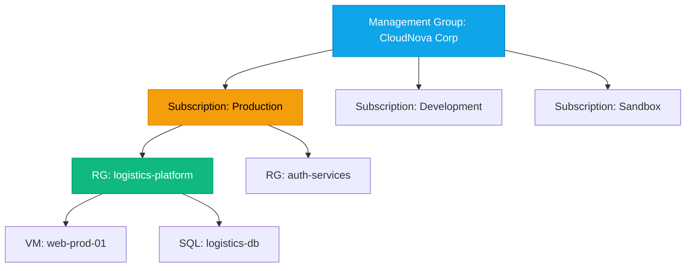

# Resource Organization & Management

:::level simple

**Organizing cloud resources is like organizing a company.**

- **Management Group** = The entire company (policies apply everywhere)
- **Subscription** = A department (has its own budget)
- **Resource Group** = A project team (everything for one project lives here)
- **Resource** = A single thing (a VM, a database, a storage account)

When you delete a resource group, everything inside it gets deleted. When you apply a policy at the management group level, every subscription inherits it.

:::

:::level core

## The Hierarchy



## Tagging Strategy

At CloudNova, every resource has mandatory tags:

| Tag | Example | Purpose |
|---|---|---|
| `environment` | `production` | Separate prod from dev costs |
| `team` | `infrastructure` | Cost allocation to teams |
| `project` | `logistics-platform` | Project-level cost tracking |
| `cost-center` | `CC-ENG-001` | Finance department mapping |

```bash
# Find untagged resources (common in cost audits)
az resource list --query "[?tags==null].name"
```

:::

---

## Key Takeaways

- **Management Groups → Subscriptions → Resource Groups → Resources.**
- **Resource Groups share lifecycle** — delete the group, delete everything.
- **Tags enable cost allocation, automation, and compliance.**
- **Apply policies at the highest level possible** for consistency.

## Spaced Repetition

Review: Day 1, Day 3, Day 7, Day 14, Day 30, Day 90
