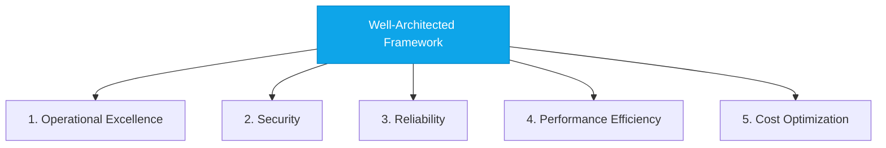

# Well-Architected Framework

:::level simple

**Building in the cloud without a framework is like building a house without blueprints.**

The Well-Architected Framework is your blueprint. It has 5 pillars — 5 areas you must think about for every workload. Skip any pillar and your house (or cloud deployment) will eventually have problems.

:::

:::level core

## The 5 Pillars

| Pillar                     | Key Question                        | CloudNova Practice                             |
| -------------------------- | ----------------------------------- | ---------------------------------------------- |
| **Operational Excellence** | How do we run this reliably?        | IaC, CI/CD, runbooks, monitoring               |
| **Security**               | How do we protect data and systems? | Zero Trust, encryption, IAM, compliance        |
| **Reliability**            | How does this survive failures?     | Multi-zone, auto-scaling, DR plan              |
| **Performance Efficiency** | How do we use resources well?       | Right-sizing, caching, CDN                     |
| **Cost Optimization**      | Are we paying the right amount?     | Reserved instances, waste elimination, tagging |

:::

## Key Takeaways

- **Every architecture decision should reference the 5 pillars.**
- **The framework is a conversation tool**, not a checklist.
- **Trade-offs are normal** — security vs cost, performance vs reliability.
- **Review architecture against the framework quarterly.**

## Spaced Repetition

Review: Day 1, Day 3, Day 7, Day 14, Day 30, Day 90
