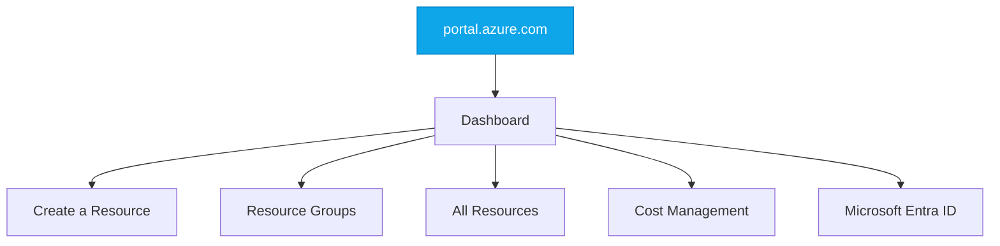

# Azure Portal & CLI Walkthrough

:::level simple

**The Azure Portal is a website where you manage all your cloud resources.** Point, click, create. It's great for learning and exploring.

**The Azure CLI is a command-line tool** that lets you do the same things by typing commands. It's great for automation and doing the same task across 50 resources at once.

Cloud engineers use both — Portal for exploration, CLI for automation.

:::

:::level core

## Portal Navigation



## Azure CLI Essentials

```bash
# Login
az login

# List your subscriptions
az account list --output table

# Create a resource group
az group create --name learning-rg --location eastus

# List all resources in a group
az resource list --resource-group learning-rg --output table

# Delete everything (careful!)
az group delete --name learning-rg --yes
```

## CloudNova at the CLI

At CloudNova, nobody provisions production resources through the Portal — everything is Terraform and CLI. But for learning, exploration, and debugging, the Portal is your friend.

```bash
# CloudNova's daily CLI usage
az vm list --output table                    # Check all VMs
az monitor metrics list --resource ...        # Check metrics
az keyvault secret show --name db-password    # Retrieve secrets
```

:::

---

## Key Takeaways

- **Portal = exploration and learning. CLI = automation and scripting.**
- **Cloud Shell** gives you a browser-based terminal with Azure CLI pre-installed.
- **az commands** follow a consistent pattern: `az <service> <action> <parameters>`.
- At CloudNova: Portal for debugging, CLI for automation, Terraform for infrastructure.

## Spaced Repetition

Review: Day 1, Day 3, Day 7, Day 14, Day 30, Day 90
