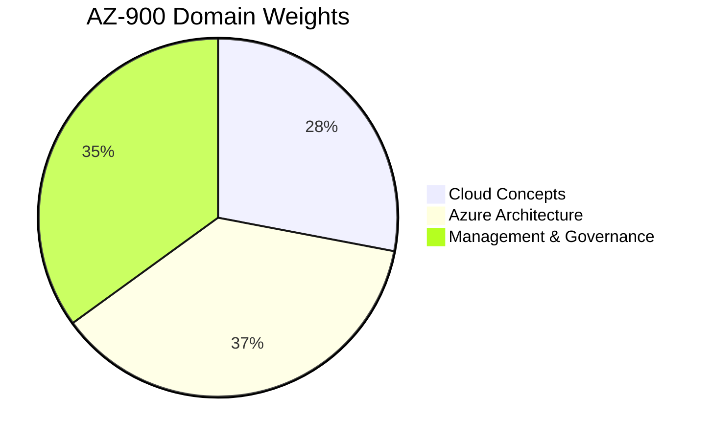

# AZ-900 Practice & Review

:::level core

## Exam Format

| Attribute         | Detail                                       |
| ----------------- | -------------------------------------------- |
| **Duration**      | 65 minutes                                   |
| **Questions**     | 40-60                                        |
| **Passing Score** | 700/1000                                     |
| **Cost**          | $99 USD                                      |
| **Format**        | Multiple choice, drag-and-drop, case studies |

## Domain Weights

## Practice Questions

**Q1:** Your company wants to move from CapEx to OpEx for IT spending. Which cloud characteristic enables this?

- A) Scalability
- B) Pay-as-you-go pricing
- C) High availability
- D) Global reach

  
Answer
**B.** Pay-as-you-go (measured service) shifts spending from capital to
  operational expenditure. You pay for what you use monthly instead of buying hardware upfront.

**Q2:** Which Azure service provides recommendations for cost optimization?

- A) Azure Monitor
- B) Azure Advisor
- C) Azure Policy
- D) Azure Sentinel

  
Answer
**B.** Azure Advisor analyzes your configuration and usage and recommends
  cost, security, reliability, and performance improvements.

**Q3:** You deploy VMs across 3 availability zones. What are you protecting against?

- A) Regional disasters
- B) Datacenter-level failures
- C) Account compromise
- D) Network latency

  
Answer
**B.** Availability zones protect against datacenter-level failures
  within a region. For regional disasters, use region pairs.

:::

---

## Key Takeaways

- **3 domains, ~40-60 questions, 65 minutes, 700 to pass.**
- **Focus study on your weakest domain.** Use the Azure AZ-900 learning path.
- **Schedule the exam when you're consistently scoring 80%+ on practice tests.**

## Next Steps

- **Module Complete!** → [Module 07: Azure Core Services](/cloud-engineering/07-azure-core/)
- **Official AZ-900 Learning Path:** Microsoft Learn

## Spaced Repetition

Review: Day 1, Day 3, Day 7, Day 14, Day 30, Day 90
