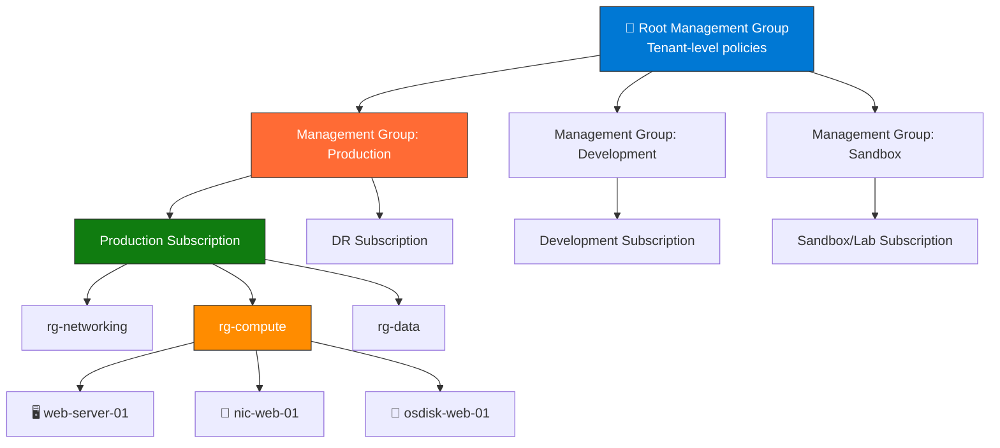
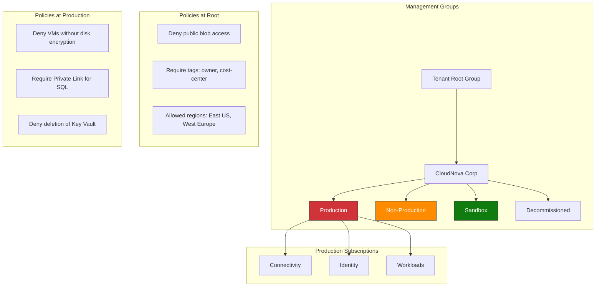

import { Info, Warning, Tip, BestPractice, Example, Exercise, Quiz, CodeBlock, TerminalBlock, Flashcard, ProductionNote, ArchitectureNote, InterviewQuestion } from '@site/src/components/shared/InteractiveBlocks';

## Learning Objectives

By the end of this lesson, you will:
- Understand Azure Resource Manager (ARM) as the deployment and management layer
- Design management group hierarchies for enterprise governance
- Choose the right subscription strategy for your organization
- Understand how Azure regions, zones, and resource groups interact
- Map to AZ-104 exam objectives on identity and governance

---

## Simple Explanation

**Azure Resource Manager (ARM) is the brain of Azure.**

Every request — from the portal, CLI, SDK, or Terraform — goes through ARM. ARM checks:
1. **Are you authenticated?** (Who are you?)
2. **Are you authorized?** (Can you create VMs?)
3. **Is this allowed by policy?** (Are public IPs denied?)
4. **Does the quota allow it?** (Can you create another VM?)

Only after all four checks pass does the request reach the Azure fabric to actually create your resource.

---

## Core Explanation

### The Azure Resource Hierarchy

| Level | Purpose | Key Settings | Example Count |
|-------|---------|-------------|---------------|
| **Management Group** | Policy inheritance, RBAC at scale | Policies, RBAC, budget | 3-10 |
| **Subscription** | Billing boundary, resource limits | Quotas, billing, support plan | 5-50 |
| **Resource Group** | Lifecycle container | Tags, RBAC scope, deployment scope | 20-200 |
| **Resource** | Individual service | SKU, configuration, tags | 1000+ |

---

## Professional Explanation

### Subscription Design Patterns

<ArchitectureNote title="CloudNova Subscription Strategy">
CloudNova started with one subscription. After 6 months, they had 800 resources, 15 teams, and chaos. They redesigned to the pattern below.
</ArchitectureNote>

| Pattern | Structure | Best For |
|---------|-----------|----------|
| **Per Environment** | prod-sub, dev-sub, test-sub | Small/medium orgs, clear separation |
| **Per Application** | app-a-sub, app-b-sub, shared-sub | Larger orgs, independent teams |
| **Per Business Unit** | marketing-sub, engineering-sub | Enterprise, cost allocation by department |
| **Hub-Spoke** | connectivity-sub, identity-sub, workload subs | Landing zone pattern, enterprise |

<BestPractice>
**CloudNova's chosen pattern:** Per Environment + Hub-Spoke hybrid.
- 1 Connectivity subscription (hub VNet, firewall, VPN)
- 1 Identity subscription (domain controllers, Azure AD DS)
- 1 Production subscription (customer-facing workloads)
- 1 Non-Production subscription (dev, test, staging)
- 1 Sandbox subscription (experiments, no production data)
</BestPractice>

### Resource Group Strategy

| Strategy | Pros | Cons | Use When |
|----------|------|------|----------|
| **Per Application** | Clean lifecycle (delete app = delete RG) | Many RGs to manage | Microservices |
| **Per Resource Type** | Easy cost tracking by type | Lifecycle management harder | Small environments |
| **Per Lifecycle** | Deploy together, delete together | Mixed resource types | Staging environments |
| **Per Team** | Clear ownership | Resource sprawl within RG | Large orgs with many teams |

<TerminalBlock>
{`# CloudNova: Organize resources with tagging + RGs
# Resource Group = lifecycle boundary (create together, delete together)
# Tags = metadata across RGs (cost center, owner, environment)

# Create RG for the payment microservice
az group create \\
  --name rg-payment-prod-eastus \\
  --location eastus \\
  --tags "application=payment" "environment=prod" "owner=payments-team" "cost-center=CC-402"

# All payment resources go here: AKS, SQL, Redis, Key Vault
# When payment v2 launches, create rg-payment-v2-prod-eastus
# When v1 retires, delete the entire RG in one command`}
</TerminalBlock>

---

## Production Explanation

### CloudNova: Enterprise-Scale Architecture

<ProductionNote>
**Why this structure matters:** When CloudNova was audited for SOC 2, the auditor looked at one thing: "Can you prove your production workloads are isolated from development?" The management group hierarchy + subscription separation answered that in 10 seconds.
</ProductionNote>

---

## Hands-On Exercise

<Exercise title="Design CloudNova's Subscription Strategy" time="20 minutes">

CloudNova is growing from 1 team to 5 teams. Design the subscription architecture.

**Current (Chaos):**
- 1 subscription, 800 resources, no naming convention
- Dev and prod resources mixed
- No cost tracking per team

**Future Requirements:**
- 5 teams: Payments, Catalog, Search, Analytics, Platform
- Each team needs dev, staging, and production
- SOC 2 requires prod isolation
- Finance wants per-team billing

**Tasks:**
1. Draw the management group hierarchy
2. List subscriptions needed
3. Write the Azure Policy assignments for root and prod

<Quiz question="What's the PRIMARY benefit of separating production into its own subscription?">
- Lower cost
- Faster deployments
- *Security isolation and billing separation*
- Easier naming
</Quiz>

</Exercise>

---

## Flashcard Review

<Flashcard front="What does ARM do before creating a resource?" back="1) Authenticate (who?), 2) Authorize (RBAC), 3) Evaluate policies (Azure Policy), 4) Check quotas — then deploy." />

<Flashcard front="Management Group vs Subscription" back="Management Group = policy + RBAC container (no resources). Subscription = billing boundary + resource limits (contains resources)." />

<Flashcard front="Best naming convention for Resource Groups" back="rg-{application}-{environment}-{region}. Example: rg-payment-prod-eastus" />

---

## Interview Preparation

<InterviewQuestion level="professional">

**Q: How do you organize Azure resources for an enterprise?**

**Answer:** "I use the enterprise landing zone pattern: management groups for policy inheritance (Root → Corp → Production/Non-Production/Sandbox), subscriptions for billing and control boundaries (separate connectivity, identity, workloads), resource groups as lifecycle containers (all resources for one app, create and delete together), and mandatory tags for metadata across all resources (owner, cost-center, environment). Azure Policy at the root management group enforces tagging, allowed regions, and security baselines across the entire estate."

</InterviewQuestion>

---

## Related Content

| Resource | Link |
|----------|------|
| Next: Compute Services | [Lesson 2](02-compute-services) |
| AZ-104: Manage Azure Identities & Governance | [Exam objective](../../certifications/az-104/governance) |
| Module: Cloud Fundamentals | [Module 06](../../06-cloud-fundamentals/index) |
