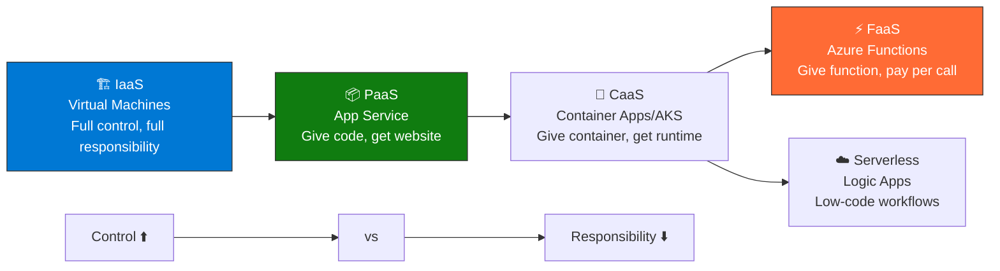
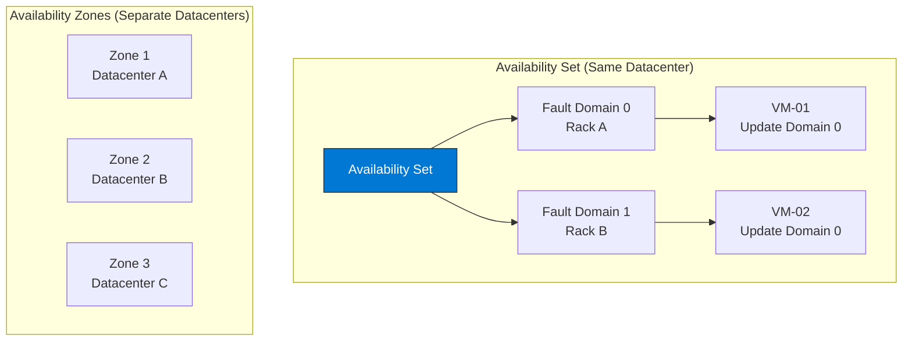

import { Info, Warning, Tip, BestPractice, Example, Exercise, Quiz, CodeBlock, TerminalBlock, Flashcard, ProductionNote, ArchitectureNote, InterviewQuestion } from '@site/src/components/shared/InteractiveBlocks';

## Learning Objectives

By the end of this lesson, you will:
- Compare all Azure compute services and choose the right one
- Configure VM availability with Availability Sets and Zones
- Implement autoscaling with VM Scale Sets
- Understand App Service tiers and deployment slots
- Deploy serverless functions with Azure Functions

---

## Simple Explanation

**Azure gives you many ways to run code. Pick the right one for the job.**

- **Virtual Machines** — Your own server. Full control. You manage everything.
- **App Service** — "Just give me my code, I'll run it." Microsoft manages the server.
- **Azure Functions** — "Run this function when X happens." Serverless, pay-per-execution.
- **AKS** — "Run my containers at scale." Kubernetes, managed by Microsoft.

More control = more responsibility. Less control = less to worry about.

---

## Core Explanation

### The Compute Spectrum

| Service | You Manage | Microsoft Manages | Use When |
|---------|-----------|-------------------|----------|
| **VMs** | OS, patches, runtime, app | Physical, hypervisor | Legacy apps, full control needed |
| **App Service** | App code, configuration | OS, patches, runtime | Web apps, APIs |
| **Container Apps** | Container image, config | OS, orchestrator | Microservices, event-driven |
| **AKS** | Nodes (optional), pods, config | Control plane (or nodes) | Full K8s ecosystem needed |
| **Functions** | Function code | Everything else | Event-driven, scheduled tasks |

---

## Professional Explanation

### VM Availability: Keeping Your App Online

| Feature | Availability Set | Availability Zone |
|---------|-----------------|-------------------|
| **Protection** | Rack failure, updates | Entire datacenter failure |
| **SLA** | 99.95% | 99.99% |
| **Latency** | < 2 ms | < 2 ms (within region) |
| **Cost** | Free (just VM cost) | Data transfer between zones |
| **Best for** | Applications within one datacenter | Mission-critical, DR |

### VM Scale Sets: Auto-Scaling Done Right

<CodeBlock language="bash">
{`# Create a VM Scale Set with auto-scaling
az vmss create \\
  --name cloudnova-web-scale \\
  --resource-group cloudnova-prod \\
  --image Ubuntu2204 \\
  --instance-count 2 \\
  --zones 1 2 3 \\
  --admin-username azureuser \\
  --generate-ssh-keys

# Auto-scale rule: +1 instance when CPU > 70% for 5 min
az monitor autoscale create \\
  --resource-group cloudnova-prod \\
  --resource cloudnova-web-scale \\
  --resource-type Microsoft.Compute/virtualMachineScaleSets \\
  --min-count 2 --max-count 20 \\
  --name autoscale-web

az monitor autoscale rule create \\
  --autoscale-name autoscale-web \\
  --resource-group cloudnova-prod \\
  --condition "Percentage CPU > 70 avg 5m" \\
  --scale out 2  # Add 2 instances

az monitor autoscale rule create \\
  --autoscale-name autoscale-web \\
  --resource-group cloudnova-prod \\
  --condition "Percentage CPU < 30 avg 10m" \\
  --scale in 1  # Remove 1 instance`}
</CodeBlock>

---

## Production Explanation

### CloudNova: Choosing Compute for Each Workload

<ArchitectureNote title="CloudNova Compute Decision Matrix">
CloudNova runs 12 workloads. Here's how they chose compute for each.
</ArchitectureNote>

| Workload | Service Chosen | Why |
|----------|---------------|-----|
| **Customer-facing web app** | App Service (P2v3) | Managed, auto-scale, deployment slots, built-in auth |
| **Background payment processor** | Container Apps | Event-driven, scale to zero, Dapr integration |
| **Legacy billing system** | VMs (with AS) | Can't containerize, needs specific OS patches |
| **Monthly report generation** | Azure Functions | Runs once/month, pay only during execution |
| **Machine learning training** | VMs (GPU, spot) | Needs GPU, can be interrupted = use spot instances |
| **Microservices (10 services)** | AKS | Service mesh, Helm charts, GitOps |

<ProductionNote>
**The most expensive mistake:** Running an App Service on an isolated App Service Environment when a standard tier would work. Or running 10 idle VMs 24/7 when Container Apps could scale to zero. **Right-sizing compute saves 40-60% of your Azure bill.**
</ProductionNote>

---

## Hands-On Exercise

<Exercise title="Choose the Right Compute" time="20 minutes">

For each scenario, choose the best Azure compute service and justify your choice:

**Scenario A:** A PHP website with 10,000 daily visitors. You have the code, want zero server management.

**Scenario B:** A Monte Carlo simulation that runs for 6 hours when triggered by a new dataset upload.

**Scenario C:** A legacy Windows Server 2012 application with a COM+ dependency that cannot be containerized.

**Scenario D:** 15 microservices that need service discovery, circuit breakers, and canary deployments.

<Quiz question="Which compute service can scale to ZERO (no cost when idle)?">
- Virtual Machines
- App Service (Basic tier)
- *Azure Functions (Consumption plan) & Container Apps*
- AKS
</Quiz>

</Exercise>

---

## Flashcard Review

<Flashcard front="Availability Set vs Availability Zone" back="Set: protects against rack failure within one datacenter (99.95% SLA). Zone: protects against entire datacenter failure (99.99% SLA)." />

<Flashcard front="When should you use VMs instead of App Service?" back="When you need full OS control, custom software installations, legacy apps, GPU workloads, or specific networking (NVA, custom routing)." />

<Flashcard front="What is a VM Scale Set?" back="Identical, auto-scaling VMs. Define a 'golden image' and rules for scaling out/in. Supports up to 1,000 VMs with automatic load balancing." />

---

## Related Content

| Resource | Link |
|----------|------|
| Previous: Azure Architecture | [Lesson 1](01-azure-architecture) |
| Next: Storage Services | [Lesson 3](03-storage-services) |
| AZ-104: Deploy & Manage Compute | [Exam objective](../../certifications/az-104/compute) |
