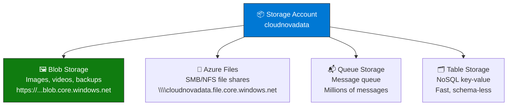
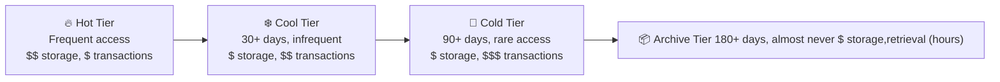

import {
  Info,
  Warning,
  Tip,
  BestPractice,
  Example,
  Exercise,
  Quiz,
  CodeBlock,
  TerminalBlock,
  Flashcard,
  ProductionNote,
  ArchitectureNote,
  InterviewQuestion,
} from "@site/src/components/shared/InteractiveBlocks";

## Learning Objectives

By the end of this lesson, you will:

- Choose the right Azure storage service for any workload
- Configure storage redundancy (LRS, ZRS, GRS, GZRS)
- Apply access tiers to optimize cost
- Use Shared Access Signatures (SAS) for secure access
- Understand Azure Files for lift-and-shift migrations

---

## Simple Explanation

**Azure Storage is a massive, durable, internet-accessible hard drive in the cloud.**

Need to store cat photos? Blob Storage. Need a shared drive for your VMs? Azure Files. Need a disk for your VM? Managed Disks. Need a message queue? Queue Storage. Need a NoSQL table? Table Storage.

One storage account, five services, infinite scalability.

---

## Core Explanation

### The Storage Account: One Account, Many Services

### Blob Storage Types

| Blob Type       | Use Case                              | Max Size  |
| --------------- | ------------------------------------- | --------- |
| **Block Blob**  | Text, images, videos, backups         | 190.7 TiB |
| **Append Blob** | Log files, audit trails (append only) | 195 GiB   |
| **Page Blob**   | Random read/write, VM disks           | 8 TiB     |

### Storage Redundancy: How Many Copies?

| Redundancy                    | Copies                               | Survives                  | Use When                  |
| ----------------------------- | ------------------------------------ | ------------------------- | ------------------------- |
| **LRS** (Locally Redundant)   | 3 copies, same datacenter            | Disk/server failure       | Dev, non-critical         |
| **ZRS** (Zone Redundant)      | 3 copies, 3 zones                    | Entire datacenter failure | Production, regional apps |
| **GRS** (Geo Redundant)       | LRS + async copy to secondary region | Region failure            | DR, compliance            |
| **GZRS** (Geo-Zone Redundant) | ZRS + async copy to secondary        | Zone + region failure     | Mission-critical          |

---

## Professional Explanation

### Access Tiers: Pay for What You Use

| Tier        | Access Cost | Storage Cost | Minimum Retention | Typical Data                  |
| ----------- | ----------- | ------------ | ----------------- | ----------------------------- |
| **Hot**     | Lowest      | Highest      | None              | Active data, website images   |
| **Cool**    | Moderate    | Moderate     | 30 days           | Backups, older logs           |
| **Cold**    | High        | Low          | 90 days           | Compliance archives           |
| **Archive** | Highest     | Lowest       | 180 days          | Legal holds, 7-year retention |

<ProductionNote>
  **CloudNova saves 60%:** By moving quarterly reports to Cool tier after 60 days, and annual
  reports to Archive tier — all automated with lifecycle management policies. 500 TB of data,
  $1,200/month savings.
</ProductionNote>

<TerminalBlock>
{`# Automated lifecycle management: move blobs to cheaper tiers
az storage account management-policy create \\
  --account-name cloudnovadata \\
  --resource-group cloudnova-prod \\
  --policy @lifecycle-policy.json

# lifecycle-policy.json:

{
"rules": [
{
"name": "auto-tier-to-cool",
"enabled": true,
"type": "Lifecycle",
"definition": {
"filters": {
"blobTypes": ["blockBlob"],
"prefixMatch": ["reports/"]
},
"actions": {
"baseBlob": {
"tierToCool": {"daysAfterModificationGreaterThan": 30},
"tierToArchive": {"daysAfterModificationGreaterThan": 180},
"delete": {"daysAfterModificationGreaterThan": 2555}
}
}
}
}
]
}

# Now reports/ auto-migrate: Hot(30d) → Cool(180d) → Archive(7y) → Delete`}

</TerminalBlock>

---

## Production Explanation

### CloudNova Storage Architecture

<ArchitectureNote title="CloudNova Storage Design">
  Three storage accounts for different purposes, each with the right redundancy and access tier.
</ArchitectureNote>

| Storage Account   | Purpose                      | Redundancy | Tier                    | Notes                                |
| ----------------- | ---------------------------- | ---------- | ----------------------- | ------------------------------------ |
| `cloudnovaprod`   | Customer uploads, CDN origin | GZRS       | Hot                     | Mission-critical, geo-redundant      |
| `cloudnovabackup` | VM backups, SQL backups      | GRS        | Cool → Archive (90d)    | 7-year retention, lifecycle policies |
| `cloudnovadiag`   | Diagnostic logs, metrics     | LRS        | Hot (7d) → Delete (30d) | Temporary, high volume, auto-cleanup |

### Shared Access Signatures (SAS)

<Warning>
  **Never share your storage account key.** Use SAS tokens — time-limited, permission-scoped URLs
  that grant specific access without exposing your key.
</Warning>

<CodeBlock language="bash">
{`# Generate a SAS token: Read-only, valid for 1 hour, specific container
END_DATE=$(date -u -d "1 hour" '+%Y-%m-%dT%H:%MZ')
az storage container generate-sas \\
  --account-name cloudnovaprod \\
  --name customer-uploads \\
  --permissions r \\
  --expiry $END_DATE \\
  --output tsv

# Resulting URL:

# https://cloudnovaprod.blob.core.windows.net/customer-uploads/report.pdf

# ?sv=2023-04-01&se=2024-01-15T15:00Z&sr=c&sp=r&sig=...

# This URL:

# ✅ Works for 1 hour

# ✅ Read-only (can't delete/modify)

# ✅ Only the 'customer-uploads' container

# ✅ No storage key exposed`}

</CodeBlock>

---

## Hands-On Exercise

<Exercise title="Design CloudNova's Storage Strategy" time="20 minutes">

**Requirements:**

1. Customer invoices (accessed daily) — must survive region outage
2. Database backups (accessed only for restore drills) — 90-day retention
3. Web server logs (700 GB/day) — needed for 7 days, then delete
4. Employee file share (SMB) — lift-and-shift from on-prem file server

**Tasks:**

1. Choose service, redundancy, and tier for each
2. Estimate monthly cost (Azure Pricing Calculator)
3. Draw the storage architecture

<Quiz question="If a region goes down, which redundancy still lets you read data?">
  - LRS (data lost with region) - *GRS (async copy in secondary region, readable after Microsoft
  failover)* - ZRS (zones within one region, not multi-region)
</Quiz>

</Exercise>

---

## Flashcard Review

<Flashcard
  front="LRS vs GRS vs GZRS"
  back="LRS: 3 copies, 1 datacenter. GRS: LRS + async copy to secondary region. GZRS: ZRS (3 zones) + async copy to secondary region. Highest durability."
/>

<Flashcard
  front="Hot vs Cool vs Archive access tiers"
  back="Hot: frequent access, expensive storage. Cool: 30+ days infrequent. Archive: hours to retrieve, cheapest storage. Cost flips: storage $ vs access $$."
/>

<Flashcard
  front="Why use SAS tokens instead of account keys?"
  back="SAS tokens are time-limited, permission-scoped (read-only, specific container), and can be revoked. Account keys are full admin access forever."
/>

---

## Related Content

| Resource                   | Link                                                  |
| -------------------------- | ----------------------------------------------------- |
| Previous: Compute Services | [Lesson 2](02-compute-services)                       |
| Next: Networking Services  | [Lesson 4](04-network-services)                       |
| AZ-104: Storage Accounts   | [Exam objective](../../certifications/az-104/storage) |
