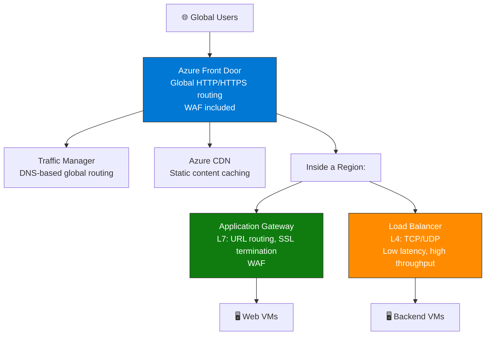
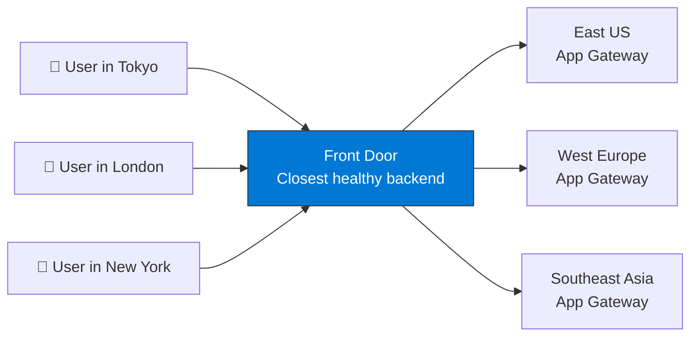

import {
  Info,
  Warning,
  Tip,
  BestPractice,
  Example,
  Exercise,
  Quiz,
  CodeBlock,
  TerminalBlock,
  Flashcard,
  ProductionNote,
  ArchitectureNote,
  InterviewQuestion,
} from "@site/src/components/shared/InteractiveBlocks";

## Learning Objectives

By the end of this lesson, you will:

- Design VNets with subnets and address spaces
- Choose the right load balancer for different scenarios
- Route global traffic with Traffic Manager and Front Door
- Configure CDN for static content delivery
- Understand when to use each networking service

---

## Simple Explanation

**Azure networking is the highway system for your cloud resources.**

- **VNet** — your private neighborhood. Resources inside can talk to each other.
- **Load Balancer** — the traffic cop at the entrance. Distributes cars evenly.
- **Application Gateway** — the security guard who also checks IDs. Inspects traffic at the application layer.
- **Front Door** — the global traffic control center. Sends users to the nearest available datacenter.
- **CDN** — local warehouses. Cache copies of your content close to every user.

---

## Core Explanation

### The Load Balancing Stack

### Load Balancer Comparison

| Service                 | Layer        | Global? | Use Case                                              |
| ----------------------- | ------------ | ------- | ----------------------------------------------------- |
| **Azure Load Balancer** | L4 (TCP/UDP) | No      | Distribute traffic to VMs in a region                 |
| **Application Gateway** | L7 (HTTP)    | No      | URL routing, SSL offload, WAF                         |
| **Front Door**          | L7 (HTTP)    | Yes     | Global HTTP routing, CDN, WAF                         |
| **Traffic Manager**     | DNS          | Yes     | DNS-based routing (performance, priority, geographic) |

<BestPractice>
  **Layer 4 (Load Balancer):** Use when you need raw speed and don't need to inspect HTTP. Backend
  databases, non-HTTP services. **Layer 7 (App Gateway/Front Door):** Use when you need URL routing
  (`/api` → backend, `/static` → CDN), SSL termination, or WAF.
</BestPractice>

---

## Professional Explanation

### Global Traffic Routing Strategies

| Routing Method  | How It Works                      | Best For                          |
| --------------- | --------------------------------- | --------------------------------- |
| **Performance** | Route to lowest latency           | User-facing apps, global audience |
| **Priority**    | Primary → Secondary → Tertiary    | Active-passive DR                 |
| **Weighted**    | Split traffic by percentage       | A/B testing, canary deployments   |
| **Geographic**  | Route by user location            | GDPR, data sovereignty            |
| **Multivalue**  | Return multiple healthy endpoints | Client-side failover              |
| **Subnet**      | Route by user IP range            | Enterprise, IP-based routing      |

---

## Production Explanation

### CloudNova: Global E-Commerce Architecture

<ArchitectureNote title="CloudNova Global Traffic Design">
  CloudNova's e-commerce platform serves customers in North America, Europe, and Asia-Pacific. They
  need low latency everywhere.
</ArchitectureNote>

<TerminalBlock>
{`# CloudNova Global Traffic Setup

# 1. Front Door: Global entry point with WAF

az network front-door create \\
--name cloudnova-global \\
--resource-group cloudnova-prod \\
--backend-address eastus-app.azurewebsites.net \\
--backend-address westeurope-app.azurewebsites.net \\
--backend-address southeastasia-app.azurewebsites.net

# 2. CDN: Cache product images in every Microsoft edge location

az cdn endpoint create \\
--name cloudnova-images \\
--profile-name cloudnova-cdn \\
--resource-group cloudnova-prod \\
--origin cloudnovaprod.blob.core.windows.net/images \\
--origin-host-header cloudnovaprod.blob.core.windows.net

# 3. Traffic Manager: DNS failover (backup to Front Door)

az network traffic-manager profile create \\
--name cloudnova-tm \\
--resource-group cloudnova-prod \\
--routing-method Priority \\
--unique-dns-name cloudnova-tm

# Result:

# → User hits cloudnova.com → Front Door → nearest region

# → Product images served from CDN (edge location closest to user)

# → If Front Door fails, Traffic Manager DNS switches to backup`}

</TerminalBlock>

---

## Hands-On Exercise

<Exercise title="Design CloudNova's Global Network" time="20 minutes">

**Scenario:** CloudNova is launching in 3 regions. Design the networking.

**Requirements:**

1. Users should reach the closest healthy region automatically
2. Static assets (images, CSS) should load in < 50ms globally
3. All HTTP traffic must be inspected for SQL injection and XSS
4. If a region fails, traffic must redirect automatically

**Tasks:**

1. Draw the architecture (Mermaid)
2. List Azure services needed
3. Explain the traffic flow from user → application

<Quiz question="Which service inspects HTTP headers for SQL injection patterns?">
  - Azure Load Balancer - *Azure Application Gateway with WAF* - Traffic Manager - Azure CDN
</Quiz>

</Exercise>

---

## Flashcard Review

<Flashcard
  front="L4 Load Balancer vs L7 Application Gateway"
  back="L4: TCP/UDP, fast, no HTTP inspection. L7: HTTP-aware, URL routing, SSL termination, WAF. AG is L4 LB + HTTP intelligence."
/>

<Flashcard
  front="Front Door vs Traffic Manager"
  back="Front Door: L7 HTTP proxy with WAF + CDN (anycast, ~1s failover). Traffic Manager: DNS-based routing (client DNS TTL, ~5 min failover). FD is newer and preferred."
/>

<Flashcard
  front="When to use Azure CDN?"
  back="Static content (images, CSS, JS, videos) that doesn't change often. CDN caches copies at edge locations worldwide → faster load, less origin traffic."
/>

---

## Related Content

| Resource                   | Link                                                     |
| -------------------------- | -------------------------------------------------------- |
| Previous: Storage Services | [Lesson 3](03-storage-services)                          |
| Next: Database Services    | [Lesson 5](05-database-services)                         |
| AZ-104: Virtual Networks   | [Exam objective](../../certifications/az-104/networking) |
