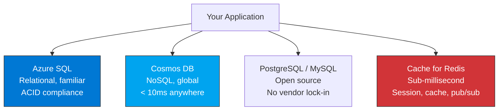
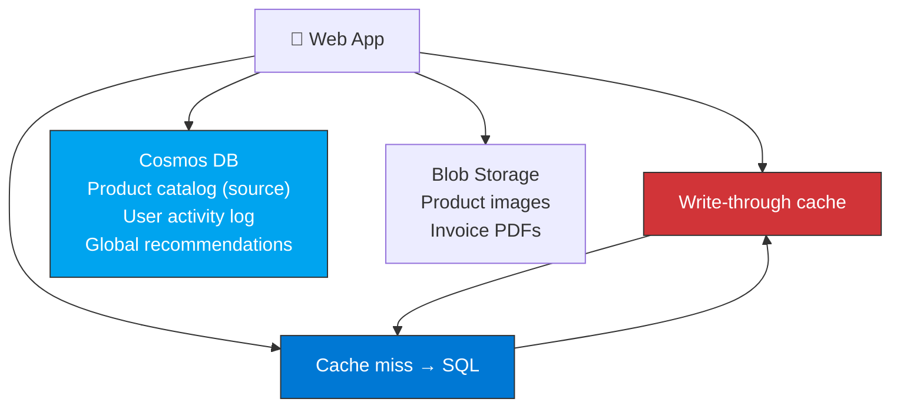

import {
  Info,
  Warning,
  Tip,
  BestPractice,
  Example,
  Exercise,
  Quiz,
  CodeBlock,
  TerminalBlock,
  Flashcard,
  ProductionNote,
  ArchitectureNote,
  InterviewQuestion,
} from "@site/src/components/shared/InteractiveBlocks";

## Learning Objectives

By the end of this lesson, you will:

- Choose the right Azure database for any workload
- Understand Azure SQL tiers, elastic pools, and geo-replication
- Differentiate Cosmos DB from relational databases
- Configure Azure Cache for Redis for performance
- Plan database migration strategies

---

## Simple Explanation

**Choosing a database is like choosing a vehicle.**

- **Azure SQL** — a reliable sedan. Familiar, well-understood, does the job for most trips.
- **Cosmos DB** — a rocket ship. Incredibly fast and global, but you need to know what you're doing.
- **PostgreSQL** — a reliable truck. Open source, battle-tested, carries any load.
- **Redis Cache** — a motorcycle courier. Blazing fast for small deliveries, but don't put your furniture in it.

Use the right vehicle for the right journey.

---

## Core Explanation

### The Azure Database Landscape

| Service              | Type                     | Best For                                      | Not For                                    |
| -------------------- | ------------------------ | --------------------------------------------- | ------------------------------------------ |
| **Azure SQL**        | Relational (SQL Server)  | Traditional apps, ERP, CRM, reporting         | Schema-less data, extreme global scale     |
| **Cosmos DB**        | Multi-model NoSQL        | IoT, gaming, real-time, global apps           | Complex JOINs, strict schema enforcement   |
| **PostgreSQL/MySQL** | Relational (Open source) | Cloud-native apps, open source stack          | When you need SQL Server-specific features |
| **Cache for Redis**  | In-memory key-value      | Session state, leaderboards, pub/sub, caching | Persistent storage, large datasets         |

---

## Professional Explanation

### Azure SQL: Production-Ready Relational

| Feature                    | What It Does                          | CloudNova Usage                     |
| -------------------------- | ------------------------------------- | ----------------------------------- |
| **Active Geo-Replication** | Readable secondaries in other regions | DR and global read scale            |
| **Auto-failover groups**   | Automatic failover to secondary       | 99.995% availability                |
| **Elastic Pools**          | Share resources across DBs            | 50 tenant databases, one pool       |
| **Built-in AI**            | Automatic tuning, threat detection    | Auto-index recommendations          |
| **Serverless tier**        | Auto-pause during inactivity          | Dev databases that aren't used 24/7 |

<TerminalBlock>
{`# Deploy an Azure SQL Database with geo-replication
# 1. Create primary (East US)
az sql db create \\
  --name cloudnova-orders \\
  --server cloudnova-sql-server \\
  --resource-group cloudnova-prod \\
  --service-objective GP_Gen5_4 \\
  --zone-redundant true

# 2. Create geo-replica (West Europe) — readable!

az sql db replica create \\
--name cloudnova-orders \\
--server cloudnova-sql-server \\
--resource-group cloudnova-prod \\
--partner-server cloudnova-sql-server-weu \\
--service-objective GP_Gen5_4

# 3. Create auto-failover group

az sql failover-group create \\
--name orders-fog \\
--server cloudnova-sql-server \\
--partner-server cloudnova-sql-server-weu \\
--resource-group cloudnova-prod \\
--failover-policy Automatic \\
--grace-period 1

# Result: Automatic failover if East US goes down

# West Europe replica becomes primary in < 1 hour`}

</TerminalBlock>

### Cosmos DB: Planet-Scale NoSQL

<ProductionNote>
**When Cosmos DB shines:** A gaming company storing player profiles. Players are everywhere. Reads must be < 10ms regardless of location. Schema changes weekly. Cosmos DB handles this natively.
</ProductionNote>

| Feature                          | Benefit                                                                     |
| -------------------------------- | --------------------------------------------------------------------------- |
| **Turn-key global distribution** | Click a region, data replicates automatically                               |
| **5 consistency models**         | Choose: Strong → Bounded Staleness → Session → Consistent Prefix → Eventual |
| **Multi-model**                  | SQL API, MongoDB API, Cassandra API, Gremlin (graph), Table API             |
| **Autoscale**                    | Scale RU/s automatically based on demand                                    |
| **99.999% availability**         | For multi-region writes                                                     |

<CodeBlock language="python">
{"""Cosmos DB: Query player profiles globally."""
from azure.cosmos import CosmosClient

client = CosmosClient(
url="https://cloudnova-gaming.documents.azure.com:443/",
credential=credential
)
database = client.get_database_client("game-db")
container = database.get_container_client("players")

# Query: "Find all players above level 50 in the US East region"

query = """
SELECT p.id, p.username, p.level, p.region
FROM players p
WHERE p.level > 50 AND p.region = 'eastus'
ORDER BY p.level DESC
"""

# This query runs in < 10ms from any Azure region

# Cosmos DB automatically routes to nearest replica

for player in container.query_items(query=query, enable_cross_partition_query=True):
print(f"🎮 {player['username']} — Level {player['level']}")

</CodeBlock>

---

## Production Explanation

### CloudNova Database Architecture

<ArchitectureNote title="CloudNova Data Layer">
  CloudNova's e-commerce platform uses a polyglot persistence strategy — different databases for
  different needs.
</ArchitectureNote>

### Database Migration Strategies

| Strategy                               | How                                  | Downtime  | Risk           |
| -------------------------------------- | ------------------------------------ | --------- | -------------- |
| **Backup/Restore**                     | Export → Copy → Import               | Hours     | Low            |
| **Azure DMS** (Data Migration Service) | Online migration, continuous sync    | Near-zero | Medium         |
| **Transactional Replication**          | SQL Server native replication        | Near-zero | High (complex) |
| **App-Level Dual Write**               | Write to old + new, verify, cut over | None      | Highest        |

---

## Hands-On Exercise

<Exercise title="Design the Data Layer" time="20 minutes">

**Scenario:** CloudNova is building a social feature for their app:

- User profiles (structured, relational)
- Activity feed (time-series, high volume, global reads)
- Session data (ephemeral, sub-ms reads)
- User-uploaded photos (unstructured, blob)

**Tasks:**

1. Choose the Azure data service for each
2. Justify each choice in one sentence
3. Draw the data flow when a user posts a photo

<Quiz question="Which Azure service is best for a globally-distributed activity feed with < 10ms reads?">
  - Azure SQL with geo-replication - *Cosmos DB with multi-region writes* - Azure Cache for Redis -
  Blob Storage
</Quiz>

</Exercise>

---

## Flashcard Review

<Flashcard
  front="Azure SQL vs Cosmos DB: when to use which?"
  back="Azure SQL: relational data, ACID, JOINs, reporting. Cosmos DB: NoSQL, global scale, < 10ms anywhere, flexible schema, IoT/gaming."
/>

<Flashcard
  front="What is an elastic pool?"
  back="Share DTUs/vCores across multiple Azure SQL databases. Cost-effective for multi-tenant SaaS where usage patterns vary per database."
/>

<Flashcard
  front="Redis Cache use cases"
  back="Session state, page caching, leaderboards, pub/sub messaging, rate limiting, and transient data that needs sub-millisecond access."
/>

---

## Related Content

| Resource                      | Link                                               |
| ----------------------------- | -------------------------------------------------- |
| Previous: Network Services    | [Lesson 4](04-network-services)                    |
| Next: Monitoring & Management | [Lesson 6](06-monitoring-management)               |
| AZ-104: Data Services         | [Exam objective](../../certifications/az-104/data) |
