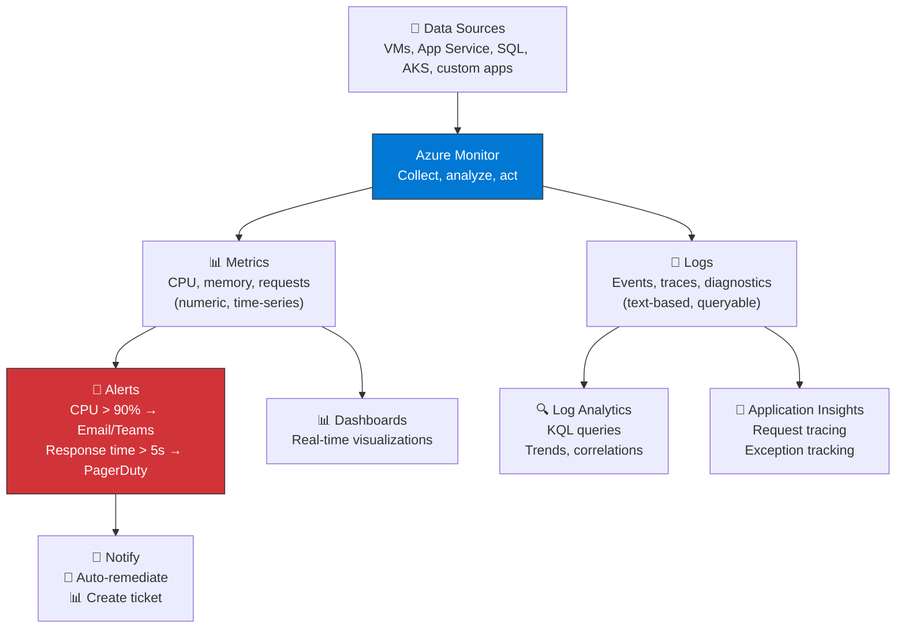
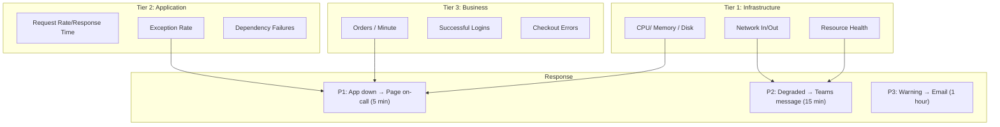

import {
  Info,
  Warning,
  Tip,
  BestPractice,
  Example,
  Exercise,
  Quiz,
  CodeBlock,
  TerminalBlock,
  Flashcard,
  ProductionNote,
  ArchitectureNote,
  InterviewQuestion,
} from "@site/src/components/shared/InteractiveBlocks";

## Learning Objectives

By the end of this lesson, you will:

- Architect a complete Azure monitoring strategy
- Configure metric alerts and action groups
- Use Log Analytics for diagnostics and troubleshooting
- Leverage Azure Advisor for cost, security, and performance recommendations
- Understand Application Insights for app-level monitoring

---

## Simple Explanation

**Monitoring is knowing what's happening before your users do.**

Without monitoring, you discover problems when customers tweet about them. With monitoring, you get a text before the first user complains.

Azure Monitor is your central nervous system. It collects signals from every Azure resource and routes them to the right place: dashboards, alerts, or analysis tools.

---

## Core Explanation

### The Azure Monitoring Stack

---

## Professional Explanation

### Metric Alerts: Proactive Detection

<TerminalBlock>
{`# Create an alert: notify when VM CPU exceeds 90% for 5 minutes

# 1. Create action group (who to notify)

az monitor action-group create \\
--name cloudnova-oncall \\
--resource-group cloudnova-prod \\
--action email cloudnova-oncall cloudnova-oncall@cloudnova.com \\
--action webhook pagerduty https://events.pagerduty.com/...

# 2. Create metric alert

az monitor metrics alert create \\
--name "high-cpu-web-server" \\
--resource-group cloudnova-prod \\
--scopes "/subscriptions/.../resourceGroups/prod-rg/providers/Microsoft.Compute/virtualMachines/web-server-01" \\
--condition "avg Percentage CPU > 90" \\
--window-size 5m \\
--evaluation-frequency 1m \\
--action cloudnova-oncall \\
--severity 2 \\
--description "Web server CPU critically high"

# Result: If CPU averages > 90% for 5 minutes →

# Email to oncall team + PagerDuty page`}

</TerminalBlock>

### Log Analytics: Ask Questions of Your Logs

<CodeBlock language="kql">
{`// KQL: Find all resources created in the last 24 hours
// (useful for security auditing and change tracking)
AzureActivity
| where TimeGenerated > ago(24h)
| where OperationNameValue contains "write"
| project TimeGenerated, 
          Who = Caller, 
          What = OperationNameValue, 
          Resource = Resource, 
          ResourceGroup
| order by TimeGenerated desc

// KQL: Identify VMs that have been running for > 7 days straight
// (potential cost optimization)
InsightsMetrics
| where TimeGenerated > ago(7d)
| where Name == "Percentage CPU"
| summarize
AvgCPU = avg(Val),
MaxCPU = max(Val),
Samples = count()
by Computer
| where Samples > 1000 // Running continuously
| project Computer, AvgCPU, MaxCPU,
Recommendation = iff(AvgCPU < 10, "Consider deallocation", "Normal")`}

</CodeBlock>

---

## Production Explanation

### Azure Advisor: Your Free Consultant

<ProductionNote>
  **Azure Advisor is free and always-on.** It scans your entire subscription and gives personalized
  recommendations in five categories. CloudNova reviews Advisor recommendations weekly.
</ProductionNote>

| Category                   | Example Recommendation                                                | Impact                       |
| -------------------------- | --------------------------------------------------------------------- | ---------------------------- |
| **Cost**                   | "VM `analytics-server` has 0% CPU for 30 days — shutdown or downsize" | Save $450/month              |
| **Security**               | "25 VMs missing endpoint protection"                                  | High — security risk         |
| **Performance**            | "SQL Database `orders-db` — add index on `customer_id`"               | 3x query speed               |
| **Reliability**            | "Storage account `backups` — enable soft delete"                      | Prevent accidental data loss |
| **Operational Excellence** | "7 resources without tags — add cost-center and owner"                | Governance gap               |

### CloudNova Monitoring Architecture

<ArchitectureNote title="CloudNova's Three-Tier Monitoring">
  CloudNova monitors at three levels: infrastructure (is it running?), application (is it working?),
  and business (are customers happy?).
</ArchitectureNote>

---

## Hands-On Exercise

<Exercise title="Build a Monitoring Plan" time="25 minutes">

**Scenario:** CloudNova's e-commerce app needs monitoring. Design the alert strategy.

**Requirements:**

- If the web app returns 5xx errors for > 5 minutes → PagerDuty (P1)
- If CPU > 80% for > 15 minutes → Teams message (P2)
- If monthly spend exceeds $5,000 → Email (P3)
- If database DTU > 90% for > 10 minutes → Scale up automatically

**Tasks:**

1. Write the Azure CLI commands for the P1 and P3 alerts
2. Describe the auto-remediation logic for the database
3. What metric would you use for the "app is down" alert?

<Quiz question="Which service provides request tracing and exception tracking at the application level?">
  - Azure Monitor Metrics - Log Analytics - *Application Insights* - Azure Advisor
</Quiz>

</Exercise>

---

## Flashcard Review

<Flashcard
  front="Metrics vs Logs in Azure Monitor"
  back="Metrics: numeric, time-series (CPU %, request count), near real-time, stored for 93 days. Logs: text-based (events, traces), queryable with KQL, stored as configured."
/>

<Flashcard
  front="What is an Action Group?"
  back="A collection of notification receivers (email, SMS, voice, webhook, ITSM) that alerts trigger. Create once, reuse across all alerts."
/>

<Flashcard
  front="Name Azure Advisor's five recommendation categories"
  back="1) Cost, 2) Security, 3) Performance, 4) Reliability, 5) Operational Excellence"
/>

---

## Related Content

| Resource                         | Link                                      |
| -------------------------------- | ----------------------------------------- |
| Previous: Database Services      | [Lesson 5](05-database-services)          |
| Next: CLI & Automation Deep Dive | [Lesson 7](07-cli-automation)             |
| Module: Observability            | [Module 21](../../21-observability/index) |
