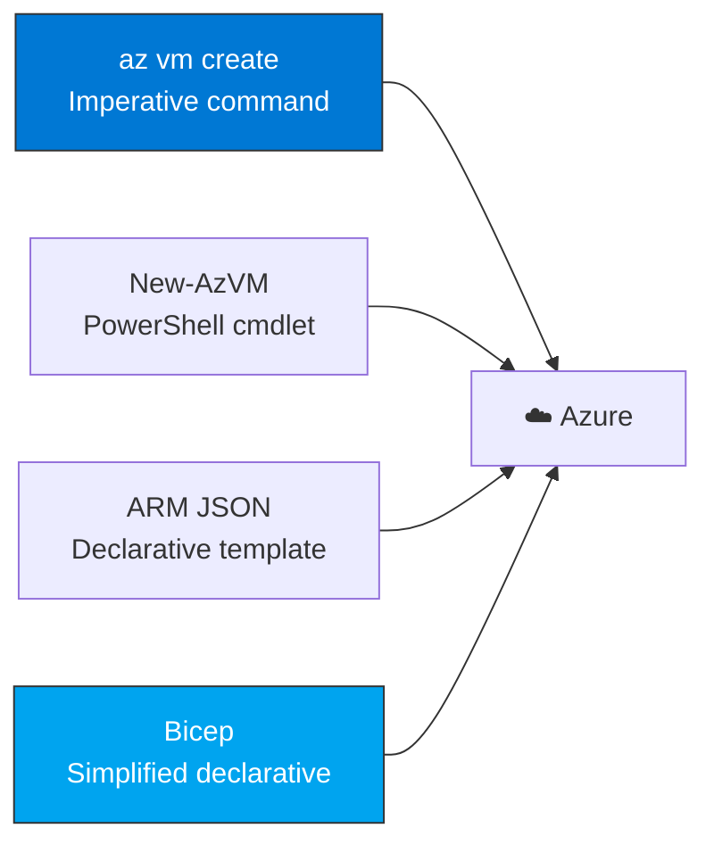
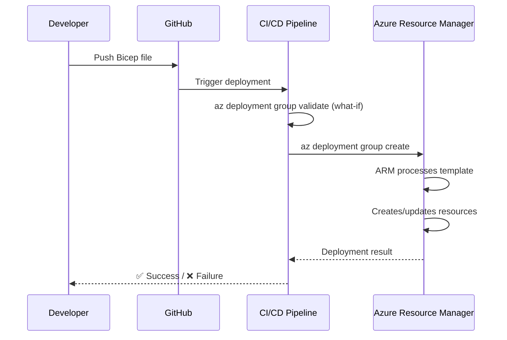

import {
  Info,
  Warning,
  Tip,
  BestPractice,
  Example,
  Exercise,
  Quiz,
  CodeBlock,
  TerminalBlock,
  Flashcard,
  ProductionNote,
  ArchitectureNote,
  InterviewQuestion,
} from "@site/src/components/shared/InteractiveBlocks";

## Learning Objectives

By the end of this lesson, you will:

- Master Azure CLI for daily operations
- Compare CLI, PowerShell, ARM templates, and Bicep
- Deploy infrastructure declaratively with Bicep
- Schedule automation with Azure Automation runbooks
- Build repeatable deployment pipelines

---

## Simple Explanation

**The Azure Portal is great for learning. The CLI is for getting work done.**

Clicking in the portal to create 50 VMs takes hours. A CLI script takes 30 seconds. When you're a cloud engineer, your terminal is your primary tool.

Think of the CLI as your direct line to Azure — no menus, no wizards, just commands that do exactly what you tell them to.

---

## Core Explanation

### CLI vs PowerShell vs ARM vs Bicep

| Tool                 | Style                       | Best For                                 | Verbosity      |
| -------------------- | --------------------------- | ---------------------------------------- | -------------- |
| **Azure CLI**        | Imperative (`az vm create`) | Interactive, scripts, quick tasks        | Low            |
| **Azure PowerShell** | Imperative (`New-AzVM`)     | Windows admins, existing PS scripts      | Low            |
| **ARM Templates**    | Declarative (JSON)          | Deployment as code, complex dependencies | High (verbose) |
| **Bicep**            | Declarative (DSL)           | Modern IaC for Azure, simpler than ARM   | Low (clean)    |

<BestPractice>
  **CLI for operations, Bicep for infrastructure.** Use `az` commands for one-off tasks and
  debugging. Use Bicep for repeatable, version-controlled infrastructure deployments.
</BestPractice>

---

## Professional Explanation

### Azure CLI Mastery

<TerminalBlock>
{`# 7 CLI tricks every cloud engineer should know

# 1. JMESPath queries — filter and format output

az vm list --query "[?powerState=='VM running'].{Name:name,Size:hardwareProfile.vmSize}" --output table

# 2. --output formats

az vm list --output table # Human-readable
az vm list --output json # Machine-readable (default)
az vm list --output tsv # Tab-separated (for shell scripts)
az vm list --output yaml # YAML format

# 3. Find available VM sizes in a region

az vm list-sizes --location eastus \\
--query "[?numberOfCores >= \`4\` && memoryInMb >= \`8192\`]" \\
--output table

# 4. Delete a resource and all its children

az resource delete \\
--ids $(az resource list --resource-group temp-rg --query "[].id" --output tsv)

# 5. Wait for a long-running operation

vm_id=$(az vm create ... --query "id" --output tsv)
az vm wait --ids $vm_id --custom "instanceView.statuses[?code=='PowerState/running']"

# 6. Run commands inside a VM without SSH (Azure Run Command)

az vm run-command invoke \\
--name web-server-01 \\
--resource-group cloudnova-prod \\
--command-id RunShellScript \\
--scripts "systemctl status nginx"

# 7. Export complete resource group as ARM template

az group export --name cloudnova-prod --include-parameter-default-value > prod-snapshot.json`}

</TerminalBlock>

### Bicep: Modern Azure IaC

<CodeBlock language="bicep" title="main.bicep">
{`// Bicep: Declarative Azure infrastructure
// Deploy with: az deployment group create --template-file main.bicep

param location string = resourceGroup().location
param environment string = 'dev'
param vmSize string = 'Standard_D2s_v3'

// Naming convention using string interpolation
var vmName = 'vm-\${environment}-web-\${uniqueString(resourceGroup().id)}'
var nicName = '\${vmName}-nic'
var nsgName = '\${vmName}-nsg'

// Network Security Group
resource nsg 'Microsoft.Network/networkSecurityGroups@2023-04-01' = {
name: nsgName
location: location
properties: {
securityRules: [
{
name: 'allow-https'
properties: {
priority: 100
direction: 'Inbound'
access: 'Allow'
protocol: 'Tcp'
sourcePortRange: '*'
destinationPortRange: '443'
sourceAddressPrefix: 'Internet'
destinationAddressPrefix: '*'
}
}
]
}
}

// Virtual Machine
resource vm 'Microsoft.Compute/virtualMachines@2023-07-01' = {
name: vmName
location: location
properties: {
hardwareProfile: { vmSize: vmSize }
osProfile: {
computerName: vmName
adminUsername: 'azureuser'
adminPassword: adminPassword
}
// ... storage profile, network profile ...
}
// Conditionally add tags
tags: environment == 'prod'
? { criticality: 'high', backup: 'daily' }
: {}
}

// Output: public IP for easy access
output publicIP string = nic.properties.ipConfigurations[0].properties.publicIPAddress.properties.ipAddress`}

</CodeBlock>

<Info>
  **Bicep compiles to ARM JSON,** so it deploys through the same pipeline. All the benefits of ARM
  (what-you-see-is-what-you-get, rollback on failure) without the 500-line JSON files.
</Info>

---

## Production Explanation

### CloudNova: Scheduled Automation

<ProductionNote>
  **Scenario:** Every Monday at 7 AM, CloudNova runs a cost optimization runbook that auto-stops all
  dev/staging VMs that were accidentally left running over the weekend.
</ProductionNote>

<TerminalBlock>
{`# Azure Automation: Scheduled PowerShell runbook

# 1. Create Automation Account

az automation account create \\
--name cloudnova-automation \\
--resource-group cloudnova-prod \\
--location eastus

# 2. Publish runbook (PowerShell)

az automation runbook create \\
--automation-account-name cloudnova-automation \\
--resource-group cloudnova-prod \\
--name stop-dev-vms \\
--type PowerShell \\
--description "Stop all dev environment VMs"

# 3. Schedule: Every Monday at 7:00 AM

az automation schedule create \\
--automation-account-name cloudnova-automation \\
--resource-group cloudnova-prod \\
--name monday-morning-cleanup \\
--frequency Week \\
--interval 1 \\
--week-days Monday \\
--start-time "2024-01-15 07:00:00"

# 4. Link schedule to runbook

az automation schedule link-to-runbook \\
--automation-account-name cloudnova-automation \\
--resource-group cloudnova-prod \\
--runbook-name stop-dev-vms \\
--schedule-name monday-morning-cleanup`}

</TerminalBlock>

### The Deployment Flow

---

## Hands-On Exercise

<Exercise title="Build a Deployment Script" time="25 minutes">

**Scenario:** CloudNova onboards a new developer. You need a script that:

1. Creates a resource group: `rg-dev-{username}`
2. Tags it with `owner={username}`, `environment=dev`, `cost-center=engineering`
3. Assigns the user "Contributor" RBAC at the RG scope
4. Sets a budget of $100/month with email alert at 80%

**Tasks:**

1. Write the Azure CLI script (accept `username` as a parameter)
2. Add `--dry-run` mode that prints what would happen
3. Explain why you'd use Bicep vs CLI for this

<Quiz question="What does `az deployment group validate` do?">
  - Actually deploys resources - *Runs ARM 'what-if' — checks for errors without deploying* -
  Validates Bicep syntax offline - Creates a deployment plan but doesn't execute
</Quiz>

</Exercise>

---

## Flashcard Review

<Flashcard
  front="Azure CLI vs Bicep: when to use which?"
  back="CLI: interactive commands, scripts, one-off operations. Bicep: repeatable infrastructure deployments, version-controlled, shareable across teams."
/>

<Flashcard
  front="What is `az vm run-command invoke`?"
  back="Runs a script inside an Azure VM without needing SSH/RDP. Useful for troubleshooting when networking is broken or you don't have credentials."
/>

<Flashcard
  front="Bicep vs ARM templates: main advantage?"
  back="Bicep is dramatically shorter (50-80% fewer lines), has better tooling (VS Code intellisense, linter), and supports modules natively. Compiles to ARM JSON for deployment."
/>

---

## Related Content

| Resource                          | Link                                  |
| --------------------------------- | ------------------------------------- |
| Previous: Monitoring & Management | [Lesson 6](06-monitoring-management)  |
| Next: Migration & Hybrid          | [Lesson 8](08-migration-hybrid)       |
| Module: Terraform                 | [Module 12](../../12-terraform/index) |
| Module: CI/CD                     | [Module 15](../../15-cicd/index)      |
