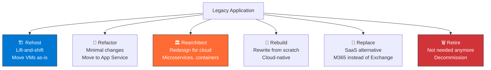
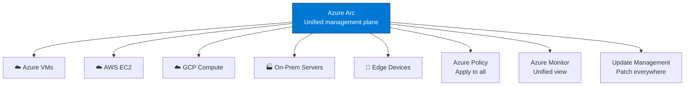

import { Info, Warning, Tip, BestPractice, Example, Exercise, Quiz, CodeBlock, TerminalBlock, Flashcard, ProductionNote, ArchitectureNote, InterviewQuestion } from '@site/src/components/shared/InteractiveBlocks';

## Learning Objectives

By the end of this lesson, you will:
- Plan a cloud migration with the 6 R's framework
- Use Azure Migrate for discovery and assessment
- Configure Azure Arc for hybrid management
- Implement disaster recovery with Azure Site Recovery
- Understand Azure Stack HCI use cases

---

## Simple Explanation

**Not everything moves to the cloud at once. Some things may never move.**

Migrating to Azure is like moving to a new house. You don't just throw everything in a truck and hope for the best. You decide what to keep, what to donate, what to upgrade, and what stays in the basement.

Azure gives you tools to plan the move, move incrementally, and even manage things that stay behind.

---

## Core Explanation

### The 6 R's of Migration

| Strategy | Effort | Cloud Benefit | Example |
|----------|--------|---------------|---------|
| **Rehost** | Low | Quick exit from data center | Move VMs to Azure as-is |
| **Refactor** | Medium | Managed services | Move SQL Server to Azure SQL |
| **Rearchitect** | High | Full cloud-native | Monolith → AKS microservices |
| **Rebuild** | Highest | Maximum benefit | Greenfield cloud-native app |
| **Replace** | Variable | Zero maintenance | Exchange → Microsoft 365 |
| **Retire** | Low | Cost savings | Decommission unused apps |

---

## Professional Explanation

### Azure Migrate: Discovery and Assessment

<TerminalBlock>
{`# 1. Create Azure Migrate project
az migrate project create \\
  --name cloudnova-migration \\
  --resource-group cloudnova-migrate \\
  --location eastus

# 2. Deploy the discovery appliance (download from portal)
# This appliance scans your on-prem VMware/Hyper-V environment
# and discovers: VMs, SQL instances, web apps, dependencies

# 3. Run assessment
# Portal → Azure Migrate → Assess → Azure VM
# Select discovered VMs → Create assessment
# Result: Shows Azure VM size recommendation, monthly cost estimate,
#         readiness (ready, ready with conditions, not ready)

# 4. Perform dependency analysis
# Shows which VMs communicate with each other
# Critical for: grouping VMs that must migrate together`}
</TerminalBlock>

### Azure Arc: Manage Anything, Anywhere

<CodeBlock language="bash">
{`# Register an on-prem server with Azure Arc
# 1. Generate installation script (Portal → Azure Arc → Add)
# 2. Run on the on-prem server
azcmagent connect \\
  --resource-group cloudnova-hybrid \\
  --tenant-id <tenant-id> \\
  --location eastus \\
  --subscription-id <subscription-id>

# 3. Now the server appears in Azure Portal
# Apply Azure Policy, use Azure Monitor, run update management
# All without migrating the VM to Azure!`}
</CodeBlock>

---

## Production Explanation

### Azure Site Recovery: Business Continuity

<ProductionNote>
**CloudNova DR Strategy:** Production VMs in East US replicate to West Europe via Azure Site Recovery. RPO: 15 minutes. RTO: 30 minutes. Cost: ~$200/month per VM for DR protection.
</ProductionNote>

<ArchitectureNote title="Disaster Recovery vs Backup">
**Backup** = point-in-time copy (restore from last week). **DR** = near-real-time replica (failover in minutes). You need both. ASR provides DR; Azure Backup provides backup.
</ArchitectureNote>

<TerminalBlock>
{`# Enable replication to DR region
# 1. Create Recovery Services vault in DR region
az backup vault create \\
  --name cloudnova-dr-vault \\
  --resource-group cloudnova-prod \\
  --location westeurope

# 2. Enable replication for a VM
az site-recovery protection-container-mapping create \\
  ...  # Complex setup, best done through Portal for DR

# Result:
# VM in East US → continuously replicates to West Europe
# If East US goes down:
#   1. Trigger failover in ASR
#   2. Test failover (non-disruptive) first
#   3. Full failover takes ~5-10 minutes
#   4. Reverse replication when primary is back`}
</TerminalBlock>

---

## Hands-On Exercise

<Exercise title="Plan CloudNova's Migration" time="20 minutes">

CloudNova has 150 servers on-premises. Categorize each using the 6 R's:

| App | Details |
|-----|---------|
| Exchange Server | 500 mailboxes, 2 TB |
| Legacy billing (VB6) | No source code, only vendor supported |
| Customer portal | ASP.NET, works but needs modernization |
| File server | 8 TB shared drive |
| Reporting server | Runs once/month, 2008 R2 |

**Task:** Choose the migration strategy for each and justify in one sentence.

<Quiz question="Which migration strategy has the LOWEST upfront effort?">
- Rearchitect
- *Rehost (lift-and-shift)*
- Rebuild
- Refactor
</Quiz>

</Exercise>

---

## Flashcard Review

<Flashcard front="Name the 6 R's of cloud migration" back="Rehost, Refactor, Rearchitect, Rebuild, Replace, Retire. In order of increasing effort and cloud benefit." />

<Flashcard front="What is Azure Arc?" back="Management plane that extends Azure control to servers running outside Azure — on-prem, AWS, GCP, edge — for policy, monitoring, and updates." />

<Flashcard front="RPO vs RTO" back="RPO (Recovery Point Objective): how much data you can lose (e.g., 15 minutes). RTO (Recovery Time Objective): how long recovery takes (e.g., 30 minutes)." />

---

## Related Content

| Resource | Link |
|----------|------|
| Previous: CLI & Automation | [Lesson 7](07-cli-automation) |
| Next: Security Center & Defender | [Lesson 9](09-security-center) |
| AZ-104: Backup & Recovery | [Exam objective](../../certifications/az-104/backup) |
