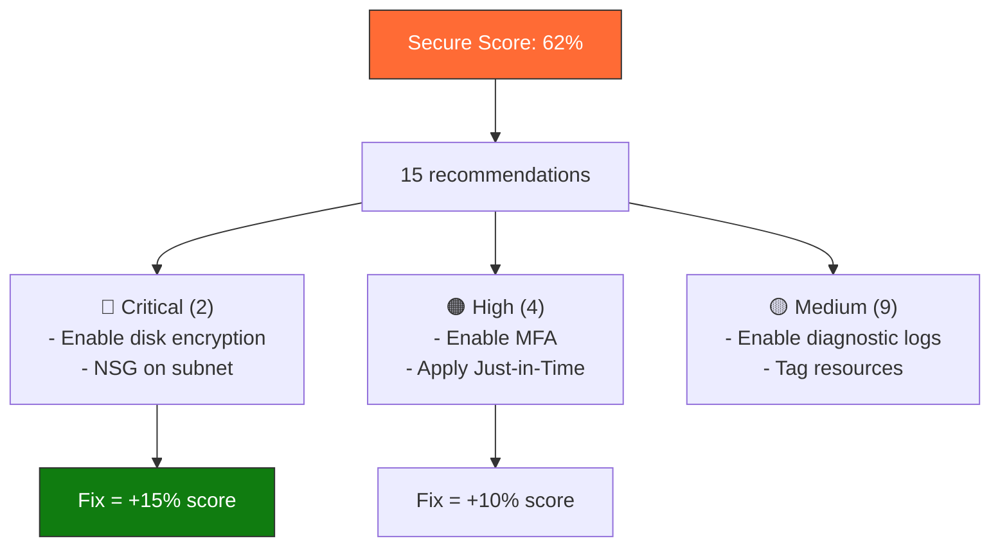
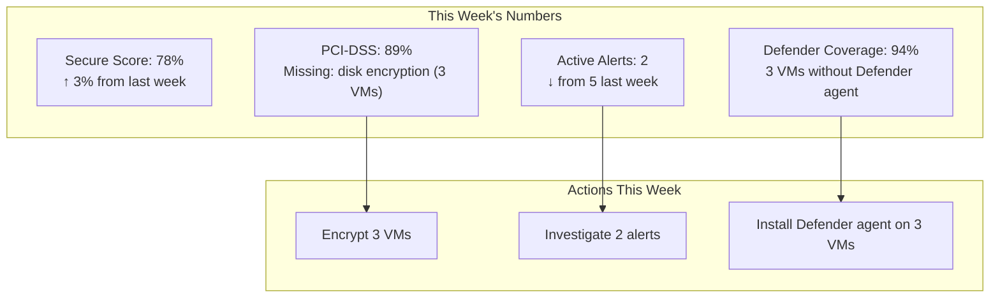

import { Info, Warning, Tip, BestPractice, Example, Exercise, Quiz, CodeBlock, TerminalBlock, Flashcard, ProductionNote, ArchitectureNote, InterviewQuestion } from '@site/src/components/shared/InteractiveBlocks';

## Learning Objectives

By the end of this lesson, you will:
- Configure Defender for Cloud across subscriptions
- Use Secure Score to prioritize security improvements
- Enable Just-in-Time (JIT) VM access
- Understand the difference between CSPM and CWPP
- Implement regulatory compliance dashboard for audits

---

## Simple Explanation

**Defender for Cloud is your security command center.**

It has two parts:
1. **CSPM** (Cloud Security Posture Management) — "Is my door locked?" It checks every resource against security best practices and gives you a score.
2. **CWPP** (Cloud Workload Protection) — "Is someone trying to break in?" It actively monitors your VMs, containers, and databases for attacks.

Without Defender, you're hoping you're secure. With Defender, you know.

---

## Core Explanation

### Secure Score: Your Security GPA

| Recommendation Impact | Secure Score Points | CloudNova Priority |
|----------------------|-------------------|-------------------|
| Enable disk encryption | +8 points | Critical — PCI-DSS requirement |
| Apply NSG to subnets | +7 points | Critical — prevent lateral movement |
| Enable MFA for admins | +5 points | High — identity protection |
| Tag all resources | +2 points | Medium — governance |

### JIT VM Access: No Standing Open Ports

<ProductionNote>
**The problem:** RDP/SSH ports open 24/7 are a gift to attackers. **The solution:** JIT keeps ports closed by default and opens them only when someone requests access — for a limited time, from a specific IP, with approval.
</ProductionNote>

<TerminalBlock>
{`# Enable JIT on a production VM
# Portal: Defender for Cloud → Workload protections → Just-in-time VM access
# Or CLI:

# 1. Enable JIT policy on the VM
az security jit-policy create \\
  --resource-group cloudnova-prod \\
  --location eastus \\
  --name jit-web-server-01 \\
  --vm-resource-id /subscriptions/.../virtualMachines/web-server-01 \\
  --ports '[{"number":22,"protocol":"*","allowedSourceAddressPrefix":"*","maxRequestAccessDuration":"PT3H"}]'

# 2. Developer requests JIT access
az security jit-network-access-policy initiate \\
  --resource-group cloudnova-prod \\
  --location eastus \\
  --vm-resource-id /subscriptions/.../virtualMachines/web-server-01 \\
  --ports '[{"number":22,"duration":"PT1H"}]'

# Result:
# NSG rule added: Allow SSH from developer's IP → port 22, valid for 1 hour
# After 1 hour: NSG rule auto-removed
# Before JIT: port 22 open 24/7 → attack surface`}
</TerminalBlock>

---

## Professional Explanation

### CSPM vs CWPP: Two Sides of the Same Coin

| Capability | CSPM | CWPP |
|-----------|------|------|
| **What it does** | Assesses configuration | Detects active threats |
| **Example** | "Storage account doesn't require HTTPS" | "Suspicious PowerShell running on VM" |
| **Free tier** | Secure Score + basic recommendations | None (requires Defender plan) |
| **Plan** | Included in all subscriptions | Defender for Servers/Containers/SQL/etc. |
| **Typical finding** | Missing encryption | Cryptominer detected |

<Info>
**Defender for Cloud is free for CSPM** (security posture management). CWPP features (threat detection, JIT, adaptive application controls) require paid Defender plans — ~$15/VM/month for Defender for Servers.
</Info>

---

## Production Explanation

### CloudNova Security Dashboard

<ArchitectureNote title="CloudNova's Weekly Security Review">
Every Monday, the Cloud Engineering team reviews the Defender for Cloud dashboard:
1. Secure Score trend (targeting 85%+)
2. New active alerts (threat detection)
3. Regulatory compliance drift (PCI-DSS controls)
4. Resources not covered by Defender plans
</ArchitectureNote>

---

## Hands-On Exercise

<Exercise title="Improve CloudNova's Secure Score" time="20 minutes">

CloudNova's Secure Score is 62%. Here's the dashboard:

| Recommendation | Impact | Resources Affected |
|---------------|--------|-------------------|
| Enable disk encryption | +8 pts | 12 VMs |
| Apply NSG to subnets | +7 pts | 3 subnets without NSGs |
| Enable MFA for admins | +5 pts | 4 admin users |
| Enable diagnostic logs | +3 pts | 15 resources |
| Tag resources | +2 pts | 40 resources |

**Tasks:**
1. Prioritize: which 3 give the highest score with least effort?
2. What would the new Secure Score be after fixing all 5?
3. Which recommendation should be fixed FIRST for PCI-DSS compliance?

<Quiz question="Which Defender for Cloud feature requires a PAID plan?">
- Secure Score
- Basic recommendations
- *Threat detection (CWPP)*
- Regulatory compliance dashboard
</Quiz>

</Exercise>

---

## Flashcard Review

<Flashcard front="CSPM vs CWPP" back="CSPM (Cloud Security Posture Management): checks configuration (is it set up right?). CWPP (Cloud Workload Protection): detects active threats (is it being attacked?). Defender for Cloud does both." />

<Flashcard front="What is JIT VM Access?" back="Just-in-Time access keeps RDP/SSH ports closed by default. Opens them only when requested, for a time-limited window, from a specific IP." />

<Flashcard front="How is Secure Score calculated?" back="Sum of (recommendation severity × affected resources) vs total possible score. Fixing critical recommendations for many resources gives the biggest score boost." />

---

## Related Content

| Resource | Link |
|----------|------|
| Previous: Migration & Hybrid | [Lesson 8](08-migration-hybrid) |
| Next: AZ-104 Exam Review | [Lesson 10](10-az104-review) |
| Module: DevSecOps | [Module 17](../../17-devsecops/index) |
