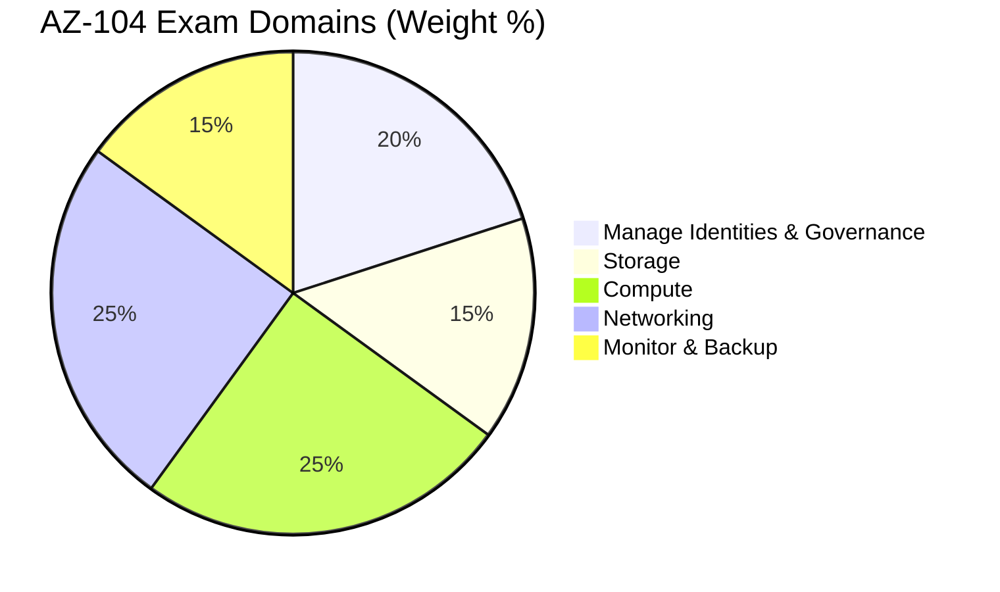

import { Info, Warning, Tip, BestPractice, Example, Exercise, Quiz, CodeBlock, TerminalBlock, Flashcard, ProductionNote, ArchitectureNote, InterviewQuestion } from '@site/src/components/shared/InteractiveBlocks';

## Learning Objectives

By the end of this review, you will:
- Understand the AZ-104 exam structure and scoring
- Self-assess readiness across all 5 exam domains
- Practice with real-format questions and case studies
- Know the most common "gotcha" questions
- Have a study plan for the final push

---

## Simple Explanation

**AZ-104 is the core Azure administrator certification.**

It tests whether you can actually **do** the job — not just memorize facts. Expect scenario-based questions: "CloudNova needs X. What should you configure?" The answer is rarely obvious and usually has 2-3 options that sound plausible.

The exam costs $165 USD. 40-60 questions. 100-120 minutes. Score needed: 700/1000.

---

## Core Explanation

### Exam Domains and Weighting

| Domain | Weight | Key Topics | CloudNova Readiness |
|--------|--------|------------|-------------------|
| **Identities & Governance** | 20-25% | RBAC, Policy, Management Groups, Azure AD | ✅ Covered |
| **Storage** | 15-20% | Blobs, Files, SAS, replication, tiers | ✅ Covered |
| **Compute** | 20-25% | VMs, Scale Sets, App Service, ACI, AKS | ✅ Covered |
| **Networking** | 20-25% | VNets, NSGs, Load Balancers, Front Door, DNS | ✅ Covered |
| **Monitor & Backup** | 10-15% | Alerts, Log Analytics, Backup, Recovery Vault | ✅ Covered |

---

## Professional Explanation

### Practice Questions (AZ-104 Format)

<Quiz question="You deploy 5 VMs in the same availability set. The VMs host a stateless web application. You need to ensure the application remains available if an Azure datacenter goes offline. What should you do?">

- Add a load balancer
- Deploy the VMs to an availability zone
- **Deploy VMs to multiple regions and use Traffic Manager**
- Increase VM instance count

</Quiz>

<Quiz question="You need to grant a developer the ability to create and manage VMs in a specific resource group only. She must NOT be able to modify networking or create other resource types. Which RBAC role should you assign?">

- Reader
- Contributor
- **Virtual Machine Contributor**
- Owner

</Quiz>

<Quiz question="A storage account contains 500 TB of data. A compliance policy requires that data older than 7 years be deleted. New data must be accessible immediately. What should you configure?">

- Manual deletion of blobs
- Archive tier with 7-year retention
- **Lifecycle management policy: move to archive at 180 days, delete at 2555 days**
- Cool tier for all data

</Quiz>

<Quiz question="You have an Azure SQL Database in East US. You need to ensure it can survive a complete Azure region outage with automatic failover. The solution must minimize cost. What should you configure?">

- Active geo-replication to West Europe
- **Auto-failover group with geo-replica in West Europe**
- Cosmos DB multi-region writes
- Manual backup and restore

</Quiz>

---

## Production Explanation

### Case Study: CloudNova Migration

<ArchitectureNote title="AZ-104 Case Study Simulation">
Real AZ-104 questions are preceded by a case study. Read the context, then answer the questions. Here's a simulation.
</ArchitectureNote>

**Background:** CloudNova is migrating 50 on-premises VMs to Azure. The VMs run a mix of Windows Server 2016, Ubuntu 20.04, and Red Hat Enterprise Linux.

**Requirements:**
1. Existing IP addresses must be preserved after migration
2. Solution must support 99.95% SLA
3. RPO of 15 minutes during migration
4. Developers must not have access to production credentials

<Quiz question="Which Azure service should CloudNova use for the migration?">

- **Azure Migrate with Azure Site Recovery**
- Azure Backup and manual restore
- Azure Data Box
- Azure Import/Export service

</Quiz>

<Quiz question="What should CloudNova use to give developers time-limited access to production VMs for emergency debugging?">

- Add developers to Contributor role
- **Just-in-Time VM Access in Defender for Cloud**
- Share the admin password via Key Vault
- Create individual user accounts on each VM

</Quiz>

<Quiz question="Which VM configuration provides 99.95% SLA?">

- Single VM with Premium SSD
- **Two or more VMs in an availability set**
- Single VM in an availability zone
- VM with automatic shutdown enabled

</Quiz>

---

## Hands-On Exercise

<Exercise title="Self-Assessment" time="15 minutes">

Rate your confidence (1-5) in each AZ-104 topic area:

| Topic | Your Rating (1-5) | Study Priority |
|-------|------------------|----------------|
| RBAC and custom roles | ? | High if < 3 |
| Azure Policy and Blueprints | ? | High if < 3 |
| VM deployment and management | ? | Medium if < 4 |
| Storage account configuration | ? | Medium if < 4 |
| VNet peering and NSGs | ? | High if < 3 |
| Load balancing (L4 vs L7) | ? | Medium if < 4 |
| Backup and Site Recovery | ? | Medium if < 4 |
| Application Insights and alerts | ? | Low if > 3 |
| ARM templates and Bicep | ? | Medium if < 3 |
| Azure AD and hybrid identity | ? | High if < 3 |

**Study plan:** Spend 70% of your time on topics rated 1-3. 
</Exercise>

---

## Top 10 AZ-104 "Gotchas"

1. **NSG priority:** Lower number = higher priority. 100 wins over 200.
2. **RBAC scope:** Reader at subscription → can see all RGs. Reader at RG → can see only that RG.
3. **LRS vs GRS:** LRS protects against disk failure. **Not** datacenter failure. Need GRS for region outage.
4. **Availability Set vs Zone:** AS = same datacenter, different racks. AZ = different datacenters.
5. **SAS token:** Scoped, time-limited, revocable. Never use account keys.
6. **Azure AD vs AD DS:** Azure AD = cloud identity (no GPO, no OU). AD DS = traditional Active Directory.
7. **App Service Plan:** Scaling the plan scales ALL apps in it. Isolate critical apps.
8. **VNet peering is NOT transitive:** A → B, B → C does NOT mean A → C.
9. **ExpressRoute vs VPN:** ER = private fiber (low latency, high SLA, expensive). VPN = over internet.
10. **Backup vs DR:** Backup = point-in-time copy. DR = near-real-time replica with failover.

---

## Flashcard Review

<Flashcard front="What's the AZ-104 passing score?" back="700 out of 1000. Questions are weighted by difficulty — harder questions are worth more points." />

<Flashcard front="Which domain has the highest weight on AZ-104?" back="Compute and Networking each at 20-25%. Together they represent nearly half the exam." />

<Flashcard front="What happens if VNet A is peered with VNet B, and B is peered with C?" back="A cannot reach C directly. VNet peering is NOT transitive. You'd need A peered with C, or use a hub-spoke with gateway transit." />

---

## Related Content

| Resource | Link |
|----------|------|
| Previous: Security Center | [Lesson 9](09-security-center) |
| Next module: Containers | [Module 08](../../08-containers/index) |
| AZ-104 Certification Path | [Certifications](../../../certifications/az-104) |
