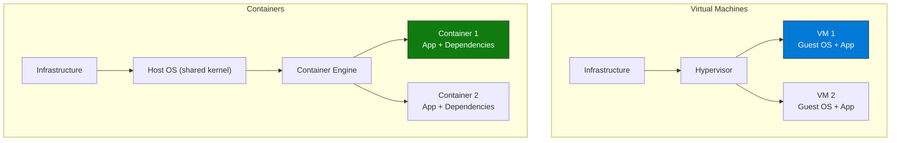
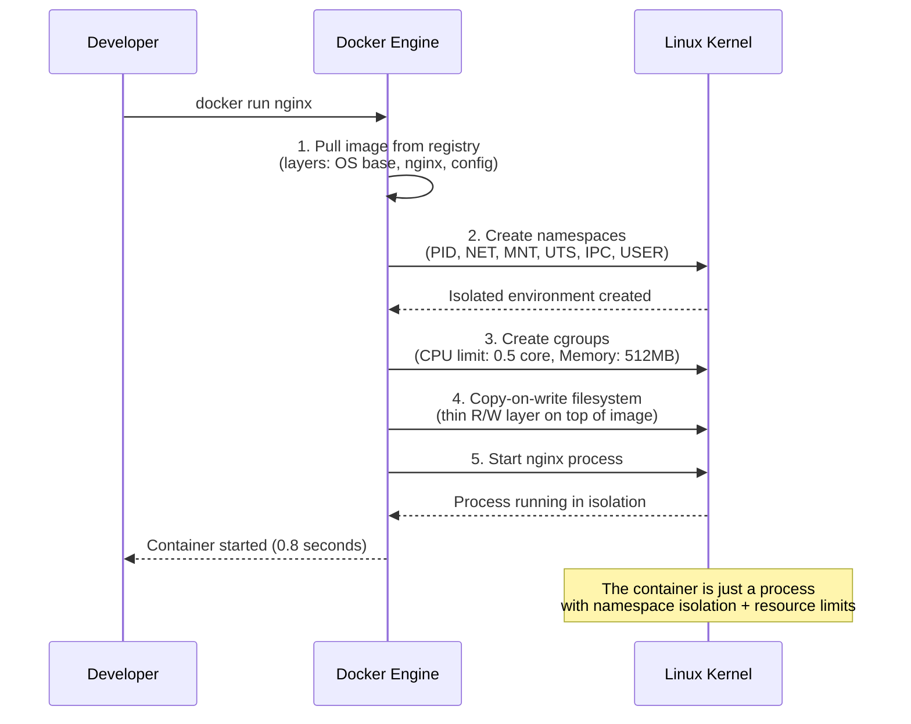

import { Info, Warning, Tip, BestPractice, Example, Exercise, Quiz, CodeBlock, TerminalBlock, Flashcard, ProductionNote, ArchitectureNote, InterviewQuestion } from '@site/src/components/shared/InteractiveBlocks';

## Learning Objectives

By the end of this lesson, you will:
- Understand what containers are and why they revolutionized software delivery
- Differentiate containers from virtual machines
- Understand the OCI (Open Container Initiative) standards
- Work with container registries and images
- Grasp how containers solve "it works on my machine"

---

## Simple Explanation

**A container is like a lunchbox for your application.**

Imagine you're sending food to a friend. Without containers, you'd say "I hope your kitchen has the right pots, pans, and oven temperature." With containers, you pack everything — the food, the recipe, the cooking instructions — into one sealed box that works the same everywhere.

That's what Docker did for software. Package your app with its exact dependencies, and it runs identically on your laptop, your teammate's laptop, and the production server.

---

## Core Explanation

### Containers vs Virtual Machines

| Aspect | VM | Container |
|--------|----|-----------|
| **Boot time** | Minutes | Seconds |
| **Size** | GBs (includes OS) | MBs (app + deps only) |
| **Isolation** | Strong (hypervisor) | Process-level (kernel) |
| **Density** | 10s per host | 100s per host |
| **Portability** | VM image, platform-specific | Container image, runs anywhere |
| **Resource overhead** | Full OS per VM | Shared kernel |

<BestPractice>
**Think of containers as isolated processes, not mini-VMs.** A container shares the host kernel and has no guest OS. Start containers in < 1 second. Destroy them just as fast. This changes how you think about infrastructure.
</BestPractice>

---

## Professional Explanation

### How Containers Work (Under the Hood)

| Isolation Mechanism | What It Does |
|--------------------|--------------|
| **PID Namespace** | Container sees only its own processes (PID 1 = container's main process) |
| **Network Namespace** | Container gets its own network stack, IP, ports |
| **Mount Namespace** | Container sees its own filesystem (the image layers) |
| **cgroups** | Limits CPU, memory, disk I/O — prevents noisy neighbor problem |
| **Union Filesystem** | Layers: base image + app layer + thin writable layer |

---

## Production Explanation

### CloudNova's Container Journey

<ArchitectureNote title="Why CloudNova Adopted Containers">
CloudNova started with VMs. Every deployment was a gamble: "Will it work in production?" Three pain points drove the switch to containers.
</ArchitectureNote>

| Pain Point | Before Containers | After Containers |
|------------|------------------|-----------------|
| **Deployment inconsistency** | "Works on my machine" — different OS versions, missing dependencies | Same image from dev → staging → production |
| **Scaling speed** | New VM boots in 3 minutes. Traffic spike already lost users | New container starts in 2 seconds. Handles spike in real-time |
| **Resource waste** | 50 VMs, average CPU 12%. Paying for 88% idle | 50 containers on 3 VMs. CPU 65%. Save 60% on compute |

### Container Registries

| Registry | Use Case | CloudNova Usage |
|----------|----------|-----------------|
| **Docker Hub** | Public images (nginx, redis, python) | Base images only |
| **Azure Container Registry (ACR)** | Private images, geo-replicated | All internal applications |
| **GitHub Container Registry** | OCI artifacts alongside code | Open source components |

<TerminalBlock>
{`# Create Azure Container Registry for CloudNova
az acr create \\
  --name cloudnovacontainers \\
  --resource-group cloudnova-prod \\
  --sku Premium \\
  --admin-enabled false  # Use Managed Identity, not admin!
  --geo-replications \\
    "westeurope" "Standard" \\
    "southeastasia" "Standard"

# Result:
# - Premium SKU: Private Link, geo-replication, 500 GiB storage
# - Geo-replicated: images available in 3 regions for fast pulls
# - No admin user: all access via Azure AD + RBAC`}
</TerminalBlock>

---

## Hands-On Exercise

<Exercise title="Container vs VM Decision" time="15 minutes">

CloudNova needs to deploy these workloads. For each, choose VM or Container and justify:

| Workload | Description |
|----------|-------------|
| A | Python API, stateless, uses PostgreSQL |
| B | Legacy .NET Framework 4.5 app (Windows-specific) |
| C | Data processing job, runs 10 min, triggered by events |
| D | PostgreSQL database (production) |

<Quiz question="What is the PRIMARY advantage of containers over VMs?">
- Better security isolation
- *Faster startup and higher density (share host OS kernel)*
- Easier to manage with GUI tools
- Built-in high availability
</Quiz>

</Exercise>

---

## Flashcard Review

<Flashcard front="Container vs VM: key difference" back="Containers share the host OS kernel (no guest OS). VMs each run a full guest OS. This makes containers start in seconds (vs minutes), take MBs (vs GBs), and run 100s per host (vs 10s)." />

<Flashcard front="What is an OCI image?" back="Open Container Initiative standard specification. Defines how to package an application (image-spec) and how to run it (runtime-spec). Docker, Podman, and containerd all follow OCI." />

<Flashcard front="What does a container registry do?" back="Stores and distributes container images. Like GitHub for container images. Supports versioning (tags), vulnerability scanning, and geo-replication." />

---

## Related Content

| Resource | Link |
|----------|------|
| Next: Docker Deep Dive | [Module 09](../../09-docker/index) |
| Azure Container Registry docs | [docs](https://learn.microsoft.com/azure/container-registry/) |
