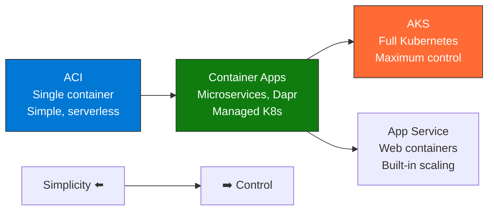
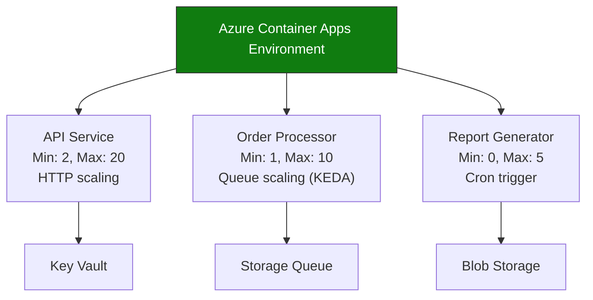

import {
  Info,
  Warning,
  Tip,
  BestPractice,
  Example,
  Exercise,
  Quiz,
  CodeBlock,
  TerminalBlock,
  Flashcard,
  ProductionNote,
  ArchitectureNote,
  InterviewQuestion,
} from "@site/src/components/shared/InteractiveBlocks";

## Learning Objectives

By the end of this lesson, you will:

- Compare all Azure container services and choose the right one
- Deploy serverless containers with Azure Container Instances
- Understand Container Apps for microservices
- Know when to use AKS vs managed container services
- Estimate costs across container options

---

## Simple Explanation

**Azure gives you four ways to run containers. Choose based on how much control you want.**

- **ACI** — "Run this container once." Simplest, fastest, no orchestration.
- **Container Apps** — "Run these microservices, scale them automatically." Managed K8s under the hood.
- **AKS** — "Give me a full Kubernetes cluster." Maximum control, maximum complexity.
- **App Service for Containers** — "Run this web app in a container." Web-focused PaaS.

More control = more responsibility (and more power). Less control = less to worry about (and less flexibility).

---

## Core Explanation

### The Container Service Spectrum

| Service            | Best For                          | Not For                  | Scaling      |
| ------------------ | --------------------------------- | ------------------------ | ------------ |
| **ACI**            | Batch jobs, dev/test, simple web  | Production microservices | Manual       |
| **Container Apps** | Microservices, event-driven, APIs | Full K8s ecosystem       | Auto 0-N     |
| **AKS**            | K8s-native, Helm, service mesh    | Simple web apps          | Manual + HPA |
| **App Service**    | Containerized web apps            | Non-HTTP workloads       | Auto         |

---

## Professional Explanation

### ACI: The Simplest Container in Azure

<TerminalBlock>
{`# Deploy a container that processes a batch job and exits
az container create \\
  --name data-processor \\
  --resource-group cloudnova-prod \\
  --image cloudnovacontainers.azurecr.io/data-processor:v2 \\
  --cpu 2 --memory 4 \\
  --command-line "python process.py --file /input/data.csv" \\
  --restart-policy Never \\
  --environment-variables \\
    "STORAGE_CONNECTION=$STORAGE_CONN" \\
    "BATCH_ID=batch-2024-0042"

# Container runs, processes data, exits automatically

# Cost: ~$0.01 for the 3 minutes it ran

# No VM to manage, no cluster, no ongoing cost`}

</TerminalBlock>

<Info>
  **ACI billing:** Pay per second of CPU + memory. Containers that exit naturally (batch jobs) stop
  billing immediately. Perfect for event-driven, cron-replacement workloads.
</Info>

### Container Apps: Production Microservices

<ProductionNote>
  **Container Apps is the sweet spot** for CloudNova's 10 microservices. It gives K8s benefits
  (auto-scaling, revisions, service discovery) without K8s complexity. Dapr integration adds state
  management, pub/sub, and service invocation out of the box.
</ProductionNote>

<TerminalBlock>
{`# Create Container App with auto-scaling
az containerapp create \\
  --name order-api \\
  --resource-group cloudnova-prod \\
  --environment cloudnova-container-env \\
  --image cloudnovacontainers.azurecr.io/order-api:v3 \\
  --target-port 8080 \\
  --ingress external \\
  --min-replicas 2 --max-replicas 20 \\
  --scale-rule-type http \\
  --scale-rule-http-concurrency 50

# Auto-scaling logic:

# - Less than 50 concurrent requests per replica

# - Scale from 2 (always on) to 20 (peak traffic)

# - Scale to zero? No — keep 2 warm for immediate response`}

</TerminalBlock>

---

## Production Explanation

### CloudNova Container Strategy

<ArchitectureNote title="How CloudNova Chose Container Services">
  After evaluating all options, CloudNova adopted a three-tier container strategy.
</ArchitectureNote>

| Tier                         | Service        | Workloads                                                    | Reason                                               |
| ---------------------------- | -------------- | ------------------------------------------------------------ | ---------------------------------------------------- |
| **Production microservices** | Container Apps | Order API, Payment API, Search service, Notification worker  | Managed K8s, Dapr, auto-scaling, revisions           |
| **Kubernetes workloads**     | AKS            | Machine learning training, GPU workloads, Istio service mesh | Needs K8s-native features (GPUs, CRDs, service mesh) |
| **Utility containers**       | ACI            | Data processing, report generation, migration scripts        | Pay-per-use, no infrastructure, exits when done      |

### Cost Comparison

| Service            | Fixed Cost/Month                        | Variable Cost             | Example: 10 microservices    |
| ------------------ | --------------------------------------- | ------------------------- | ---------------------------- |
| **Container Apps** | $0 (environment free)                   | Per vCPU/sec + memory/sec | ~$300-500/month              |
| **AKS**            | $0 (control plane free) + node VM costs | Node VMs ($70-500/each)   | ~$500-1500/month             |
| **ACI**            | $0                                      | Per vCPU/sec + memory/sec | ~$50-200/month (short-lived) |

---

## Hands-On Exercise

<Exercise title="Choose the Right Service" time="15 minutes">

For each CloudNova workload, choose the best Azure container service:

| Workload | Requirements                                                 |
| -------- | ------------------------------------------------------------ |
| A        | Python script that downloads logs, parses them, and exits    |
| B        | 8 microservices with pub/sub, state management, auto-scaling |
| C        | Team wants Helm, service mesh, and custom CRDs               |
| D        | Web app container that needs staging slots and custom domain |

<Quiz question="Which service can scale to ZERO (no cost when idle)?">
  - AKS - *Container Apps and ACI* - App Service (Basic tier)
</Quiz>

</Exercise>

---

## Flashcard Review

<Flashcard
  front="ACI vs Container Apps: main difference"
  back="ACI: single container, manual scaling, pay-per-second. Container Apps: microservices platform, auto-scaling (KEDA), Dapr, revisions, managed K8s underneath."
/>

<Flashcard
  front="When to use AKS instead of Container Apps?"
  back="When you need full K8s ecosystem: custom CRDs, service mesh (Istio), GPU scheduling, node-level control, or Helm charts that require cluster-wide resources."
/>

<Flashcard
  front="How does Container Apps scale?"
  back="HTTP scaling (concurrent requests per replica) or KEDA scalers (queue length, cron schedule, CPU/memory). Can scale from 0 to N, or keep minimum replicas warm."
/>

---

## Related Content

| Resource                                 | Link                                   |
| ---------------------------------------- | -------------------------------------- |
| Previous: Container Fundamentals         | [Lesson 1](01-container-fundamentals)  |
| Next: Azure Container Registry Deep Dive | [Lesson 3](03-acr-deep-dive)           |
| Module: Kubernetes                       | [Module 10](../../10-kubernetes/index) |
