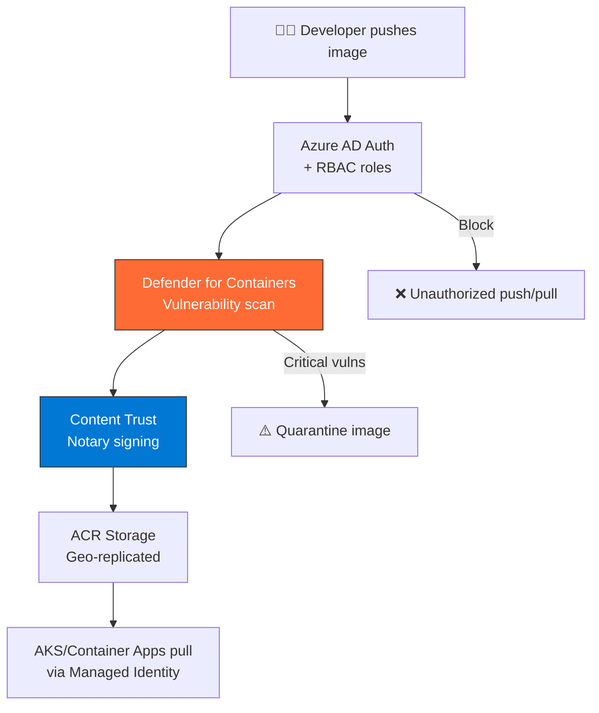

import { Info, Warning, Tip, BestPractice, Example, Exercise, Quiz, CodeBlock, TerminalBlock, Flashcard, ProductionNote, ArchitectureNote, InterviewQuestion } from '@site/src/components/shared/InteractiveBlocks';

## Learning Objectives

By the end of this lesson, you will:
- Secure ACR with RBAC, Private Link, and network restrictions
- Enable vulnerability scanning with Defender for Containers
- Build images in Azure with ACR Tasks (no local Docker needed)
- Configure geo-replication for multi-region deployments
- Implement content trust and image signing

---

## Simple Explanation

**ACR is a private, secure warehouse for your container images.**

Instead of storing your application images on the public Docker Hub (where anyone could potentially access them), you store them in ACR — your own private registry inside Azure. It's faster (images are in the same network as your compute), more secure (Azure AD authentication), and integrated with Azure's security scanning.

---

## Core Explanation

### ACR Security Stack

| Security Layer | What It Protects |
|---------------|-----------------|
| **Azure AD Authentication** | Only authorized identities can push/pull |
| **RBAC Roles** | Granular: AcrPush (push only), AcrPull (pull only), AcrDelete |
| **Private Link** | Registry accessible only from your VNet |
| **Vulnerability Scanning** | Scans every image for known CVEs |
| **Content Trust** | Only signed images can be deployed |
| **Retention Policies** | Auto-delete old/unused images |

---

## Professional Explanation

### ACR Tasks: Build Without Docker

<ProductionNote>
**ACR Tasks** builds your container images in Azure. No local Docker daemon, no "it builds on my machine," no pushing large images over slow internet. Push your code, ACR builds the image in the cloud.
</ProductionNote>

<TerminalBlock>
{`# 1. Quick task: Build and push in one command
az acr build \\
  --registry cloudnovacontainers \\
  --image order-api:v3 \\
  --file Dockerfile \\
  https://github.com/cloudnova/order-api.git#main

# 2. Scheduled task: Rebuild base images nightly
az acr task create \\
  --name nightly-base-rebuild \\
  --registry cloudnovacontainers \\
  --context https://github.com/cloudnova/base-images.git \\
  --file Dockerfile \\
  --schedule "0 0 2 * * *" \\
  --commit-trigger-enabled false

# 3. Quick run: Execute a command in a container (no VM needed!)
az acr run \\
  --registry cloudnovacontainers \\
  --cmd "az acr show -n cloudnovacontainers" \\
  /dev/null

# Result: Run Azure CLI commands in a temporary container
# Cloud-based, no local Docker, output returned to you`}
</TerminalBlock>

### Defender for Containers: Vulnerability Scanning

<TerminalBlock>
{`# Enable Defender for Containers (requires Defender for Cloud plan)
# Portal: Defender for Cloud → Environment settings → Enable Defender for Containers

# Scan results for an image:
az acr repository show \\
  --name cloudnovacontainers \\
  --image order-api:v3 \\
  --query "vulnerabilities" \\
  --output table

# Output:
# Severity   CVE              Package    Version
# HIGH       CVE-2024-12345   libssl     1.1.1 → Upgrade to 1.1.1t
# MEDIUM     CVE-2024-67890   curl       7.68 → Upgrade to 7.88
# LOW        CVE-2024-11111   zlib       1.2.11 → Update available

# Critical/High vulns → Quarantine policy blocks deployment
# Medium/Low → Flagged, can still deploy`}
</TerminalBlock>

---

## Hands-On Exercise

<Exercise title="Secure CloudNova's Registry" time="15 minutes">

**Scenario:** CloudNova's ACR needs hardening before production deployment.

**Tasks:**
1. What RBAC role gives a developer push-only access (no delete)?
2. How do you ensure images from the registry can ONLY be pulled by AKS in your VNet?
3. What happens when Defender finds a critical vulnerability in an image?

<Quiz question="Which RBAC role allows pushing images but NOT deleting them?">
- AcrPull
- *AcrPush*
- Contributor
- Owner
</Quiz>

</Exercise>

---

## Flashcard Review

<Flashcard front="ACR Tasks: what problem does it solve?" back="Build container images in the cloud without local Docker. No 'works on my machine' issues. Especially useful for CI/CD pipelines and multi-architecture builds." />

<Flashcard front="What does Defender for Containers scan?" back="Every image pushed to ACR is scanned for known CVEs. Critical/High vulns can be quarantined. Scans base image packages (apt, apk, pip, npm, etc.)." />

<Flashcard front="Why use Private Link for ACR?" back="Keep registry traffic off the public internet. ACR accessible only from your VNet. Eliminates data exfiltration risk. Required for PCI-DSS and many compliance frameworks." />

---

## Related Content

| Resource | Link |
|----------|------|
| Previous: Azure Container Services | [Lesson 2](02-azure-container-services) |
| Next: Container Networking & Security | [Lesson 4](04-container-networking-security) |
