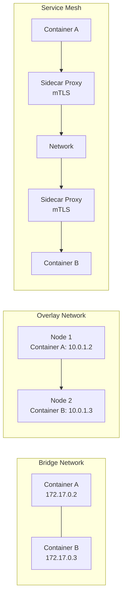
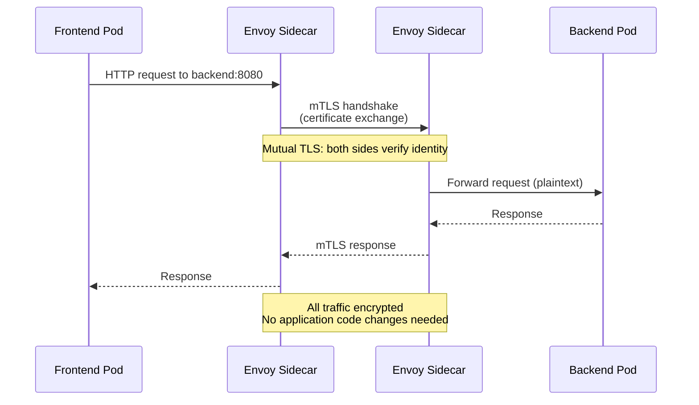

import {
  Info,
  Warning,
  Tip,
  BestPractice,
  Example,
  Exercise,
  Quiz,
  CodeBlock,
  TerminalBlock,
  Flashcard,
  ProductionNote,
  ArchitectureNote,
  InterviewQuestion,
} from "@site/src/components/shared/InteractiveBlocks";

## Learning Objectives

By the end of this lesson, you will:

- Understand container networking models (bridge, overlay, host)
- Configure network policies to restrict pod-to-pod traffic
- Understand the service mesh pattern (mTLS, traffic splitting)
- Apply container security best practices
- Design a secure container communication architecture

---

## Simple Explanation

**Containers need to talk to each other — but not too much.**

By default, every container in a cluster can talk to every other container. This is great for getting started but terrible for security. If one container gets compromised, it can reach anything.

Network policies are like firewall rules for containers: "The payment container can talk to the database. The logging container cannot." Service meshes add encryption to the conversation — even inside the cluster.

---

## Core Explanation

### Container Networking Models

| Model            | How It Works                              | Use Case                 | Security                 |
| ---------------- | ----------------------------------------- | ------------------------ | ------------------------ |
| **Bridge**       | Containers on same host, private IPs      | Development, single-host | No encryption            |
| **Overlay**      | Containers across hosts, virtual network  | Multi-host, K8s CNI      | VXLAN encapsulation      |
| **Service Mesh** | Sidecar proxy per container, mTLS, policy | Production microservices | Full encryption + policy |

### Network Policy: Defense in Depth

<CodeBlock language="yaml">
  {`# Kubernetes Network Policy: Only allow frontend → backend → database
apiVersion: networking.k8s.io/v1
kind: NetworkPolicy
metadata:
  name: backend-policy
  namespace: payment
spec:
  podSelector:
    matchLabels:
      app: backend
  policyTypes:
  - Ingress
  - Egress
  ingress:
  - from:
    - podSelector:
        matchLabels:
          app: frontend   # Only frontend can reach backend
    ports:
    - protocol: TCP
      port: 8080
  egress:
  - to:
    - podSelector:
        matchLabels:
          app: database   # Backend can only reach database
    ports:
    - protocol: TCP
      port: 5432
# Default deny-all egress for anything else`}
</CodeBlock>

<BestPractice>
  **Start with default-deny and explicitly allow.** Default-allow is the Kubernetes default — any
  pod can reach any pod. Apply a default-deny NetworkPolicy first, then add specific allows. This is
  zero-trust for containers.
</BestPractice>

---

## Professional Explanation

### Service Mesh: mTLS + Traffic Control

<ProductionNote>
  **Why CloudNova adopted a service mesh:** They had 10 microservices. Some handled payments
  (PCI-DSS scope). Some just served static content. They needed to ensure all traffic inside the
  cluster was encrypted and only allowed paths were used. Network Policies controlled what could
  talk to what. The service mesh ensured conversations were encrypted, authenticated, and
  observable.
</ProductionNote>

### Container Security Best Practices

| Principle                | Implementation                       | CloudNova Practice                 |
| ------------------------ | ------------------------------------ | ---------------------------------- |
| **Don't run as root**    | `USER 1000` in Dockerfile            | All containers run as non-root     |
| **Read-only filesystem** | `readOnlyRootFilesystem: true`       | All production containers          |
| **Minimal base images**  | Distroless, Alpine, scratch          | No shells in production images     |
| **Drop capabilities**    | `drop: ["ALL"]` then add back needed | Least privilege Linux capabilities |
| **Resource limits**      | CPU + memory requests AND limits     | Prevents noisy neighbor            |
| **Image scanning**       | Defender for Containers              | Block on critical vulnerabilities  |
| **No secrets in images** | Key Vault + CSI Driver               | Secrets mounted at runtime         |

---

## Hands-On Exercise

<Exercise title="Design Secure Container Communication" time="20 minutes">

CloudNova's payment system has three containers: `payment-gateway`, `fraud-detector`, `receipt-generator`.

**Requirements:**

1. Only `payment-gateway` can call `fraud-detector`
2. `fraud-detector` can call `receipt-generator` (to generate receipts)
3. `receipt-generator` must NOT access the internet
4. All inter-service communication must be encrypted

**Tasks:**

1. Draw the NetworkPolicy rules (which allows what)
2. Explain how a service mesh provides the encryption requirement
3. What happens if someone compromises `receipt-generator`?

</Exercise>

---

## Flashcard Review

<Flashcard
  front="Default Kubernetes network behavior"
  back="Default-allow: any pod can reach any pod across any namespace. Apply NetworkPolicy to restrict. First policy should be default-deny."
/>

<Flashcard
  front="What is mTLS?"
  back="Mutual TLS — both client and server present certificates to verify identity. Service mesh provides mTLS between services without application changes."
/>

<Flashcard
  front="Why use non-root users in containers?"
  back="If a container is compromised, root access means the attacker can modify the filesystem, install tools, and potentially escape the container. Non-root limits damage."
/>

---

## Related Content

| Resource                | Link                                  |
| ----------------------- | ------------------------------------- |
| Previous: ACR Deep Dive | [Lesson 3](03-acr-deep-dive)          |
| Next module: Docker     | [Module 09](../../09-docker/index)    |
| Module: DevSecOps       | [Module 17](../../17-devsecops/index) |
