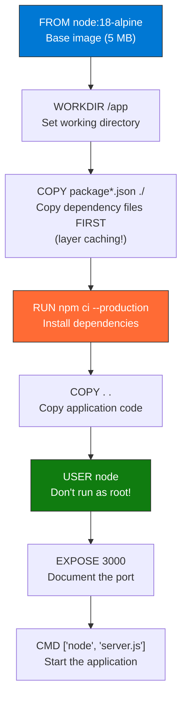

import { Info, Warning, Tip, BestPractice, Example, Exercise, Quiz, CodeBlock, TerminalBlock, Flashcard, ProductionNote, ArchitectureNote, InterviewQuestion } from '@site/src/components/shared/InteractiveBlocks';

## Learning Objectives

By the end of this lesson, you will:
- Write production-quality Dockerfiles with multi-stage builds
- Understand layer caching and optimize build speed
- Use Docker Compose for local multi-container development
- Debug running containers with exec, logs, and inspect
- Build images that are small, secure, and fast to deploy

---

## Simple Explanation

**A Dockerfile is a recipe. Docker builds the dish.**

You write instructions: "Start with Ubuntu, install Python, copy my code, run this command." Docker follows your recipe and produces an image — a snapshot of your application and everything it needs.

The art of Docker is writing recipes that produce small, secure, reproducible images. A bad Dockerfile creates 2 GB images with security holes. A good Dockerfile creates 50 MB images that start in 2 seconds.

---

## Core Explanation

### Anatomy of a Dockerfile

### The Layer Caching Superpower

<BestPractice>
**Order matters in Dockerfiles.** Docker caches each instruction as a layer. When you change something, only that layer and subsequent layers rebuild. Put things that change rarely (base image, package installs) at the TOP. Put things that change often (your code) at the BOTTOM.
</BestPractice>

<CodeBlock language="dockerfile" title="production.Dockerfile">
{`# CloudNova Order API — Production Dockerfile
# Stage 1: Build (fat image with compilers)
FROM node:18-alpine AS builder
WORKDIR /app
COPY package*.json ./
RUN npm ci
COPY . .

# Build/compile the application
RUN npm run build

# Stage 2: Production (minimal image)
FROM node:18-alpine AS production
WORKDIR /app

# Copy only compiled output + production dependencies
COPY --from=builder /app/dist ./dist
COPY --from=builder /app/node_modules ./node_modules
COPY package*.json ./

# Security hardening
RUN addgroup -g 1001 appgroup && \\
    adduser -u 1001 -G appgroup -s /bin/sh -D appuser
USER appuser

# Healthcheck
HEALTHCHECK --interval=30s --timeout=3s \\
  CMD wget --no-verbose --tries=1 --spider http://localhost:3000/health || exit 1

EXPOSE 3000
CMD ["node", "dist/server.js"]

# Result: ~80 MB production image (not 500 MB!)
# No build tools, no dev dependencies, non-root user`}
</CodeBlock>

---

## Professional Explanation

### Multi-Stage Builds: Build Big, Deploy Small

<ProductionNote>
**Before multi-stage builds:** You needed one Dockerfile to build (500 MB with SDKs, compilers) and a separate one to run. Or you used shell scripts to extract artifacts. Multi-stage builds solve this elegantly in one file.
</ProductionNote>

| Stage | Purpose | Size | What's Inside |
|-------|---------|------|--------------|
| **Builder** | Compile, test, lint | 500 MB | Node SDK, devDependencies, source code |
| **Tester** (optional) | Run unit tests | 400 MB | Test runner, mock data |
| **Production** | Run the app | 80 MB | Compiled JS, prod dependencies, non-root user |

<TerminalBlock>
{`# Build the production image
docker build \\
  --file production.Dockerfile \\
  --target production \\
  --tag cloudnovacontainers.azurecr.io/order-api:v3 \\
  .

# Verify image size
docker images cloudnovacontainers.azurecr.io/order-api:v3
# REPOSITORY    TAG    SIZE
# order-api     v3     82.4 MB  ← Multi-stage win!

# Check for vulnerabilities
docker scan cloudnovacontainers.azurecr.io/order-api:v3

# Run locally to verify
docker run -d -p 3000:3000 \\
  --name order-api-test \\
  --read-only \\
  --tmpfs /tmp \\
  cloudnovacontainers.azurecr.io/order-api:v3

# Verify healthcheck
docker inspect --format='{{.State.Health.Status}}' order-api-test
# healthy ✅`}
</TerminalBlock>

### Docker Compose: Local Multi-Container Development

<CodeBlock language="yaml" title="docker-compose.yml">
{`# CloudNova Local Development Environment
version: "3.9"
services:
  api:
    build:
      context: ./api
      target: development
    ports:
      - "3000:3000"
    volumes:
      - ./api/src:/app/src  # Live reload
    environment:
      - DB_HOST=postgres
      - REDIS_HOST=redis
    depends_on:
      postgres:
        condition: service_healthy
    networks:
      - cloudnova-net
      
  postgres:
    image: postgres:16-alpine
    environment:
      POSTGRES_DB: cloudnova_dev
      POSTGRES_USER: dev_user
      POSTGRES_PASSWORD: dev_password
    volumes:
      - pgdata:/var/lib/postgresql/data
    healthcheck:
      test: ["CMD-SHELL", "pg_isready -U dev_user -d cloudnova_dev"]
      interval: 5s
      timeout: 3s
      retries: 5
    networks:
      - cloudnova-net
      
  redis:
    image: redis:7-alpine
    ports:
      - "6379:6379"
    networks:
      - cloudnova-net

volumes:
  pgdata:

networks:
  cloudnova-net:
    driver: bridge

# One command to start everything:
# docker compose up -d`}
</CodeBlock>

---

## Hands-On Exercise

<Exercise title="Write a Production Dockerfile" time="25 minutes">

**Scenario:** CloudNova's notification service needs a production Dockerfile.

**Requirements:**
- Base: `python:3.12-alpine`
- Multi-stage: build stage + production stage
- Non-root user (`notifier`, UID 2000)
- Healthcheck endpoint: `/health`
- Final image must be < 150 MB

**Task:** Write the Dockerfile and explain each stage's purpose.

<Quiz question="Why copy `package.json` before source code?">
- It's a Docker convention
- *Docker caches the layer. If package.json hasn't changed, the npm install layer is cached and skip — builds are much faster.*
- The source code needs package.json first
- It's required by Node.js
</Quiz>

</Exercise>

---

## Flashcard Review

<Flashcard front="Why use multi-stage builds?" back="Build in a fat image (SDKs, compilers), deploy a minimal image (just runtime). Final image is smaller, more secure, and has no build artifacts." />

<Flashcard front="How does Docker layer caching work?" back="Each instruction (FROM, COPY, RUN) creates a layer. If the layer's inputs haven't changed, Docker reuses the cached layer. Order matters: put rarely-changing instructions first." />

<Flashcard front="Why add a HEALTHCHECK?" back="Docker monitors the container and reports healthy/unhealthy. Orchestrators (K8s, Container Apps) use this for auto-restart and traffic routing decisions." />

---

## Related Content

| Resource | Link |
|----------|------|
| Next: Docker Compose & Orchestration | [Lesson 2](02-docker-compose-orchestration) |
| Kubernetes module | [Module 10](../../10-kubernetes/index) |
