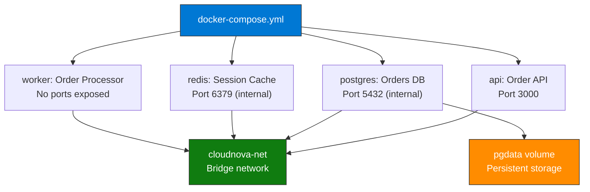
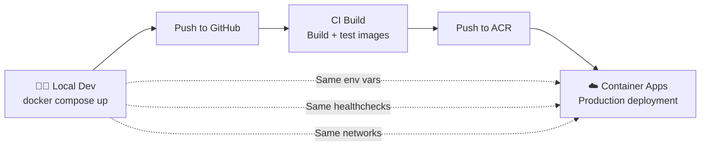

import { Info, Warning, Tip, BestPractice, Example, Exercise, Quiz, CodeBlock, TerminalBlock, Flashcard, ProductionNote, ArchitectureNote, InterviewQuestion } from '@site/src/components/shared/InteractiveBlocks';

## Learning Objectives

By the end of this lesson, you will:
- Master Docker Compose for local multi-service development
- Configure Docker networks for service isolation
- Manage persistent data with Docker volumes
- Understand when to graduate from Compose to Kubernetes

---

## Simple Explanation

**Docker Compose is the remote control for your local development environment.**

Instead of running 5 `docker run` commands with long flags, you write one YAML file that describes all your services — the API, database, cache, and message queue. One command (`docker compose up`) starts everything. Another (`docker compose down`) tears it down.

It's your "production in a box" for development and testing.

---

## Core Explanation

### Docker Compose Patterns

| Compose Concept | Purpose | Example |
|----------------|---------|---------|
| **Services** | Container definitions | API, DB, Redis, Worker |
| **Networks** | Isolated communication | Backend network, frontend network |
| **Volumes** | Persistent data | Database files survive container deletion |
| **Configs/Secrets** | External configuration | Inject configuration at runtime |
| **Profiles** | Optional services | Debug tools, admin panels |
| **Depends on** | Startup ordering | API waits for healthy DB |

---

## Professional Explanation

### The Full Compose Stack

<CodeBlock language="yaml" title="docker-compose.yml">
{`# CloudNova Local Dev — Production-like environment
services:
  # Tier 1: Reverse proxy (optional, for production-like routing)
  traefik:
    image: traefik:v3.0
    command:
      - "--api.insecure=true"
      - "--providers.docker=true"
    ports:
      - "80:80"
      - "8080:8080"  # Dashboard
    volumes:
      - /var/run/docker.sock:/var/run/docker.sock:ro
    networks:
      - frontend
    profiles: ["full"]  # Only with --profile full

  # Tier 2: Application services
  api:
    build: ./api
    ports:
      - "3000:3000"
    environment:
      DB_HOST: postgres
      REDIS_HOST: redis
    depends_on:
      postgres: { condition: service_healthy }
      redis: { condition: service_started }
    networks: [frontend, backend]
    restart: unless-stopped

  worker:
    build: ./worker
    environment:
      DB_HOST: postgres
      REDIS_HOST: redis
    depends_on: [postgres, redis]
    networks: [backend]
    restart: unless-stopped
    deploy:
      replicas: 2  # Simulate production scale

  # Tier 3: Data services
  postgres:
    image: postgres:16-alpine
    environment:
      POSTGRES_DB: cloudnova_dev
      POSTGRES_USER: dev
      POSTGRES_PASSWORD: dev
    volumes:
      - pgdata:/var/lib/postgresql/data
      - ./db/init:/docker-entrypoint-initdb.d  # Initialization scripts
    networks: [backend]
    healthcheck:
      test: ["CMD-SHELL", "pg_isready -U dev -d cloudnova_dev"]
      interval: 5s
      retries: 5

  redis:
    image: redis:7-alpine
    volumes:
      - redisdata:/data
    networks: [backend]
    command: redis-server --appendonly yes

volumes:
  pgdata:
  redisdata:

networks:
  frontend:  # Public-facing services
  backend:   # Internal-only services`}
</CodeBlock>

<BestPractice>
**Use multiple networks for isolation.** In the Compose file above, `api` is on both `frontend` and `backend`. The `worker` is only on `backend` — it can reach the database but can't be reached from outside. This mirrors production network segmentation.
</BestPractice>

---

## Production Explanation

### CloudNova: Compose to Production Pipeline

<ArchitectureNote title="From Compose to Kubernetes">
CloudNova's development workflow: Docker Compose locally → CI builds images → Azure Container Apps in production. The Compose file mirrors the production architecture so problems are caught early.
</ArchitectureNote>

### Volumes: Don't Lose Your Data

| Volume Type | Use Case | Example |
|------------|----------|---------|
| **Named Volume** | Persistent, managed by Docker | Database storage |
| **Bind Mount** | Development, live code reload | `./src:/app/src` |
| **tmpfs** | Temporary, in-memory only | Sensitive temp files |

<TerminalBlock>
{`# Backup a database volume
docker run --rm \\
  -v cloudnova_pgdata:/source \\
  -v $(pwd)/backup:/backup \\
  alpine tar czf /backup/pgdata-$(date +%Y%m%d).tar.gz -C /source .

# Restore to a new environment
docker run --rm \\
  -v cloudnova_staging_pgdata:/target \\
  -v $(pwd)/backup:/backup \\
  alpine tar xzf /backup/pgdata-20240115.tar.gz -C /target .

# Volumes survive `docker compose down`
# Only `docker compose down -v` deletes volumes`}
</TerminalBlock>

---

## Hands-On Exercise

<Exercise title="Build a Testing Environment" time="20 minutes">

**Scenario:** CloudNova needs a local testing environment with:
1. The API service (port 3000)
2. A PostgreSQL database for tests (port 5433, not standard 5432)
3. A Redis instance for caching
4. Database initialization script that creates test tables

**Task:** Write the `docker-compose.test.yml` file.

<Quiz question="What does `docker compose down -v` do?">
- Stops containers only
- *Stops containers AND deletes volumes (all data lost)*
- Deletes the Compose file
- Restarts all services
</Quiz>

</Exercise>

---

## Flashcard Review

<Flashcard front="Docker network types in Compose" back="Default bridge (service isolation), custom bridge (named networks for segmentation), host (share host network), none (no networking)." />

<Flashcard front="Bind mount vs Named volume" back="Bind mount: maps host directory to container (dev, live reload). Named volume: Docker-managed, persistent, portable (database data)." />

<Flashcard front="When to graduate from Compose to Kubernetes?" back="When you need multi-host orchestration, auto-scaling, rolling updates, self-healing, or service mesh. Compose is single-host. K8s is cluster-wide." />

---

## Related Content

| Resource | Link |
|----------|------|
| Previous: Docker Deep Dive | [Lesson 1](01-docker-deep-dive) |
| Next: Docker Networking & Volumes | [Lesson 3](03-docker-networking-volumes) |
