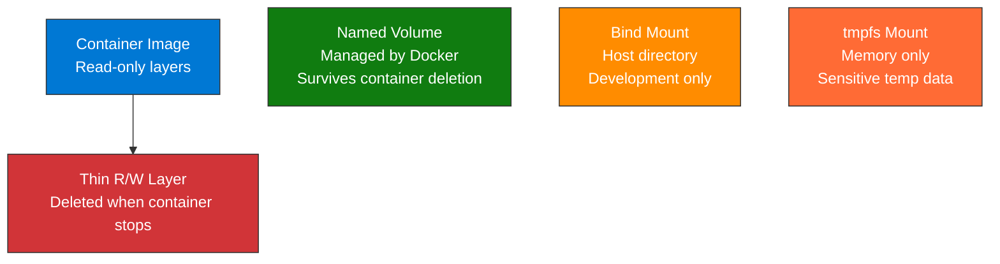

import { Info, Warning, Tip, BestPractice, Example, Exercise, Quiz, CodeBlock, TerminalBlock, Flashcard, ProductionNote, ArchitectureNote, InterviewQuestion } from '@site/src/components/shared/InteractiveBlocks';

## Learning Objectives

By the end of this lesson, you will:
- Configure Docker networks for production parity
- Manage persistent storage across container lifecycles
- Use volume drivers (NFS, Azure Files, cloud storage)
- Troubleshoot container networking issues

---

## Simple Explanation

**Containers are ephemeral. Your data shouldn't be.**

When a container dies, everything inside it vanishes. Any files, any database records, any uploaded images — gone. Volumes solve this by storing data outside the container, surviving restarts, recreations, and even host failures (with the right drivers).

Networks are the plumbing that connect containers. Without them, your API can't find your database — it's like having a phone with no signal.

---

## Core Explanation

### Docker Storage Hierarchy

| Storage | Persistence | Performance | Production? |
|---------|------------|-------------|-------------|
| **Container R/W Layer** | Lost on delete | Fastest | No — temporary only |
| **Named Volume** | Survives delete | Fast (local) | Yes, with backups |
| **Volume with Driver** | Survives everything | Depends on backend | Yes — Azure Files, NFS |
| **Bind Mount** | Tied to host | Fast | Development only |
| **tmpfs** | Lost on stop | Fastest (RAM) | Yes, for secrets/temp |

---

## Professional Explanation

### Volume Drivers: Cloud Storage for Containers

<ProductionNote>
**Use case:** Run a container locally that needs access to Azure Files. Mount the cloud share as a Docker volume. Test file operations locally against real cloud storage.
</ProductionNote>

<TerminalBlock>
{`# Mount Azure Files as a Docker volume
docker volume create \\
  --driver azure_file \\
  --name cloudnova-uploads \\
  -o share_name=uploads \\
  -o storage_account_name=cloudnovaprod \\
  -o storage_account_key=$AZURE_STORAGE_KEY

# Use in production containers
docker run -d \\
  --name file-processor \\
  -v cloudnova-uploads:/data/uploads \\
  cloudnovacontainers.azurecr.io/file-processor:v2

# Files written to /data/uploads are stored in Azure Files
# Survive container deletion AND host failures
# Multiple containers on different hosts can share the same volume`}
</TerminalBlock>

### Network Troubleshooting Tools

<TerminalBlock>
{`# 1. Inspect a container's network config
docker inspect api-server --format '{{json .NetworkSettings.Networks}}' | jq .

# 2. Test connectivity between containers
docker exec api-server nc -zv postgres 5432
# Connection to postgres:5432 succeeded ✅

# 3. DNS resolution inside containers
docker exec api-server nslookup postgres
# Server: 127.0.0.11 (Docker's embedded DNS)
# Name: postgres → 172.18.0.3

# 4. Sniff traffic (if tcpdump installed)
docker exec -it api-server tcpdump -i eth0 port 5432

# 5. Network disconnect isolation test
docker network disconnect backend api-server
# Now test what breaks — verify that your app handles DB disconnection gracefully`}
</TerminalBlock>

---

## Hands-On Exercise

<Exercise title="Design a Storage Strategy" time="15 minutes">

For each CloudNova workload, choose the right storage:

| Workload | Requirement |
|----------|-------------|
| PostgreSQL | Must survive container recreation |
| Uploaded images | Shared across 5 API containers |
| API logs | Temporary, high volume, can lose on restart |
| SSL certificates | Must be injected securely, not in image |

<Quiz question="Which storage type is BEST for database files?">
- Container R/W layer
- *Named volume with backup*
- tmpfs
- Bind mount
</Quiz>

</Exercise>

---

## Flashcard Review

<Flashcard front="Three volume types in Docker" back="Named Volumes (Docker-managed, persistent), Bind Mounts (host directory mapped to container, dev only), tmpfs (RAM-based, temporary, for sensitive temp data)." />

<Flashcard front="What happens to data in a named volume when the container is deleted?" back="Data survives. Named volumes are independent of container lifecycle. Only `docker volume rm` or `docker compose down -v` deletes them." />

<Flashcard front="How do containers resolve each other's names?" back="Docker's embedded DNS server (127.0.0.11) resolves service names to IPs. In Compose, the service name is the DNS name (e.g., postgres, redis)." />

---

## Related Content

| Resource | Link |
|----------|------|
| Previous: Compose & Orchestration | [Lesson 2](02-docker-compose-orchestration) |
| Next: Docker in Production & Internals | [Lesson 4](04-docker-production) |
