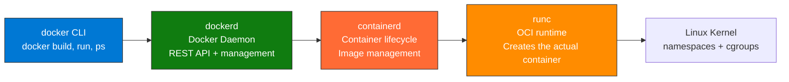
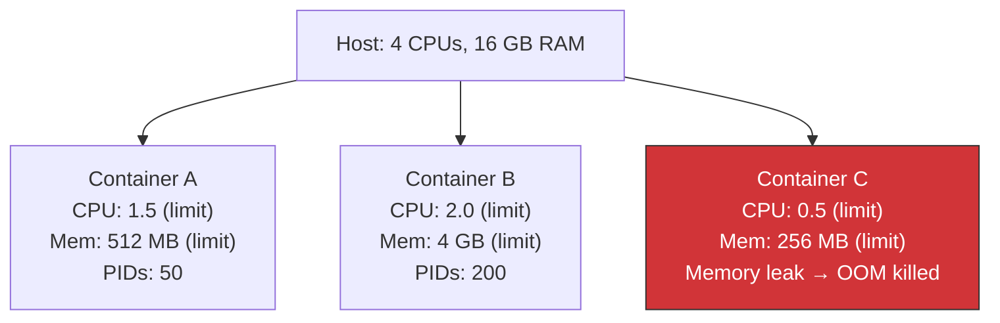

import {
  Info,
  Warning,
  Tip,
  BestPractice,
  Example,
  Exercise,
  Quiz,
  CodeBlock,
  TerminalBlock,
  Flashcard,
  ProductionNote,
  ArchitectureNote,
  InterviewQuestion,
} from "@site/src/components/shared/InteractiveBlocks";

## Learning Objectives

By the end of this lesson, you will:

- Understand Docker's architecture: client → daemon → containerd → runc
- Apply production security hardening to containers
- Configure resource limits to prevent noisy neighbors
- Use BuildKit for faster, more secure builds
- Prepare Docker containers for Kubernetes

---

## Simple Explanation

**Docker is actually three things working together.**

1. **The CLI** (`docker build`, `docker run`) — what you type
2. **The daemon** (`dockerd`) — the brain that manages images, containers, networks
3. **The runtime** (`containerd` + `runc`) — the hands that actually create and run containers

Understanding this architecture helps you debug, secure, and optimize your containers. It also explains why Kubernetes doesn't need Docker — K8s talks directly to `containerd`.

---

## Core Explanation

### Docker Architecture



| Component      | Role                              | Port/Protocol                 |
| -------------- | --------------------------------- | ----------------------------- |
| **docker CLI** | User interface                    | Unix socket or TCP to dockerd |
| **dockerd**    | Orchestrator, API, image cache    | `/var/run/docker.sock`        |
| **containerd** | Container supervisor, image pulls | gRPC                          |
| **runc**       | Low-level OCI runtime             | Creates namespaces, cgroups   |

---

## Professional Explanation

### Production Security Hardening

<BestPractice>
  **Production container checklist:** If you answer "no" to any of these, your container isn't
  production-ready.
</BestPractice>

<TerminalBlock>
{`# Security hardening checklist for production containers

# 1. Run as non-root user

docker run --user 1001:1001 myapp

# 2. Read-only root filesystem

docker run --read-only --tmpfs /tmp --tmpfs /var/run myapp

# 3. Drop all Linux capabilities, add back only what's needed

docker run --cap-drop=ALL --cap-add=NET_BIND_SERVICE myapp

# 4. No new privileges (prevent privilege escalation)

docker run --security-opt=no-new-privileges myapp

# 5. Limit resources (prevents DoS)

docker run \\
--cpus="1.5" \\
--memory="512m" \\
--memory-swap="512m" # No swap
--pids-limit=50 \\
myapp

# 6. Use seccomp/AppArmor profiles

docker run --security-opt seccomp=production.json myapp
docker run --security-opt apparmor=docker-production myapp

# All together — production-ready container:

docker run -d \\
--name order-api-prod \\
--user 1001:1001 \\
--read-only --tmpfs /tmp --tmpfs /var/run \\
--cap-drop=ALL --cap-add=NET_BIND_SERVICE \\
--security-opt=no-new-privileges \\
--cpus="2" --memory="1g" --memory-swap="1g" \\
cloudnovacontainers.azurecr.io/order-api:v3`}

</TerminalBlock>

### Resource Limits Deep Dive



| Limit            | What It Prevents              | Without It                                    |
| ---------------- | ----------------------------- | --------------------------------------------- |
| **CPU limit**    | One container hogging all CPU | "Noisy neighbor" slowing everyone             |
| **Memory limit** | Memory leak crashing the host | OOM killer kills random processes             |
| **PID limit**    | Fork bomb (process explosion) | Host runs out of PIDs, can't create processes |
| **No swap**      | Container thrashing to disk   | Container swaps, everything slows down        |

---

## Production Explanation

### CloudNova: From Docker to Kubernetes

<ProductionNote>
  **The bridge:** When CloudNova migrated from Docker Compose to Kubernetes, they used a pattern
  that made the transition smooth. Docker best practices → K8s deployments → production.
</ProductionNote>

<CodeBlock language="yaml" title="docker-compose.yml → k8s-deployment.yaml">
{`# Docker Compose (dev)
# services:
#   api:
#     image: cloudnovacontainers.azurecr.io/order-api:v3
#     ports: ["3000:3000"]
#     environment: [...]
#     deploy:
#       resources:
#         limits: { cpus: "2", memory: "1g" }

# Kubernetes Deployment (production)

apiVersion: apps/v1
kind: Deployment
metadata:
name: order-api
spec:
replicas: 3
selector:
matchLabels:
app: order-api
template:
metadata:
labels:
app: order-api
spec:
containers: - name: api
image: cloudnovacontainers.azurecr.io/order-api:v3
ports: - containerPort: 3000
resources:
requests: { cpu: "500m", memory: "512Mi" }
limits: { cpu: "2", memory: "1Gi" }
securityContext:
runAsNonRoot: true
runAsUser: 1001
readOnlyRootFilesystem: true
capabilities:
drop: ["ALL"]
add: ["NET_BIND_SERVICE"]
livenessProbe:
httpGet:
path: /health
port: 3000
readinessProbe:
httpGet:
path: /ready
port: 3000`}

</CodeBlock>

---

## Hands-On Exercise

<Exercise title="Security Audit a Container" time="15 minutes">

A developer submitted this Docker Compose snippet for production. Find all security issues:

```yaml
services:
  api:
    image: myapp:latest
    ports: ["3000:3000"]
    environment:
      - DB_PASSWORD=SuperSecret123
      - API_KEY=sk-abc123
    restart: always
```

**Issues to find:**

1. ...
2. ...
3. ...
4. ...

</Exercise>

---

## Flashcard Review

<Flashcard
  front="Docker architecture: three main components"
  back="1) docker CLI (user interface), 2) dockerd (daemon, REST API, image cache), 3) containerd + runc (container lifecycle + OCI runtime)"
/>

<Flashcard
  front="Why use --read-only and --tmpfs?"
  back="Read-only filesystem prevents attackers from modifying binaries or installing tools if they compromise the container. tmpfs provides writable space for temporary files (/tmp, /var/run) that's in memory only."
/>

<Flashcard
  front="CPU limit vs CPU request (K8s)"
  back="Request: guaranteed minimum CPU (scheduler uses this). Limit: maximum CPU (container is throttled if it exceeds). Set request ≤ limit."
/>

---

## Related Content

| Resource                       | Link                                     |
| ------------------------------ | ---------------------------------------- |
| Previous: Networking & Volumes | [Lesson 3](03-docker-networking-volumes) |
| Next module: Kubernetes        | [Module 10](../../10-kubernetes/index)   |
