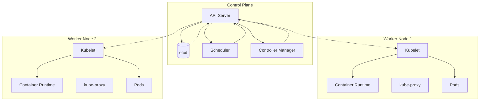
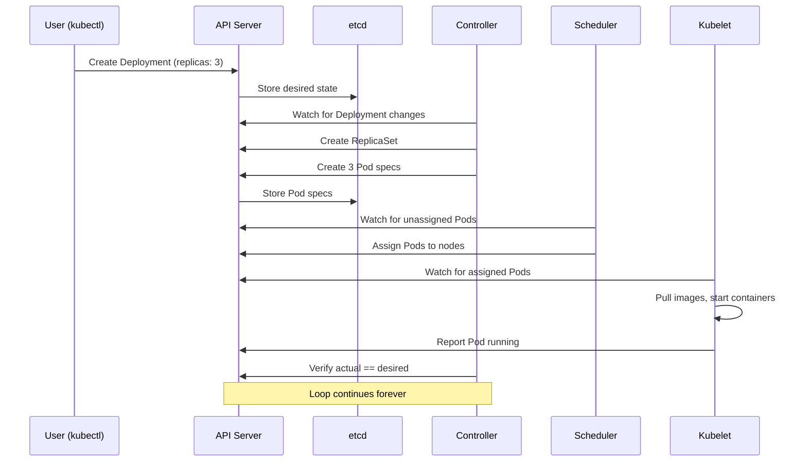
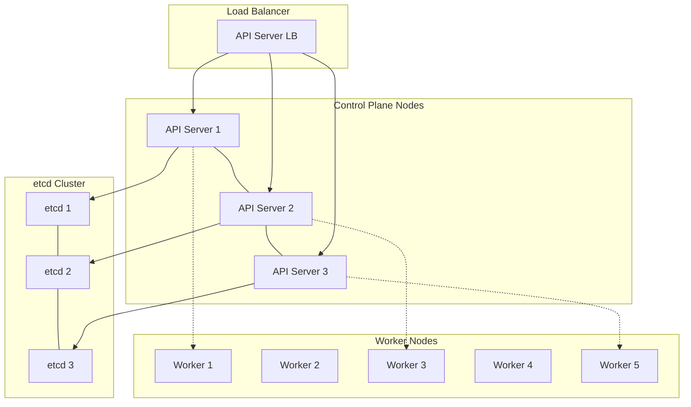
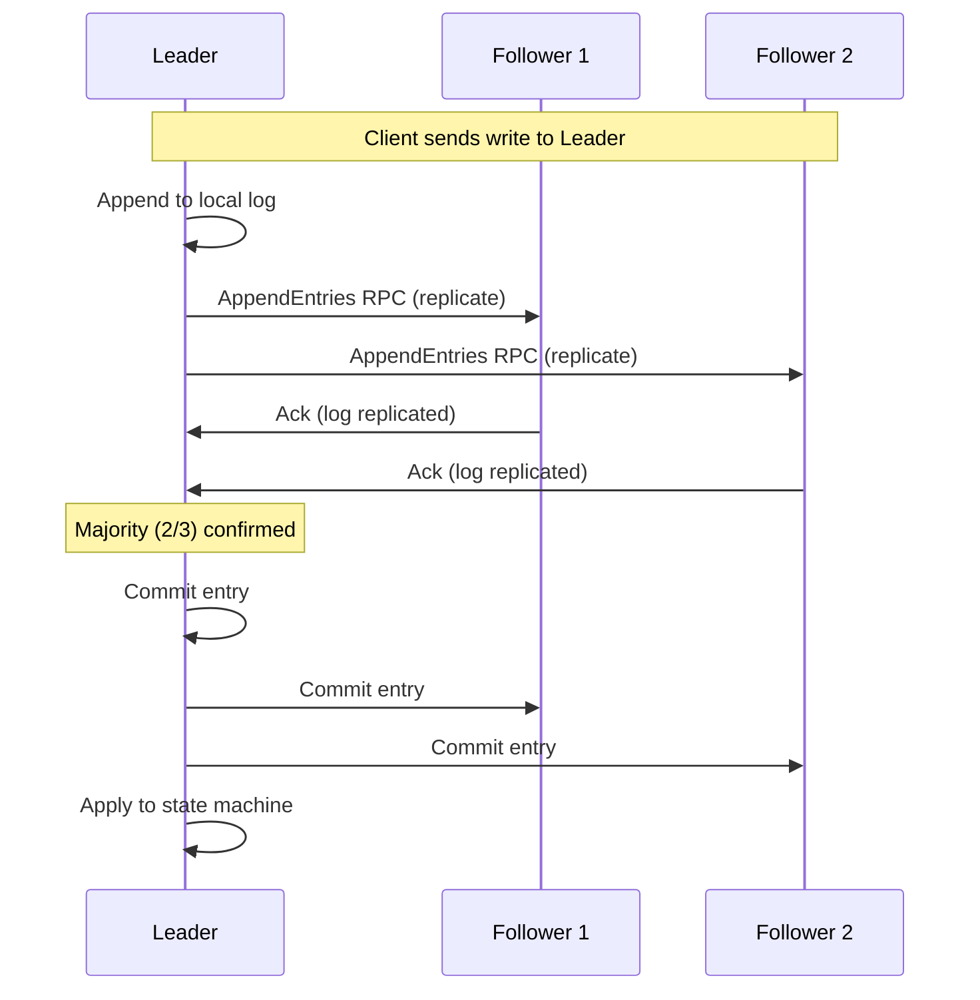

import {
  Info,
  Warning,
  Tip,
  BestPractice,
  Definition,
  Example,
  Analogy,
  CommonMistake,
  Debugging,
  Exercise,
  Quiz,
  CodeBlock,
  TerminalBlock,
  Flashcard,
  ProductionNote,
  ArchitectureNote,
  SecurityNote,
  CostNote,
  InterviewQuestion,
  CheatSheet,
  AIExplanation,
  AIQuiz,
  AIFlashcards,
} from "@site/src/components/shared/InteractiveBlocks";

export const CloudNova = ({ children }) => (
  <div
    style={{
      borderLeft: "4px solid #0ea5e9",
      padding: "1rem 1.5rem",
      margin: "1.5rem 0",
      background: "var(--ifm-color-emphasis-100)",
      borderRadius: "0 8px 8px 0",
    }}
  >
    <strong style={{ color: "#0ea5e9" }}>🏢 CloudNova Engineering</strong>
    <div style={{ marginTop: "0.5rem" }}>{children}</div>
  </div>
);

# Kubernetes Architecture — The Control Tower

## Learning Objectives

After this lesson, you will be able to:

1. Explain every component in the Kubernetes control plane and worker node
2. Describe the reconciliation loop and why it defines Kubernetes' philosophy
3. Draw the complete Kubernetes architecture diagram from memory
4. Trace an API request through every system component

## Prerequisites

- Container fundamentals (namespaces, cgroups, OCI)
- Docker basics (building and running containers)
- Basic Linux networking concepts
- Comfort with CLI tools

---

## Simple — The Airport Analogy

<Analogy>

Imagine a busy international airport:

- **API Server** = The **air traffic control tower**. Every plane (request) must talk to the tower. The tower validates flight plans and routes them.
- **etcd** = The **flight database**. Every plane's position, route, and status lives here. If this database is lost, the airport loses track of everything.
- **Scheduler** = The **gate assignment system**. When a new plane needs parking, the scheduler finds an available gate.
- **Controller Manager** = The **airport operations center**. It constantly checks: "Is the runway clear? Are gates functioning? Are there enough fuel trucks?"
- **Kubelet** = The **gate crew**. They make sure the planes actually park, connect jet bridges, and report back to the tower.
- **kube-proxy** = The **internal transport system**. Passenger buses that move people (network traffic) between gates.

Kubernetes is a distributed airport management system for your applications.

</Analogy>

---

## Core — Understanding Each Component

### The Kubernetes Architecture Diagram



### Control Plane Components

<Definition term="API Server (kube-apiserver)">

The single entry point to the cluster. **Every** operation — `kubectl apply`, a pod starting, a scheduler decision — passes through the API server. It:

- Validates and processes REST requests
- Authenticates (who are you?) and authorizes (are you allowed?)
- Writes to etcd
- Serves as the hub for all component communication

</Definition>

<Definition term="etcd">

A distributed, consistent key-value store. It holds **the entire state of the cluster**:

- What pods exist and where
- What services are defined
- What secrets are stored
- RBAC configurations
- Node information

If etcd is lost without backups, the cluster has amnesia. **Always back up etcd**.

</Definition>

<Definition term="Scheduler (kube-scheduler)">

Watches for pods that have no assigned node, then **decides where they should run**. It considers:

- Resource requirements (CPU, memory, GPU)
- Node affinity/anti-affinity rules
- Taints and tolerations
- Available capacity
- Quality of Service (QoS) requirements

The scheduler **doesn't place the pod** — it only writes the binding to the API server. The kubelet does the actual work.

</Definition>

<Definition term="Controller Manager">

A collection of controllers running in a single process. Each controller watches a specific resource type and ensures the **actual state matches the desired state**. Key controllers:

- **Node controller**: Detects when nodes go down
- **Replication controller**: Maintains correct pod count
- **Endpoint controller**: Populates endpoint objects
- **ServiceAccount controller**: Creates default service accounts

</Definition>

### Worker Node Components

<Definition term="Kubelet">

The agent running on **every node**. It:

- Receives pod specifications from the API server
- Ensures containers described in pod specs are running and healthy
- Reports node and pod status back to the API server
- Doesn't manage containers not created by Kubernetes

</Definition>

<Definition term="kube-proxy">

Network proxy on every node. It implements Kubernetes **Service** abstraction by maintaining network rules (iptables or IPVS) that route traffic to the correct backend pods.

</Definition>

<Definition term="Container Runtime">

The software that actually runs containers. Kubernetes supports any runtime implementing the **Container Runtime Interface (CRI)**:

- containerd (default, most common)
- CRI-O
- Docker (deprecated, via dockershim removed in v1.24)

</Definition>

---

## The Reconciliation Loop — Kubernetes' Secret Sauce

This is the single most important concept in Kubernetes.



Every controller follows the same pattern:

1. **Observe** current state (from API server / etcd)
2. **Compare** current state to desired state
3. **Act** to reconcile differences
4. **Repeat** indefinitely

<Tip>

**Think of it this way**: You don't tell Kubernetes "Start 3 pods." You tell it "I want 3 pods running." Kubernetes continuously checks and ensures there are always exactly 3 — if one dies, it creates another. If one is running but shouldn't be, it terminates it.

</Tip>

---

## Professional — Tracing a Pod Creation

Let's trace exactly what happens when you run:

```bash
kubectl apply -f nginx-deployment.yaml
```

<CodeBlock language="yaml" title="nginx-deployment.yaml">
  apiVersion: apps/v1 kind: Deployment metadata: name: nginx-deployment spec: replicas: 3 selector:
  matchLabels: app: nginx template: metadata: labels: app: nginx spec: containers: - name: nginx
  image: nginx:1.25 ports: - containerPort: 80
</CodeBlock>

**Step-by-step trace:**

1. **kubectl → API Server**: kubectl serializes the YAML to JSON, sends a POST to `/apis/apps/v1/namespaces/default/deployments`

2. **API Server → Validation**: Validates the schema, checks RBAC permissions, applies admission controllers (e.g., PodSecurity, LimitRange)

3. **API Server → etcd**: Writes the Deployment object to etcd. At this point, the Deployment exists but nothing is running.

4. **Deployment Controller observes**: The Deployment controller detects a new Deployment. Desired replicas: 3. Current replicas: 0. **Must reconcile**.

5. **Deployment Controller → API Server**: Creates a ReplicaSet object.

6. **ReplicaSet Controller observes**: Detects the ReplicaSet. Desired pods: 3. Current: 0. **Must reconcile**.

7. **ReplicaSet Controller → API Server**: Creates 3 Pod objects (without node assignments).

8. **Scheduler observes**: Detects 3 pods with no `nodeName`. Runs its filtering and scoring algorithms.

9. **Scheduler → API Server**: Assigns each pod to a node (writes `nodeName` to Pod spec).

10. **Kubelet on assigned nodes observes**: Detects new pod assignments for its node.

11. **Kubelet → CRI**: Calls the container runtime to pull the `nginx:1.25` image and start containers.

12. **Kubelet → API Server**: Reports pod status as `Running`.

13. **Kubelet → Liveness/Readiness Probes**: Continuously checks container health.

14. **Controllers continue watching**: The reconciliation loop continues. If a pod crashes, the ReplicaSet controller notices (desired: 3, actual: 2) and creates a replacement.

<Info>

**The entire process** from `kubectl apply` to running pods takes **less than 2 seconds** in most clusters. Every component operates asynchronously via the watch mechanism.

</Info>

---

## Production — High Availability Architecture

In production, you need redundancy at every layer.



<ProductionNote>

**Production Design Decisions:**

| Component          | HA Strategy           | Notes                     |
| ------------------ | --------------------- | ------------------------- |
| API Server         | 3 replicas behind LB  | Stateless, easy to scale  |
| etcd               | 3 or 5 nodes          | Requires quorum (N/2 + 1) |
| Scheduler          | Leader election       | Only one active at a time |
| Controller Manager | Leader election       | Only one active at a time |
| Worker Nodes       | N+1 or N+2 redundancy | Spread across AZs         |

**etcd Quorum**: With 3 etcd nodes, you can lose 1. With 5, you can lose 2. **Never use an even number of etcd nodes** — it wastes capacity without improving fault tolerance.

</ProductionNote>

<CloudNova>

**Your Task — CloudNova Infrastructure Planning**

You're designing the Kubernetes infrastructure for CloudNova's next-gen platform. The CTO has given you these requirements:

- **99.95% SLA** for the control plane
- Must survive **a full availability zone failure**
- Cannot exceed **$8,000/month** for the cluster itself
- Must support **200 microservices** across dev, staging, and production

**Your design decisions:**

1. How many control plane nodes and etcd replicas?
2. How many worker nodes, and what sizing?
3. Which Azure region and how many availability zones?
4. How will you handle the cost constraint?

Document your architecture and be ready to defend it at the architecture review board.

</CloudNova>

---

## Architect — Deep Dive into etcd

### Why etcd Matters So Much

etcd uses the **Raft consensus algorithm**. Here's how it works:



**Key etcd facts:**

- **Write**: Always goes through the leader. Requires majority confirmation.
- **Read**: Can be served by any node, but linearizable reads go through leader.
- **Quorum**: `floor(N/2) + 1` — with 3 nodes, need 2; with 5, need 3.
- **Data size limit**: 8 GB by default (configurable). Not designed for large blobs.
- **Performance**: ~10,000 writes/sec in typical configurations.

<SecurityNote>

**etcd Security Checklist:**

- [ ] TLS encryption for peer and client communication
- [ ] Client certificate authentication (not just bearer tokens)
- [ ] Network policies restricting etcd port (2379-2380) access
- [ ] Regular automated backups to secure, off-cluster storage
- [ ] Encryption at rest enabled
- [ ] Audit logging enabled for all etcd access

</SecurityNote>

<CommonMistake>

**The #1 etcd mistake**: Storing large objects directly in Kubernetes. Every ConfigMap, Secret, and annotation lives in etcd. A single 1MB ConfigMap multiplied by hundreds of replicas across namespaces can overwhelm etcd. **Keep objects small** — use external storage for large data.

</CommonMistake>

---

## Hands-On Exercise

<Exercise>

### Exercise: Explore Your Cluster's Control Plane

If you have a Kubernetes cluster (local or cloud):

1. **Check control plane health**:

   ```bash
   kubectl get componentstatuses
   ```

2. **Inspect the scheduler and controller manager**:

   ```bash
   kubectl get pods -n kube-system | grep -E "scheduler|controller-manager"
   ```

3. **View API server arguments**:

   ```bash
   kubectl -n kube-system get pod -l component=kube-apiserver -o yaml | grep -A1 command
   ```

4. **Check your etcd size** (if accessible):
   ```bash
   # On the etcd node
   ETCDCTL_API=3 etcdctl --endpoints=https://127.0.0.1:2379 \
     --cacert=/etc/kubernetes/pki/etcd/ca.crt \
     --cert=/etc/kubernetes/pki/etcd/server.crt \
     --key=/etc/kubernetes/pki/etcd/server.key \
     endpoint status --write-out=table
   ```

</Exercise>

<Challenge>

**Challenge**: Set up a local Kubernetes cluster using `kind` or `minikube` and:

1. Scale the number of nodes
2. Deploy a workload and watch the scheduler in action
3. Simulate a node failure and observe pod rescheduling
4. Write down the exact sequence of events you observe

</Challenge>

---

## Quiz

<Quiz
  questions={[
    {
      question: "Which component is the single entry point for all Kubernetes operations?",
      options: ["etcd", "kubelet", "kube-proxy", "API Server"],
      correct: 3,
      explanation:
        "The API Server is the hub. Every operation — kubectl commands, controller actions, node reports — goes through it.",
    },
    {
      question: "What algorithm does etcd use for consensus?",
      options: ["Paxos", "Raft", "Two-Phase Commit", "Gossip Protocol"],
      correct: 1,
      explanation:
        "etcd uses the Raft consensus algorithm, chosen for its understandability and practical implementation.",
    },
    {
      question: "What is the minimum number of etcd nodes needed for high availability?",
      options: ["1", "2", "3", "4"],
      correct: 2,
      explanation:
        "3 nodes minimum. This tolerates 1 failure while maintaining quorum. 2 nodes offers no fault tolerance.",
    },
    {
      question: "The reconciliation loop pattern follows which sequence?",
      options: [
        "Plan → Execute → Verify",
        "Observe → Compare → Act → Repeat",
        "Request → Approve → Deploy",
        "Build → Test → Release",
      ],
      correct: 1,
      explanation:
        "Controllers observe current state, compare with desired state, act to reconcile, and repeat indefinitely.",
    },
  ]}
/>

---

## Active Recall

<Flashcard
  front="What are the four core components of the Kubernetes control plane?"
  back="1. **API Server** (kube-apiserver) — entry point
2. **etcd** — distributed key-value store
3. **Scheduler** (kube-scheduler) — pod placement
4. **Controller Manager** — reconciliation loops"
/>

<Flashcard
  front="What's the difference between the scheduler and the kubelet?"
  back="**Scheduler**: Decides *where* a pod should run (which node). Only writes the binding to the API server.
**Kubelet**: Actually *runs* the pod on its node by talking to the container runtime. Reports status back to the API server."
/>

<Flashcard
  front="Why does etcd need an odd number of nodes?"
  back="Raft requires **majority (quorum)** to commit writes. With 3 nodes, quorum = 2 (tolerates 1 failure). With 4 nodes, quorum = 3 (still tolerates only 1 failure). **An even number wastes capacity** without improving fault tolerance."
/>

<Flashcard
  front="Trace the full path of a Deployment creation from kubectl to running pod."
  back="kubectl → API Server (validate/auth) → etcd (store) → Deployment Controller (create RS) → ReplicaSet Controller (create Pods) → Scheduler (assign node) → Kubelet (start containers) → Containers running"
/>

---

## Feynman Exercise

<AICallout type="feynman">
**Explain Kubernetes architecture to someone with no cloud background.**

Try this: "Kubernetes is like a city's public transit system. Each bus route (Deployment) has a schedule saying how many buses should be running. The dispatcher (Controller Manager) constantly checks: are there enough buses? If a bus breaks down, the dispatcher calls the garage (Scheduler) to find an available bus and assign a driver (Kubelet). The central dispatch board (API Server) records everything, and the city's database (etcd) keeps track of it all."

</AICallout>

---

## Interview Preparation

<InterviewQuestion difficulty="medium" certification="CKA">

**Question**: "Walk me through what happens when a pod is created in Kubernetes, from `kubectl apply` to the container actually running."

**Expected Answer**: Cover authentication/authorization at API server, etcd write, controller chain (Deployment → ReplicaSet → Pod), scheduler filtering/scoring, kubelet pulling image and starting container via CRI, status reporting. Mention the reconciliation loop as the driving force.

</InterviewQuestion>

<InterviewQuestion difficulty="hard" certification="CKA">

**Question**: "Our etcd cluster has 3 nodes and one went down. What happens? Can we still deploy? What if a second node goes down?"

**Answer**: With 3 nodes and 1 down, quorum = 2, remaining = 2. Cluster still works. Deployments proceed. If a second goes down, quorum = 2, remaining = 1. Cluster is **unavailable** for writes. API server can still serve reads (from cache) but no new resources can be created. **This is why 5 nodes are recommended for production** — tolerates 2 failures.

</InterviewQuestion>

---

## Cheat Sheet

<CheatSheet title="Kubernetes Architecture Quick Reference">

| Component               | Location      | Function        | Key Flag/Config                          |
| ----------------------- | ------------- | --------------- | ---------------------------------------- |
| kube-apiserver          | Control Plane | REST API hub    | `--etcd-servers`, `--authorization-mode` |
| etcd                    | Control Plane | State storage   | `--data-dir`, `--listen-client-urls`     |
| kube-scheduler          | Control Plane | Pod placement   | `--leader-elect`, `--profiling`          |
| kube-controller-manager | Control Plane | Reconciliation  | `--controllers`, `--leader-elect`        |
| kubelet                 | All Workers   | Container agent | `--container-runtime`, `--node-ip`       |
| kube-proxy              | All Workers   | Network proxy   | `--proxy-mode` (iptables/IPVS)           |

**Port Reference:**

- API Server: 6443
- etcd client: 2379
- etcd peer: 2380
- kubelet: 10250
- kube-scheduler: 10251
- kube-controller-manager: 10252

</CheatSheet>

---

## AI Prompt Suggestions

<AICallout type="prompt">
  "I'm designing a Kubernetes cluster for a production workload with 99.95% SLA. Walk me through the
  control plane architecture decisions — how many API servers, etcd nodes, what networking model,
  and how to handle upgrades with zero downtime."
</AICallout>

<AICallout type="prompt">
  "Draw me an ASCII art diagram showing the complete Kubernetes architecture with all components
  labeled, including the data flow for a pod creation request."
</AICallout>

---

## Related Content

<KnowledgeLinks>
  - **Next Lesson**: [Pods & Workloads](pods-workloads) — Understanding the smallest deployable unit
  - **Previous**: [Docker Production](docker-production) — Building container images for K8s -
  **Related**: [Container Fundamentals](../08-containers/container-fundamentals) — The primitives
  K8s builds upon - **Lab**: Multi-node Kubernetes cluster setup - **Certification**: CKA Domain 1 —
  Cluster Architecture (25%)
</KnowledgeLinks>
