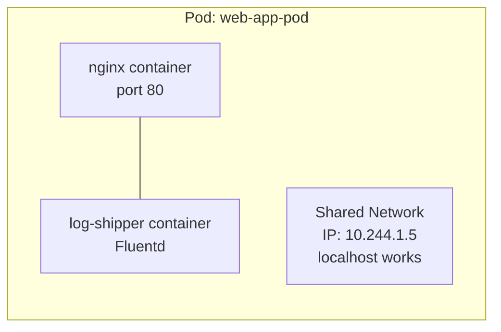
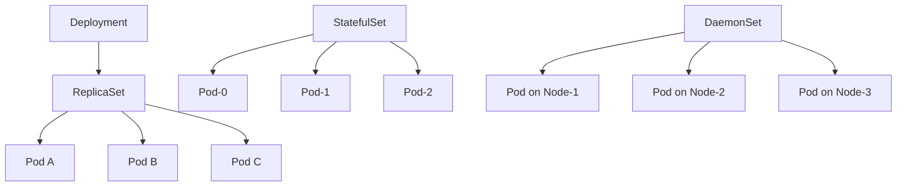
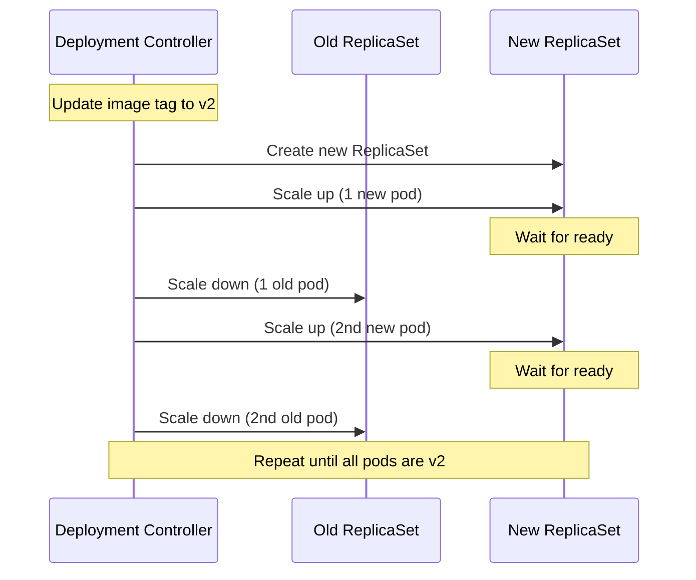
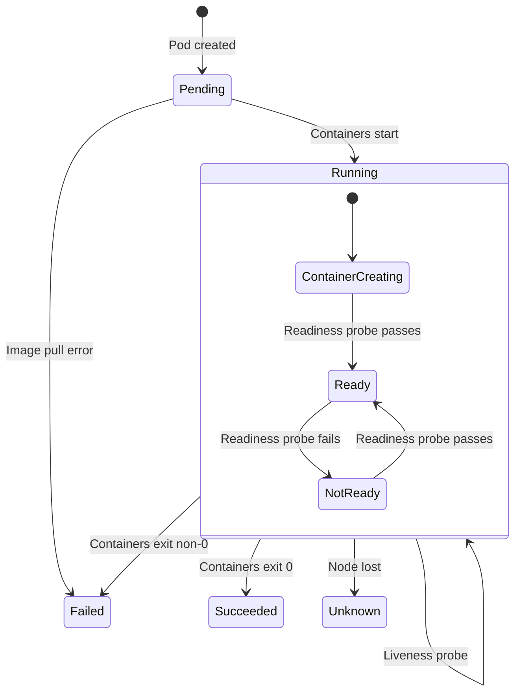

import {
  Info,
  Warning,
  Tip,
  BestPractice,
  Definition,
  Example,
  Analogy,
  CommonMistake,
  Debugging,
  Exercise,
  Quiz,
  CodeBlock,
  TerminalBlock,
  Flashcard,
  ProductionNote,
  ArchitectureNote,
  SecurityNote,
  CostNote,
  InterviewQuestion,
  CheatSheet,
  AIExplanation,
  AIQuiz,
  AIFlashcards,
} from "@site/src/components/shared/InteractiveBlocks";

export const CloudNova = ({ children }) => (
  <div
    style={{
      borderLeft: "4px solid #0ea5e9",
      padding: "1rem 1.5rem",
      margin: "1.5rem 0",
      background: "var(--ifm-color-emphasis-100)",
      borderRadius: "0 8px 8px 0",
    }}
  >
    <strong style={{ color: "#0ea5e9" }}>🏢 CloudNova Engineering</strong>
    <div style={{ marginTop: "0.5rem" }}>{children}</div>
  </div>
);

# Pods & Workloads — The Unit of Deployment

## Learning Objectives

After this lesson, you will be able to:

1. Explain why Kubernetes schedules Pods, not individual containers
2. Deploy and update stateless applications with Deployments
3. Choose the correct workload type for any scenario
4. Troubleshoot pod lifecycle issues

---

## Simple — What is a Pod?

<Analogy>

Imagine you're moving houses. You don't just hire a truck — you need a truck **and** a driver, both working together. The truck needs the driver, and the driver needs the truck. They share the same space (the cab), communicate directly, and live and die together.

A **Pod** is that truck-and-driver unit. It's the smallest thing Kubernetes manages:

- It can contain one or more containers
- All containers in a pod share the **same network namespace** (same IP, same ports)
- They share **storage volumes**
- They're **always scheduled together** on the same node
- If the pod dies, **all its containers die together**

</Analogy>

<Definition term="Pod">

The smallest deployable unit in Kubernetes. A Pod encapsulates one or more containers that share:

- **Network**: Same IP address, port space, and can communicate via `localhost`
- **Storage**: Shared volumes mounted at the pod level
- **Lifecycle**: Created, scheduled, and terminated as a unit

</Definition>



### Single vs Multi-Container Pods

<Info>

**Most pods run a single container.** Multi-container pods are for tightly coupled processes that MUST share resources.

Common multi-container patterns:

- **Sidecar**: Helper that enhances the main container (e.g., log shipper, config reloader)
- **Ambassador**: Proxy that abstracts external services
- **Adapter**: Transforms output for consumption (e.g., metrics adapter)

</Info>

---

## Core — The Workload API



### Deployments — The Default Choice

Deployments are for **stateless, scalable applications**. They manage ReplicaSets, which manage Pods.

<CodeBlock language="yaml" title="nginx-deployment.yaml">
  apiVersion: apps/v1 kind: Deployment metadata: name: nginx-deployment labels: app: nginx spec:
  replicas: 3 selector: matchLabels: app: nginx template: metadata: labels: app: nginx spec:
  containers: - name: nginx image: nginx:1.25 ports: - containerPort: 80 resources: requests:
  memory: "64Mi" cpu: "250m" limits: memory: "128Mi" cpu: "500m"
</CodeBlock>

<BestPractice>

**Always set resource requests and limits.** Without them, a misbehaving pod can consume all node resources, and the scheduler can't make intelligent placement decisions.

- **requests**: What the pod is guaranteed (scheduler uses this)
- **limits**: Hard cap the pod cannot exceed

</BestPractice>

### Rolling Updates — Zero-Downtime Deployments

The Deployment controller orchestrates rolling updates:



<CodeBlock title="Update Strategies">
# Rolling update (default) - gradual replacement
kubectl set image deployment/nginx nginx=nginx:1.26 --record

# Recreate - kill all, then start all (downtime!)

kubectl patch deployment nginx -p '{"spec":{"strategy":{"type":"Recreate"}}}'

# Check rollout status

kubectl rollout status deployment/nginx

# Rollback!

kubectl rollout undo deployment/nginx --to-revision=2

</CodeBlock>

### StatefulSets — When Identity Matters

Use StatefulSets when pods need **stable, unique identities**:

- Databases (PostgreSQL, MySQL)
- Message queues (Kafka, RabbitMQ)
- Distributed storage (Cassandra, Elasticsearch)

<CodeBlock language="yaml" title="postgres-statefulset.yaml">
  apiVersion: apps/v1 kind: StatefulSet metadata: name: postgres spec: serviceName: "postgres"
  replicas: 3 selector: matchLabels: app: postgres template: metadata: labels: app: postgres spec:
  containers: - name: postgres image: postgres:16 ports: - containerPort: 5432 volumeMounts: - name:
  data mountPath: /var/lib/postgresql/data volumeClaimTemplates: - metadata: name: data spec:
  accessModes: ["ReadWriteOnce"] resources: requests: storage: 10Gi
</CodeBlock>

<Info>

**StatefulSet guarantees** (that Deployments don't):

1. **Stable pod names**: `postgres-0`, `postgres-1`, `postgres-2` (not random hashes)
2. **Ordered deployment**: `postgres-0` starts first, then `postgres-1`, then `postgres-2`
3. **Stable storage**: Each pod gets its own PVC that persists across restarts
4. **Stable network identity**: `<pod-name>.<service-name>` always resolves

</Info>

### DaemonSets — One Pod Per Node

DaemonSets ensure a copy of a pod runs on **every node** (or a subset):

<CodeBlock language="yaml" title="fluentd-daemonset.yaml">
  apiVersion: apps/v1 kind: DaemonSet metadata: name: fluentd spec: selector: matchLabels: name:
  fluentd template: metadata: labels: name: fluentd spec: containers: - name: fluentd image:
  fluentd:latest volumeMounts: - name: varlog mountPath: /var/log - name: dockercontainers
  mountPath: /var/lib/docker/containers readOnly: true volumes: - name: varlog hostPath: path:
  /var/log - name: dockercontainers hostPath: path: /var/lib/docker/containers
</CodeBlock>

**Common DaemonSet use cases:**

- Log collectors (Fluentd, Filebeat)
- Monitoring agents (Datadog, Prometheus node-exporter)
- Network plugins (Calico, Cilium)
- Storage daemons

---

## Professional — Pod Lifecycle Deep Dive

Every pod goes through a defined lifecycle:



### Probes — The Health Check System

<Definition term="Liveness Probe">

Answers: "Is the container still alive?" If it fails, the kubelet **kills and restarts** the container. Use to detect deadlocks or crashes where the process is running but broken.

</Definition>

<Definition term="Readiness Probe">

Answers: "Is the container ready to serve traffic?" If it fails, the pod is **removed from Service endpoints**. Use to let the application warm up or handle temporary overload.

</Definition>

<Definition term="Startup Probe">

Answers: "Has the application started?" If configured, liveness and readiness are disabled until startup succeeds. Use for slow-starting applications.

</Definition>

<CodeBlock language="yaml" title="probes-example.yaml">
  apiVersion: v1 kind: Pod spec: containers: - name: app image: myapp:latest startupProbe: httpGet:
  path: /healthz port: 8080 failureThreshold: 30 periodSeconds: 10 livenessProbe: httpGet: path:
  /healthz port: 8080 initialDelaySeconds: 0 periodSeconds: 15 failureThreshold: 3 readinessProbe:
  httpGet: path: /ready port: 8080 initialDelaySeconds: 5 periodSeconds: 5
</CodeBlock>

<CommonMistake>

**The #1 probe mistake**: Using the same endpoint for liveness and readiness. The liveness probe should check "is my process healthy?" (e.g., `/healthz`) while the readiness probe should check "am I ready for traffic?" (e.g., `/ready` — check DB connection, cache warmup, etc.).

If readiness fails due to a slow database, you want to stop sending traffic but NOT restart the pod. If liveness uses the same check, Kubernetes will kill your pod unnecessarily.

</CommonMistake>

---

## Production — Deployment Strategies

````mermaid
graph LR
    subgraph "Rolling Update"
        R1[Old Pods: 3] --> R2[Old: 2, New: 1] --> R3[Old: 1, New: 2] --> R4[New Pods: 3]
    end
</```

### Canary Deployments vs Blue-Green

<ProductionNote>

**Canary Deployment** (gradual traffic shift):
```yaml
# Step 1: Create small new Deployment (1 replica)
# Step 2: Route 10% → 50% → 100% traffic via Ingress/Service mesh
# Step 3: Monitor, then scale up/rollback
````

**Blue-Green Deployment** (instant cutover):

```yaml
# Step 1: Deploy full "green" environment (all replicas)
# Step 2: Validate green independently
# Step 3: Switch Service selector from blue → green
# Step 4: Keep blue for fast rollback
```

| Strategy   | Rollback Time | Resource Cost | Risk   |
| ---------- | ------------- | ------------- | ------ |
| Rolling    | ~Minutes      | Normal        | Medium |
| Canary     | Instant       | +10-50%       | Low    |
| Blue-Green | Instant       | 2x            | Lowest |

</ProductionNote>

### Pod Disruption Budgets (PDB)

Protect your application from voluntary disruptions:

```yaml
apiVersion: policy/v1
kind: PodDisruptionBudget
metadata:
  name: nginx-pdb
spec:
  minAvailable: 2 # Never have fewer than 2 pods
  selector:
    matchLabels:
      app: nginx
```

<CloudNova>

CloudNova is deploying their customer-facing API to Kubernetes. The CTO demands **zero-downtime deployments** — customers should never see 5xx errors during updates.

**Your task:**

1. Design the appropriate Deployment update strategy
2. Configure proper readiness probes (the API warms up for 30 seconds)
3. Set up a PodDisruptionBudget
4. Plan the rollback procedure
5. Test the strategy: deploy v1, then update to v2 and verify zero 5xx errors in logs

</CloudNova>

---

## Hands-On

<Exercise>

### Mini Lab: Deploy and Update

```bash
# 1. Create a deployment
kubectl create deployment nginx --image=nginx:1.24 --replicas=3

# 2. Watch pods come up
kubectl get pods -w

# 3. Update the image (triggers rolling update)
kubectl set image deployment/nginx nginx=nginx:1.25

# 4. Watch the rollout
kubectl rollout status deployment/nginx

# 5. Check rollout history
kubectl rollout history deployment/nginx

# 6. Rollback
kubectl rollout undo deployment/nginx
```

</Exercise>

---

## Quiz

<Quiz
  questions={[
    {
      question: "Why does Kubernetes schedule Pods instead of individual containers?",
      options: [
        "Pods are simpler than containers",
        "Pods provide a shared context for tightly coupled containers",
        "Kubernetes doesn't understand containers",
        "It was an arbitrary design choice",
      ],
      correct: 1,
      explanation:
        "Pods encapsulate containers that need to share network namespace, volumes, and lifecycle. The sidecar/ambassador patterns depend on this shared context.",
    },
    {
      question: "What distinguishes a StatefulSet from a Deployment?",
      options: [
        "StatefulSets have more replicas",
        "StatefulSets provide stable network identity and persistent storage per pod",
        "StatefulSets use different container images",
        "StatefulSets are faster to scale",
      ],
      correct: 1,
      explanation:
        "StatefulSets give each pod a stable hostname (e.g., postgres-0) and its own PVC, essential for stateful workloads like databases.",
    },
    {
      question: "A DaemonSet ensures what?",
      options: [
        "One pod running across the entire cluster",
        "One pod on every node (or subset)",
        "Pods are deleted after execution",
        "Automatic horizontal scaling",
      ],
      correct: 1,
      explanation:
        "DaemonSets run a copy of a pod on each node (or a labeled subset), commonly used for logging agents, monitoring, and network plugins.",
    },
  ]}
/>

---

## Active Recall

<Flashcard
  front="What are the three types of health probes in Kubernetes?"
  back="1. **Liveness**: Is the container alive? Restart if it fails.
2. **Readiness**: Is the container ready for traffic? Remove from Service if it fails.
3. **Startup**: Is the application up? Disable liveness/readiness until it passes."
/>

<Flashcard
  front="When should you use a multi-container Pod instead of separate Pods?"
  back="When containers must share the network namespace (communicate via localhost), share volumes, or have a tightly coupled lifecycle. Common patterns: sidecar (logging), ambassador (proxy), adapter (format conversion)."
/>

---

## Interview Preparation

<InterviewQuestion difficulty="medium" certification="CKAD">

**Question**: "How would you deploy a web application to Kubernetes so it can handle rolling updates without downtime?"

**Answer**: Use a Deployment with replicas ≥ 3, configure readiness probes on `/health`, set `maxUnavailable: 0` and `maxSurge: 1` for the strategy, and add a PodDisruptionBudget with `minAvailable: 1`. Explain that the Service only routes to ready pods, so during rollout, traffic flows only to healthy pods.

</InterviewQuestion>

---

## Cheat Sheet

<CheatSheet title="Kubernetes Workloads Quick Reference">

| Workload        | Use Case                     | Key Feature        | Example             |
| --------------- | ---------------------------- | ------------------ | ------------------- |
| **Pod**         | Single/co-located containers | Atomic unit        | Sidecar pattern     |
| **Deployment**  | Stateless apps               | Rolling updates    | Web servers, APIs   |
| **StatefulSet** | Stateful apps                | Stable identity    | Databases, Kafka    |
| **DaemonSet**   | Node-level agents            | One per node       | Logging, monitoring |
| **Job**         | Batch processing             | Runs to completion | Data processing     |
| **CronJob**     | Scheduled tasks              | Cron schedule      | Backups, reports    |

</CheatSheet>

---

## Related Content

<KnowledgeLinks>
  - **Next**: [Services & Networking](services-networking) — Exposing your workloads - **Previous**:
  [Kubernetes Architecture](k8s-architecture) — The foundation - **Lab**: Multi-tier application
  deployment - **Certification**: CKAD Domain 2 — Application Deployment (20%)
</KnowledgeLinks>
